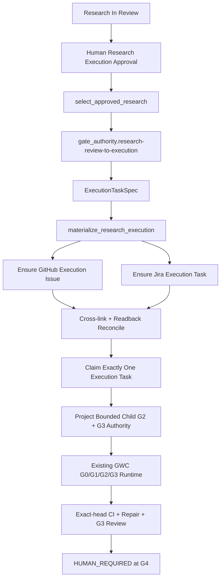

# Design Document

## Overview

Extend the existing autonomous pre-prod task orchestration delivered by SCRUM-271 through SCRUM-274. Do not create a second scheduler or gate engine. Add a research-to-execution adapter layer that compiles approved research into a deterministic execution task, reconciles tracking projections, claims one execution task, derives bounded child authority, and hands control to the existing GWC delivery path.

## Architecture



Existing mechanisms reused:

- `select_autonomous_jira_task.py` for lane/dependency-safety patterns.
- `run_task_continuation_loop.py` for serial fencing, durable checkpointing, and stop semantics.
- SCRUM-272 parent/child authority derivation pattern.
- existing Node Architect evidence/checkpoint primitives.
- existing G0/G1/G2/G3 lifecycle and exact-head CI/review behavior.

## Components and Interfaces

### R1 — Research execution approval schema

Define a versioned schema binding research identity/digest, repository, approved round/scope, bounded action/path derivation policy, risk ceiling, approval ID, issuance/expiry, and canonical scope hash.

### R2 — `select_approved_research.py`

Pure deterministic selector. Inputs: active lane, excluded lanes, research snapshots, approvals, dependency evidence, materialization state. Outputs: one selected research ref or typed idle/blocked result. It grants no authority.

### R3 — `gate_authority.research-review-to-execution` node

Validate approval/readback, compile ExecutionTaskSpec, compute materialization key, emit provider-neutral effect intents, and produce bounded child-G2 and child-G3 authority projection inputs. It must use existing node instruction/evidence contracts.

### R4 — `materialize_research_execution.py`

Reconciliation-first materializer. Search/readback by materialization key before create. Resolve `both`, `github-only`, `jira-only`, `none`, or `conflict`. External effects are idempotent, checkpointed, and read back.

### R5 — `run_research_execution_flow.py`

Thin orchestration wrapper that handles immediate/scheduled trigger source, delegates selection/materialization, then transfers execution to existing task continuation/runtime. It stops on hard blocker or Human authority.

### R6 — Post-81 registry extension contract

Preserve `REVAMP-GWC-015` and its exact 81-node plan as historical baseline. Add a versioned extension contract/manifest that admits explicitly G1-approved post-baseline nodes. For SCRUM-284 it admits exactly one node under the existing `gate_authority` family. Runtime registry validation must evaluate `baseline 81 + declared extensions` rather than silently weakening the baseline invariant. The canonical runtime graph/profile surfaces must include the admitted node and reject undeclared node growth.

### R7 — Schemas and tests

Add schemas for approval, ExecutionTaskSpec, materialization result, and the post-81 extension registry/contract. Add focused unit/contract tests plus registry/schema/graph/profile validation coverage required by current Node Architect conventions.

## Data Models

### ResearchExecutionApproval

```text
schema_version
approval_id
research_ref
research_digest
repository
approved_round_or_scope
scope_hash
allowed_paths_or_derivation_policy
authorized_actions
risk_ceiling
issued_at
expires_at
authority_revision
```

### ExecutionTaskSpec

```text
schema_version
origin_research_refs
approved_research_digest
approved_scope
repository
protected_base_sha
objective
implementation_guidance[]
acceptance_criteria[]
dependencies[]
risks[]
excluded_actions[]
materialization_key
projection_bindings
child_gate_authority_derivation
```

### ResearchExecutionMaterialization

```text
materialization_key
state
research_ref
execution_task_identity
github_projection
jira_projection
claim_state
reconciliation_state
checkpoint_ref
evidence_refs[]
reason_code
```

## Correctness Properties

1. **P1 Determinism:** identical canonical research/approval/policy snapshots produce identical selector result, ExecutionTaskSpec digest, and materialization key. [R1,R2,R4]
2. **P2 No duplicate work:** the same materialization key maps to at most one logical execution task pair. [R3]
3. **P3 Authority monotonicity:** child G2/G3 authority is never broader than parent research execution approval, and no child path grants G4/G5/G6. [R1,R5]
4. **P4 Lane preservation:** selection never crosses active/excluded lane boundaries. [R2]
5. **P5 Evidence-before-effect:** durable intent/checkpoint exists before effect and authoritative readback reconciles after effect. [R3,R7]
6. **P6 Research approval never merges:** no code path maps research approval to G4/G5/G6. [R1,R5,R6]
7. **P7 Exact-head freshness:** any head change invalidates prior CI/review evidence. [R6]
8. **P8 Baseline-preserving extension:** original 81-node baseline identity remains intact and only declared post-81 extension nodes may increase runtime cardinality. [R7]

## Error Handling

Typed failures include:

- `RESEARCH_APPROVAL_MISSING`
- `RESEARCH_APPROVAL_EXPIRED`
- `RESEARCH_DIGEST_DRIFT`
- `RESEARCH_SCOPE_DRIFT`
- `NO_ELIGIBLE_APPROVED_RESEARCH`
- `RESEARCH_OUTSIDE_ACTIVE_LANE`
- `RESEARCH_DEPENDENCY_UNSAFE`
- `EXECUTION_MATERIALIZATION_CONFLICT`
- `EXECUTION_PROJECTION_RECONCILIATION_REQUIRED`
- `EXECUTION_TASK_CLAIM_CONFLICT`
- `CHILD_G2_SCOPE_EXPANSION_REJECTED`
- `DUPLICATE_DISPATCH_FENCED`
- `HUMAN_AUTHORITY_REQUIRED`

Projection transport errors are retryable only after durable checkpoint and authoritative readback. Conflicting identities fail closed.

## Testing Strategy

- deterministic selector tests for immediate vs scheduled triggers;
- approval digest/scope/expiry drift tests;
- materialization replay and duplicate suppression tests;
- GitHub-only/Jira-only partial-create reconciliation tests;
- conflicting-pair fail-closed tests;
- durable checkpoint/restart tests;
- out-of-lane and unsafe-Done dependency tests;
- child-G2 subset/property tests;
- G4 negative-authority tests;
- flow tests proving existing runtime handoff rather than bypass;
- exact-head evidence invalidation tests for CI repair cycles;
- post-81 extension admission tests proving the 81 baseline is preserved and undeclared node growth fails closed;
- affected Node Architect schema/catalog/graph/profile validators and repository CI.

## Implementation Constraints

- Risk class R2: workflow/state/integration behavior change.
- Protected base: `main@2e20badf04b4d84bf8a2e88d6e1e88d540745d35` until G2 readback; drift requires refresh/rebinding.
- GitHub is repository technical truth; Jira/GitHub issues are tracking projections only.
- Serial execution only in this slice.
- No generic task-controller abstraction.
- No implementation of SCRUM-279/280/281/282 research content.
- No auto-merge, G5 manual action, G6 operation, production write, secret or migration.
- Preserve `MODE_DOES_NOT_BYPASS_NODE_RUNTIME` and existing gate/node evidence semantics.
- Preserve the historical 81-node expansion plan unchanged; evolve current runtime through a separately versioned post-81 extension contract.
- Add exactly one extension node in this slice; do not repurpose `sync_projection.task-center-sync`, `gate_authority.gate-transition-decision`, or another slot with different semantics.
