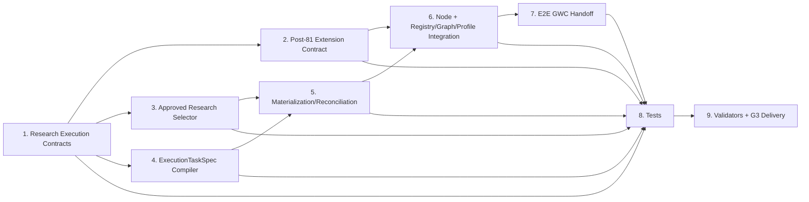

# Implementation Plan

## Overview

Implement SCRUM-284 as an additive Node Architect orchestration slice on top of SCRUM-274. Preserve the historical 81-node rollout as an immutable baseline, introduce a narrow post-81 extension admission contract for exactly one new executable node, then build research approval/task materialization and hand off to the existing GWC runtime. No unrelated refactoring.

## Task Dependency Graph



## Tasks

- [ ] **1. Add versioned research execution contracts and authority invariants** — Requirements R1, R3, R4, R5
  - Add research execution approval schema.
  - Add ExecutionTaskSpec schema.
  - Add materialization/result schema.
  - Encode Human research approval as bounded parent authority that may materialize/claim and project task-scoped G2 plus optional bounded G3 Draft-PR authority for the exact approved subset.
  - Encode negative authority for G4/G5/G6 and validate canonical digest/materialization-key inputs.

- [ ] **2. Add controlled post-81 runtime-node extension contract** — Requirement R7
  - Keep `CONTROLLED_81_NODE_CATALOG_EXPANSION_PLAN_v0.1.md` and `node-catalog-expansion-plan.json` unchanged as historical baseline.
  - Add a versioned post-81 extension policy/registry/schema that declares SCRUM-284 as the G1 decision authorizing one additional node.
  - Evolve runtime node-registry schema and validator from `exactly 81 total` to `immutable 81 baseline + explicitly admitted extensions`.
  - Preserve all 81 baseline IDs/provenance and reject undeclared extension nodes, duplicates, invalid slots, and graph/profile drift.
  - Keep the new node in the existing `gate_authority` family; do not create a tenth family in this slice.

- [ ] **3. Implement deterministic approved-research selector** — Requirements R2, R8
  - Add pure selector with active/excluded lane enforcement.
  - Reuse unsafe-Done dependency evidence semantics from SCRUM-274.
  - Support deterministic selection for immediate and scheduled trigger snapshots.
  - Emit no authority.

- [ ] **4. Implement ExecutionTaskSpec compiler and bounded G2/G3 projection inputs** — Requirements R1, R4, R5
  - Compile only explicitly approved research round/scope.
  - Generate stable materialization identity.
  - Preserve research text as data rather than executable authority.
  - Fail on digest/scope/expiry drift.
  - Require generated task-scoped G2 and G3 receipts to remain exact subsets/projections of Human research-execution authority; no standalone contract-only child decision is treated as live approval.
  - G3 child authority may cover only Draft PR create/update, exact-head CI/review closure, and ready-for-review metadata; it must never include merge.

- [ ] **5. Implement reconciliation-first execution materialization** — Requirements R3, R8
  - Model lookup/readback results for GitHub/Jira projections.
  - Handle both/missing-one/none/conflict states.
  - Checkpoint before effect and reconcile after effect.
  - Prevent duplicate task creation and duplicate claim on replay/restart.

- [ ] **6. Register `gate_authority.research-review-to-execution` node and flow** — Requirements R5, R7, R8
  - Add exactly one new runtime node descriptor/canonical registry entry as a declared post-81 extension.
  - Update runtime graph and flow profile/route references so graph node set remains closed and validators can resolve the route.
  - Add `run_research_execution_flow.py` as a thin orchestrator over existing primitives.
  - Ensure trigger type is observational metadata, not authority.
  - Preserve serial execution.

- [ ] **7. Wire existing GWC delivery handoff through G3** — Requirements R5, R6
  - Hand off claimed execution task to normal task-scoped G0/G1/G2/G3 runtime.
  - Reuse AI execution, checkpoint, evidence and continuation primitives.
  - Require exact-head CI/read-only review; invalidate stale evidence after repair.
  - End successful route at `HUMAN_AUTHORITY_REQUIRED` for G4.
  - Explicitly reject auto-merge/G5/G6 authority.

- [ ] **8. Add focused adversarial, migration and recovery tests** — Requirements R1–R8
  - Approval drift/expiry/scope expansion.
  - Immediate vs scheduled deterministic selection.
  - Out-of-lane and unsafe Done dependencies.
  - Replay duplicate suppression and partial-projection recovery.
  - Conflicting identities fail closed.
  - Checkpoint/restart and duplicate dispatch fencing.
  - Bounded G2/G3 projections, parent omission of G3 delegation, and no-G4 authority.
  - 81-baseline preservation + exactly one declared extension + undeclared extension rejection.
  - Registry/graph/profile provenance and node-resolution validation.
  - G3 stop boundary and exact-head stale-evidence invalidation.

- [ ] **9. Run Node Architect/repository validation and deliver Draft PR** — Requirements R1–R8
  - Discover and run affected schema/catalog/runtime/graph/profile validators.
  - Run focused unit tests and repository-required CI.
  - Inspect full diff against approved scope.
  - Push guarded branch and create/update Draft PR only under valid G2/G3 evidence.
  - Poll exact-head CI to terminal; repair only within approved scope.
  - Perform exact-head G3 read-only review.
  - Stop before merge and request exact Human G4 authority.

## Expected mutation surfaces

Final paths may follow repository-native naming discovered during implementation, but G2 scope is bounded to these categories:

```text
schemas/node-architect/research-execution-approval.schema.json
schemas/node-architect/execution-task-spec.schema.json
schemas/node-architect/research-execution-materialization.schema.json
schemas/runtime/node-registry.schema.json
schemas/node-architect/runtime-node.schema.json
core/node-architect/POST_81_RUNTIME_NODE_EXTENSION_RULE_v0.1.md
core/node-architect/runtime-node-extension-registry.json
core/node-architect/node-catalog/gate_authority/research-review-to-execution.node.json
core/node-architect/node-registry.json
core/node-architect/runtime-graph-registry.json
core/node-architect/profile-registry.json
tools/node_architect/select_approved_research.py
tools/node_architect/materialize_research_execution.py
tools/node_architect/run_research_execution_flow.py
tools/node_architect/validate_runtime_registry.py
tests/test_research_execution_materialization.py
tests/test_research_execution_flow.py
tests/test_runtime_node_extension.py
projects/gwc/package.yaml
releases/changelog.d/2026-08-08-scrum-284-research-execution.md
.gwc/tasks/SCRUM-284/**
```

## Notes

- Task Me is semantically useful for architecture/dependency planning but no Task Me execution host/skill is exposed in this chat runtime; this G1 therefore uses a generated Kiro-compatible task plan and records the fallback explicitly.
- The plan is bound to protected base `2e20badf04b4d84bf8a2e88d6e1e88d540745d35`; any protected-base drift before G2 requires readback and plan/scope impact evaluation.
- The old 81-node plan remains historical truth for REVAMP-GWC-015. SCRUM-284 is a separate G1 decision that admits one post-baseline node; it does not rewrite or reopen that rollout.
- The first implementation slice intentionally excludes generic multi-controller support, parallel execution, automatic merge, and all G5/G6 operations.
