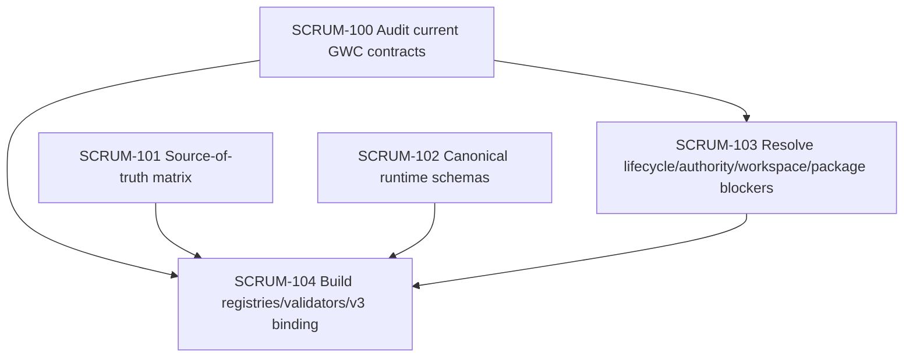

# Design — GWC Phase 1 Architecture Readiness & Registry Foundation

## 1. Overview

Phase 1 establishes the architecture-readiness baseline required before building a durable GWC runtime. The design keeps GWC as the canonical governance authority while allowing Task-Me, UA and BMAD to contribute bounded planning, knowledge and procedure artifacts.

```text
UA supplies knowledge
Task-Me supplies planning
BMAD supplies reusable procedures
GWC owns authority, evidence and canonical transitions
GitHub/CI provides world-state evidence
Human retains final authority
```

## 2. Architecture responsibilities

### GWC

Owns:

- gate lifecycle;
- authority evaluation;
- execution envelope;
- evidence validation;
- runtime graph revision;
- scenario routing;
- canonical transition.

Does not own:

- domain knowledge extraction;
- planning algorithm internals;
- BMAD procedure implementation;
- GitHub/CI truth.

### Task-Me

Owns:

- task decomposition;
- dependency DAG;
- risk and impact planning;
- implementation sequencing;
- candidate capability selection;
- acceptance and test strategy proposal.

Does not own:

- repository write authority;
- canonical workflow state;
- merge/deploy authority.

### UA

Owns:

- structural knowledge graph;
- dependency and impact knowledge;
- versioned snapshots;
- provenance and freshness.

### BMAD

Owns:

- reusable implementation procedures;
- architecture, story, TDD, review and release methods;
- procedure result output.

## 3. Source-of-truth matrix

| Concern | Canonical source |
|---|---|
| Governance authority | `.gwc/tasks/**` and GWC contracts |
| Planning | `.task-me/runs/**` |
| Kiro projection | `.kiro/specs/**` |
| UA knowledge extension | `.ua/extensions/**` |
| Branch/PR/CI truth | GitHub |
| Task board | Jira projection only |
| Human authority | explicit approval artifacts |

## 4. Phase 1 task decomposition



## 5. Runtime schema model

### Node contract

A runtime node must not be described by a single `effect_class`. The metadata is multi-dimensional:

```yaml
id: gwc.node.repo_delivery.ci_run_capture
version: 1.0.0
family: repo_delivery
effect_class: read_only | local_write | external_write | destructive
authority_class: automatic | delegated | human_required | prohibited
reversibility: reversible | compensatable | irreversible | unknown
idempotency: intrinsic | key_required | readback_required | non_idempotent
suspension: none | checkpointable | wait_state | takeover_safe
determinism: deterministic | environment_dependent | probabilistic
```

### Scenario contract

A scenario is not the same as a graph edge.

```yaml
id: gwc.scenario.ci_pending_exact_sha
activation:
  gate: G3_PR
  event: ci_status_observed
facts_schema: {}
rules: []
routes: []
green_targets: []
human_boundaries: []
```

### Runtime graph

Runtime graph edges must be typed:

```yaml
relationship: runtime_dependency | conditional_route | recovery_route | authority_route | evidence_dependency | visual_grouping | suggested_sequence
runtime_executable: true | false
```

Visualization-only edges are never executable.

## 6. Readiness blockers

Phase 1 must address or produce precise remediation tasks for:

1. G4/G5 lifecycle mismatch.
2. Connector action authority validator path.
3. Canonical `.gwc/tasks/<task-id>/` workspace consistency.
4. G3 ready-for-review contract contradiction.
5. Package target/integrity drift.
6. G2 operational contract thinness.
7. Stale README/release/integrity outputs.
8. Verified CI evidence for current main.

## 7. Registry binding for v3

The v3 visual scenario graph remains the baseline UI, but its data must move out of hard-coded JavaScript and into registry-backed JSON/YAML.

Required properties:

- full-flow canvas;
- inactive nodes dimmed;
- all paths to green;
- routing history;
- edge/node inspection;
- semantic route classification;
- human-boundary markers.

## 8. Gating model

Phase 1 planning artifacts require G0/G1. Repository writes require G2. Draft PR requires G3. Merge/deploy/production remain excluded.

## 9. R2 baseline refresh

R2 was generated after protected-base drift. The drift touched Power Distribution workflow/test files and was classified non-material to this Phase 1 planning design. All active provenance is rebound to the current protected base.
