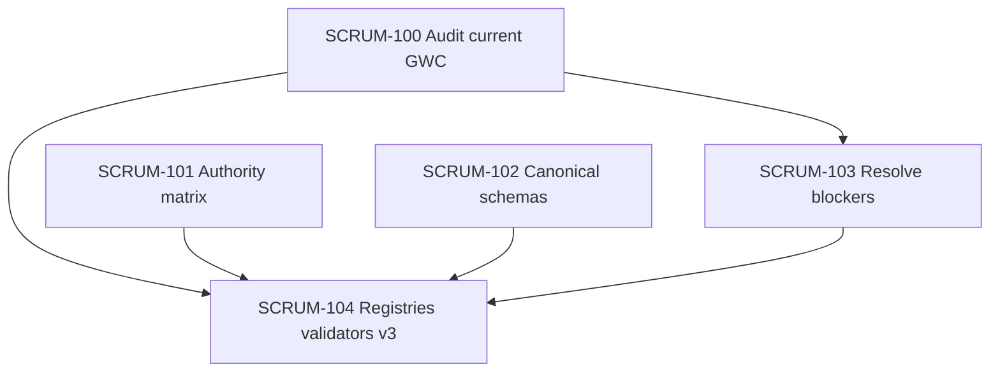

# Implementation Plan

## Overview

This plan implements the Phase 1 architecture-readiness and canonical-registry foundation. Knowledge tasks execute in parallel and converge before registry/v3 implementation. Source changes are not authorized by this plan alone; GWC G2/G3 evidence is still required.

## Task Dependency Graph



```json
{
  "waves": [
    {
      "id": "wave-1",
      "description": "Parallel knowledge foundation",
      "tasks": ["SCRUM-100", "SCRUM-101", "SCRUM-102"]
    },
    {
      "id": "wave-2",
      "description": "Resolve confirmed readiness blockers",
      "tasks": ["SCRUM-103"]
    },
    {
      "id": "wave-3",
      "description": "Build registries, validators and v3 binding",
      "tasks": ["SCRUM-104"]
    }
  ]
}
```

## Tasks

- [ ] 1. Audit current GWC contracts, blockers and executable surfaces
  - Inventory protected-base contracts, validators, tests and package surfaces.
  - Classify implemented, partial, contract-only, proposed and stale behavior.
  - Separate 81 catalog slots, four explicit nodes, 116 scenarios and graph-edge counts.
  - Record unresolved evidence and current CI visibility.
  - _Requirements: 1, 4_

- [ ] 2. Define DW SUPER APP source-of-truth and authority matrix
  - Define owners for product source, knowledge, plans, gate state, runtime history and external projections.
  - Define GWC, UA, Task-Me and BMAD adapter boundaries.
  - Define GitHub, deployment and Jira truth/projection roles.
  - _Requirements: 2_

- [ ] 3. Design canonical runtime schemas
  - Define node, scenario, profile, typed guard, graph revision and routing-history schemas.
  - Separate effect, authority, reversibility, idempotency and suspension dimensions.
  - Add fixtures and promotion rules.
  - _Requirements: 3_

- [ ] 4. Resolve lifecycle and enforcement blockers
  - Add failing tests for confirmed gaps.
  - Align lifecycle, authority validation, task workspace and G3 readiness.
  - Repair reproducible package and integrity outputs.
  - Run applicable validation and full diff review.
  - _Requirements: 1, 4_

- [ ] 5. Build canonical registries, validators and v3 data binding
  - Review every proposed registry slot.
  - Materialize maturity/provenance-aware registries.
  - Add cross-registry validation.
  - Bind the full-flow Cytoscape v3 viewer to external data.
  - Validate inactive dimming, all paths to green and human boundaries.
  - _Requirements: 2, 3, 5_

- [ ] 6. Validate Phase 1 completion
  - Run repository validation candidates.
  - Run focused schema, lifecycle and viewer tests.
  - Verify all 81 slots have explicit maturity/provenance.
  - Verify no blocker-severity audit finding remains.
  - Produce final evidence and known-limitations report.
  - _Requirements: 1, 2, 3, 4, 5_

## Notes

- Do not start the durable runtime or GraphCompiler in this phase.
- Do not use free-form LLM text as executable policy.
- Do not merge or deploy from this task.
- Preserve Task-Me as output-only planning.
- Re-read the exact implementation plan before the first G2 repository write.
