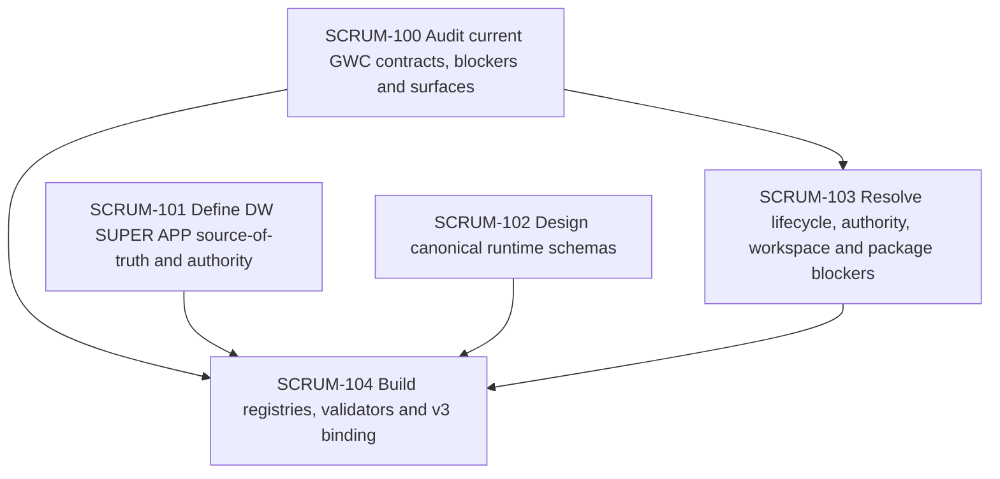

# Tasks — GWC Phase 1 Architecture Readiness & Registry Foundation

## Dependency graph

## SCRUM-100 — Audit current GWC contracts, blockers and surfaces

### Objective

Create a source-backed baseline for current GWC implementation maturity.

### Steps

1. Inventory governance contracts, schemas, validators, skills and profiles.
2. Classify each item as implemented, partial, contract-only, proposed, obsolete.
3. Audit current blockers and technical debt.
4. Produce source-backed baseline and blocker table.

### Outputs

- `architecture/current-state-baseline.md`
- `architecture/current-blockers-resolution.md`

### Requirement mapping

- FR-1
- FR-4

## SCRUM-101 — Define DW SUPER APP source-of-truth and authority

### Objective

Define integration boundaries for GWC + Task-Me + UA + BMAD in DW SUPER APP.

### Steps

1. Define component ownership.
2. Define source-of-truth matrix.
3. Mark Jira/task-board state as projection only.
4. Define human authority boundaries.

### Outputs

- `architecture/source-of-truth-matrix.yaml`
- `architecture/dw-super-app-authority-boundaries.md`

### Requirement mapping

- FR-2

## SCRUM-102 — Design canonical runtime schemas

### Objective

Design schemas required for node registry, scenario registry and runtime decision history.

### Steps

1. Draft node contract schema.
2. Draft scenario contract schema.
3. Draft decision-rule schema.
4. Draft runtime-graph and routing-history schemas.
5. Define edge categories and executable semantics.

### Outputs

- `schemas/node-contract.schema.json`
- `schemas/scenario-contract.schema.json`
- `schemas/decision-rule.schema.json`
- `schemas/runtime-graph.schema.json`
- `schemas/routing-history.schema.json`

### Requirement mapping

- FR-3
- FR-5

## SCRUM-103 — Resolve lifecycle, authority, workspace and package blockers

### Objective

Plan and/or implement readiness fixes required before adaptive runtime work.

### Steps

1. Align state engine with G4/G5 lifecycle.
2. Define executable connector action validator path.
3. Normalize `.gwc/tasks/<task-id>/` workspace.
4. Resolve G3 ready-for-review contract contradiction.
5. Regenerate package/integrity outputs.

### Outputs

- blocker remediation PR plan;
- validator update plan;
- package integrity regeneration plan.

### Requirement mapping

- FR-4

## SCRUM-104 — Build registries, validators and v3 binding

### Objective

Prepare canonical registry and v3 data binding plan.

### Steps

1. Review 81 node slots.
2. Mark canonical/candidate/deprecated maturity.
3. Define scenario registry format.
4. Separate runtime edges from visualization edges.
5. Bind visual v3 to external registry data.

### Outputs

- `registries/node-registry.yaml`
- `registries/scenario-registry.yaml`
- `registries/flow-profile-registry.yaml`
- `tools/validate_registry.*`
- `docs/v3-registry-binding-spec.md`

### Requirement mapping

- FR-1
- FR-3
- FR-5

## Completion rule

This phase is complete only when:

- current blockers are explicitly classified;
- source-of-truth matrix is approved;
- schema designs are reviewable;
- 81-node registry status is no longer ambiguous;
- v3 binding design is complete;
- no artifact implies G4/G5/G6 authority.

## R2 note

This task projection belongs to Task-Me run `gwc-scrum-95-20260725-r2` and supersedes the stale first run. The stale branch must remain audit-only.