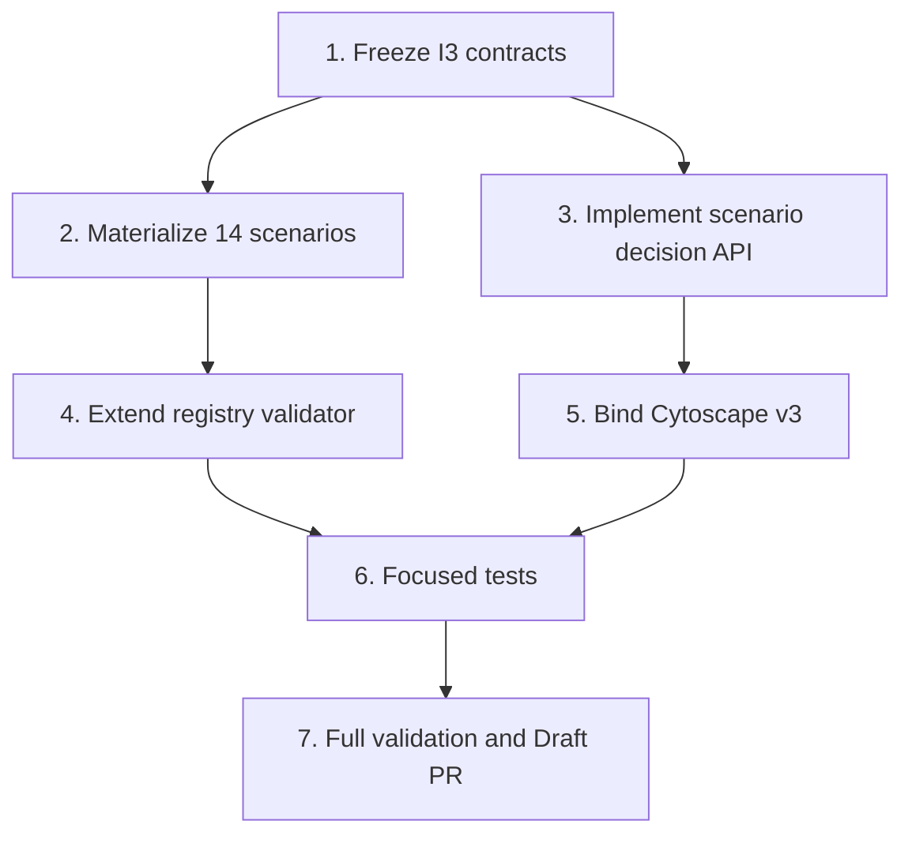

# Implementation Plan

## Overview

Deliver SCRUM-115 as one bounded guarded-branch change after SCRUM-113 and SCRUM-114 are merged. The implementation adds 14 canonical scenarios, deterministic scenario decisions and immutable history, registry validation, and Cytoscape v3 projection.

## Task Dependency Graph

## Tasks

- [ ] **1. Freeze SCRUM-115 scenario and decision contracts**
  - Update scenario contract and registry schemas for typed guards and route policy.
  - Preserve backward compatibility for existing scenario fields.
  - Requirements: 1, 2, 3, 4.

- [ ] **2. Materialize the 14 canonical scenarios**
  - Update `core/node-architect/scenario-registry.json` with exact category coverage and provenance.
  - Preserve `declared_scenario_count: 116` and set `materialized_scenario_count: 14`.
  - Requirements: 1, 2.

- [ ] **3. Implement deterministic scenario decision and immutable history**
  - Extend `tools/p3_backward_graph.py` using existing strict guards and route enumeration.
  - Emit graph/facts/decision digests and enforce decision-ID immutability.
  - Requirements: 3, 4.

- [ ] **4. Extend cross-registry validation**
  - Validate IDs, counts, guards, route policies, node/rule/edge references, provenance, and edge executability.
  - Requirements: 1, 2, 6.

- [ ] **5. Bind scenario decisions to Cytoscape v3**
  - Overlay scenario, candidate routes, selected route, and history evidence.
  - Keep every overlay/history edge non-executable.
  - Requirements: 4, 5.

- [ ] **6. Add focused and regression tests**
  - Add `tests/test_p3_scenario_registry.py`.
  - Extend P3 routing, runtime registry, and v3 history tests.
  - Requirements: 1–6.

- [ ] **7. Validate, record G3 evidence, and open Draft PR**
  - Run G2 gate validator before first repository write.
  - Run focused tests, full governance tests, compileall, scope/integrity/secret checks.
  - Create Draft PR only after local validation; bind CI to exact PR head SHA.
  - Requirements: 6.

## Notes

- SCRUM-113 and SCRUM-114 are merged prerequisites at protected base `9e79dd6e3cffbe452647cc339701eb4b937d41ba`.
- The older K1/K2 plan is not a valid implementation plan for SCRUM-115 and is superseded for this task by this package.
- G4 merge and G5/G6 operations remain separately gated and excluded.
