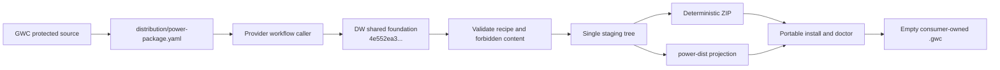

# Design Document

## Overview

The implementation extends GWC with provider-owned distribution metadata only. It reuses the deterministic builder, portable runtime, schemas, and reusable workflow already implemented in DW-SuperApps. Existing GWC skills and governance contracts are packaged by allowlist without modifying their behavior.

## Architecture

The current G2 scope creates the recipe and caller but does not execute publication.

## Components and Interfaces

### Provider Recipe

`distribution/power-package.yaml` is the provider contract. It declares:

- G0 and G1 skill entrypoints;
- narrow source includes and managed paths;
- provider-specific forbidden paths and secret patterns;
- `.gwc` as consumer-owned runtime data;
- no configuration requirement at install time.

### Configuration Defaults and Contract

`distribution/config/gwc.defaults.yaml` provides neutral defaults. `distribution/contracts/gwc-config.schema.json` validates those defaults and rejects undeclared fields. The configuration carries no tokens, credentials, repository mutation authority, or environment-specific paths.

### Workflow Caller

`.github/workflows/publish-power.yml` delegates to the immutable DW reusable workflow. Manual inputs default to no release and no `power-dist` update. Both publication outputs use the same staging tree inside the shared workflow.

### Provider Validation

`tests/test_power_distribution.py` checks entrypoints, dependency inventory, exclusions, configuration schema, workflow pinning, and authority/runtime boundaries.

### Governance Evidence

`.gwc/tasks/SCRUM-91/g0`, `g1`, and `g2` preserve exact task, repository, protected-base, branch, and scope-hash traceability. These artifacts authorize only the current G2 implementation scope.

## Data Models

### PowerDistribution

The recipe uses the shared `dw.superapps/v1` `PowerDistribution` model with:

- `metadata.id = gwc`;
- source repository and default ref;
- entrypoints and managed paths;
- include, exclude, and forbidden rules;
- runtime data root `.gwc`.

### PowerRuntimeConfig

The default configuration uses:

- `apiVersion: dw.superapps/v1`;
- `kind: PowerRuntimeConfig`;
- `metadata.powerId: gwc`;
- project profile, default language, runtime root, task provider, connector order, and non-authority flags.

## Correctness Properties

1. **Dependency closure:** every required G0/G1 dependency is selected by at least one include pattern.
2. **Boundary isolation:** no forbidden runtime, evidence, generated, UI, test, release, cache, or secret path is selected.
3. **Deterministic publication:** release and `power-dist` outputs originate from one staging tree at the pinned foundation commit.
4. **Runtime ownership:** installation creates `.gwc` empty and never embeds provider task evidence.
5. **Authority preservation:** package installation and configuration do not grant any G2-G6 or external-write authority.
6. **Scope integrity:** repository writes remain limited to the active execution envelope.

## Error Handling

- Missing entrypoints or required references fail provider tests and shared recipe validation.
- Absolute paths, parent traversal, symlinks, runtime data, generated plans, secret files, and forbidden content fail the shared builder.
- Invalid configuration fails JSON Schema validation.
- A changed or unpinned reusable-workflow ref fails provider tests.
- Any required new repository path is scope drift and requires a new envelope before mutation.

## Testing Strategy

- Parse all new YAML and JSON.
- Validate defaults against the configuration schema.
- Run `tests/test_power_distribution.py`.
- Run protected-base `tools/validate_g01.py` for the task workspace.
- Run `tools/validate_instructions.py` against the assembled candidate tree when a complete checkout is available; otherwise record the connector-only limitation and require CI at G3.
- Run shared foundation recipe validation and build twice from a source mirror; compare manifest and archive hashes.
- Smoke-install and run doctor; assert `.gwc` is empty.
- Review the complete feature-branch diff and exact head SHA.

## Implementation Constraints

- Protected base is `main@16c72a1200cdeadc2c549f992966f731acab89bb`.
- Shared foundation is pinned to `4e552ea3d915a4790814b08b3155c66e3c5736a1`.
- Existing GWC skill or core contract behavior is not modified.
- No PR, merge, release, `power-dist` publication, deployment, credential, secret, production configuration, or production data action is authorized.
