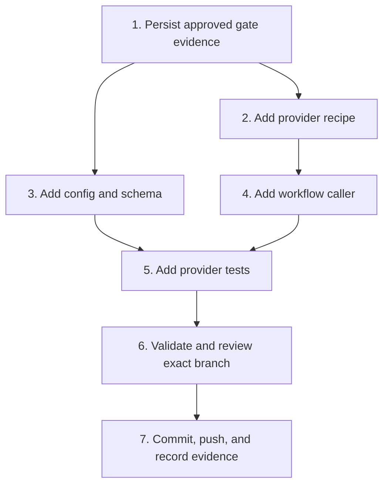

# Implementation Plan

## Overview

Implement the GWC skills-only provider package on `feat/dw-power-distribution-v1`, validate it against the protected base and shared DW foundation, then stop before G3/PR activity.

## Task Dependency Graph

## Tasks

- [x] **1. Persist approved SCRUM-91 G0/G1/G2 artifacts** — Requirements: 6
  - Preserve exact protected-base SHA, scope hash, approval request ID, branch, and exclusions.
  - Do not alter the approved envelope after approval.

- [x] **2. Add the curated GWC provider recipe** — Requirements: 1, 2, 5
  - Declare `gwc-g0` and `gwc-g1` entrypoints.
  - Include only verified agents, contracts, schemas, templates, tools, runbooks, offline library, and project guidance.
  - Add fail-closed forbidden path and content rules.

- [x] **3. Add neutral GWC defaults and JSON Schema** — Requirements: 3, 5
  - Keep configuration host-neutral and credential-free.
  - Encode `.gwc` as consumer-owned runtime data.
  - Prevent configuration from implying external-write authority.

- [x] **4. Add the pinned reusable publishing workflow** — Requirements: 4, 6
  - Pin DW-SuperApps reusable workflow to `4e552ea3d915a4790814b08b3155c66e3c5736a1`.
  - Default release and `power-dist` publication inputs to false.

- [x] **5. Add provider validation tests and changelog fragment** — Requirements: 1, 2, 3, 4, 5, 6
  - Test dependency selection, forbidden boundaries, schema validation, workflow pinning, and no authority uplift.
  - Record asset naming and publication contract without publishing anything.

- [x] **6. Run validation and complete diff review** — Requirements: 1–6
  - Run G0/G1/G2 validator.
  - Parse YAML/JSON and run provider tests.
  - Run shared recipe/build/install/doctor checks where the isolated source mirror permits.
  - Check exact changed paths, secrets, generated noise, accidental deletion, and scope drift.

- [x] **7. Commit and push the guarded branch** — Requirements: 6
  - Fast-forward only.
  - Record exact head SHA and validation evidence in Jira.
  - Stop before PR creation, release, `power-dist`, merge, deploy, or production actions.

## Notes

- The provider package is a distribution projection, not a governance source of truth.
- Consumer runtime `.gwc` remains outside the package and is never populated by installation.
- Any new write path or publication action requires a refreshed scope and later gate authority.
