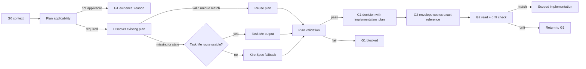

# Design Document

## Overview

Extend the existing G0/G1 runtime generator, schemas and validator instead of creating a parallel planning workflow. The selected design follows `Reuse → Extend`: reuse the active Kiro rule, current task-scoped G0/G1 artifacts, the `process_readback` / `execution_feasibility` preflight extension, the G2 execution envelope, and existing package/test mechanisms.

The plan source decision is:

```text
plan required?
  ├─ no  -> record not_applicable + reason
  └─ yes -> search existing canonical plan
              ├─ valid -> reuse
              └─ absent/stale/conflicting
                    ├─ Task Me applicable + available -> generate/refine with Task Me
                    └─ otherwise -> generate/refine standard Kiro Spec
```

## Architecture



## Components and Interfaces

### 1. Runtime input contract

Extend `schemas/g01-runtime-input.schema.json` with observed planning evidence:

- applicability decision and reason;
- existing-plan candidates and discovery result;
- Task Me applicability/availability/invocation evidence;
- selected plan source and durable paths;
- plan revision/hash and validation evidence.

This keeps generation deterministic: `tools/generate_g01_runtime.py` consumes observed facts and performs no external side effects.

### 2. G1 preflight contract

Extend `schemas/g1-preflight-report.schema.json` with a structured `implementation_plan` block. The preflight owns discovery and feasibility evidence. It must fail closed when required evidence is partial.

Suggested states:

- `applicability`: `required | not_applicable`
- `source`: `existing_kiro | task_me | generated_kiro | none`
- `discovery_status`: `MATCH | NOT_FOUND | STALE | CONFLICT | NOT_APPLICABLE`
- `validation_status`: `PASS | FAIL | NOT_APPLICABLE`

### 3. G1 decision contract

Extend `schemas/g1-decision-record.schema.json` with the immutable accepted plan reference. The decision contains only the selected canonical plan, not all discovery candidates. Cross-artifact validation ensures it matches preflight.

### 4. Validator

Extend `tools/validate_g01.py` with:

- plan pair/completeness rules analogous to the existing feasibility extension;
- required-plan failure codes;
- preflight-to-decision consistency checks;
- path/revision/task/repository/base binding checks;
- compatibility behavior for legacy artifacts with neither new field;
- a G2 handoff check when `--gate G2_EXECUTION` is requested.

Candidate failure codes the validator must emit:

- `G1_PLAN_APPLICABILITY_MISSING`
- `G1_PLAN_REQUIRED_MISSING`
- `G1_PLAN_VALIDATION_FAILED`
- `G1_PLAN_REFERENCE_MISMATCH`
- `G1_PLAN_BASE_DRIFT`
- `G2_PLAN_HANDOFF_MISSING`
- `G2_PLAN_READ_EVIDENCE_MISSING`
- `G2_PLAN_SCOPE_MISMATCH`

### 5. Generator and templates

Update `tools/generate_g01_runtime.py` and relevant `templates/g01/**` so generated artifacts include the plan block. The generator must not call Task Me itself; it consumes evidence from the orchestrating agent/runtime and classifies the route.

### 6. G2 execution contract

Extend the G2 envelope convention and `libs/g2-skill-library/skills/g2-execution-plan.md` with:

- exact G1 decision and plan references;
- plan revision/hash;
- read receipt (paths read, observed revision, reader, time);
- drift outcome;
- allowed implementation scope derived from both G1 decision and plan.

The G2 runtime stops before write on mismatch.

### 7. Agent/runbook routing

Update the Kiro rule, G0/G1 runbook and ChatGPT/DWC instructions to state the routing order and evidence requirements. Keep policy language additive and avoid duplicating the full Kiro template.

## Data Models

### ImplementationPlanEvidence

```yaml
implementation_plan:
  applicability: required | not_applicable
  reason: string
  source: existing_kiro | task_me | generated_kiro | none
  canonical_task_uid: string
  repository: owner/repo
  protected_base_sha: 40-hex
  plan_root: path-or-url | null
  requirements_path: path-or-url | null
  design_path: path-or-url | null
  tasks_path: path-or-url | null
  plan_revision: hash | null
  validation_status: PASS | FAIL | NOT_APPLICABLE
  validation_evidence: path-or-url | null
  generated_by: string | null
  generated_at_utc: date-time | null
```

### G2PlanReadReceipt

```yaml
plan_read_receipt:
  canonical_task_uid: string
  plan_revision: hash
  paths_read: [string]
  observed_base_sha: 40-hex
  scope_match: true | false
  drift_detected: true | false
  read_by: string
  read_at_utc: date-time
```

## Correctness Properties

1. **Completeness:** A required plan cannot be partially represented.
2. **Identity binding:** Plan task UID, repository and base SHA equal G0/G1 trace values.
3. **Single selection:** Exactly one selected plan source governs G2.
4. **No silent drift:** Any material mismatch returns to G1.
5. **Authority separation:** Plan evidence grants no write, merge, deploy or production authority.
6. **Compatibility:** Legacy artifacts are accepted only under explicit pair-absence compatibility; partial new-format enforcement is blocked.
7. **Trace continuity:** G1, G2, G3 and PR evidence preserve the same canonical plan revision.

## Error Handling

- Task Me unavailable: record capability as unavailable and use Kiro fallback; do not classify as fatal if fallback is legal.
- Existing-plan conflict: stop G1 with explicit conflict evidence.
- Invalid Kiro headings/traceability: fail plan validation and remain in G1.
- Base SHA change: invalidate plan and scope hash, refresh from G0.
- Missing G2 read receipt: deny repository mutation.
- Connector failure: retry equivalent read route; never use transport fallback to bypass governance.

## Testing Strategy

- Schema tests for complete/partial/not-applicable plan blocks.
- Validator unit tests for all failure codes and legacy compatibility.
- Generator tests for existing-plan, Task Me and Kiro fallback routes.
- G2 handoff tests for read receipt, revision mismatch, base drift and scope mismatch.
- Instruction/package tests ensuring updated artifacts are exported.
- End-to-end fixture: G0/G1 plan selection → validator PASS → G2 envelope read receipt → allowed scoped write.

## Implementation Constraints

- Protected base: `main@b3edbb102fb5b0e7e1532e221d89c16896f17755`.
- Jira issue `SCRUM-89` is traceability only.
- Current execution mode is `chat_connector_only`; no repository write occurs before valid G2 authority.
- Existing mechanisms must be extended, not replaced.
- No direct write to `main`; Draft PR only under G3.
- G4 merge, G5 deploy and G6 production remain excluded.
- Package version/changelog changes must follow existing repository conventions discovered at implementation time.
