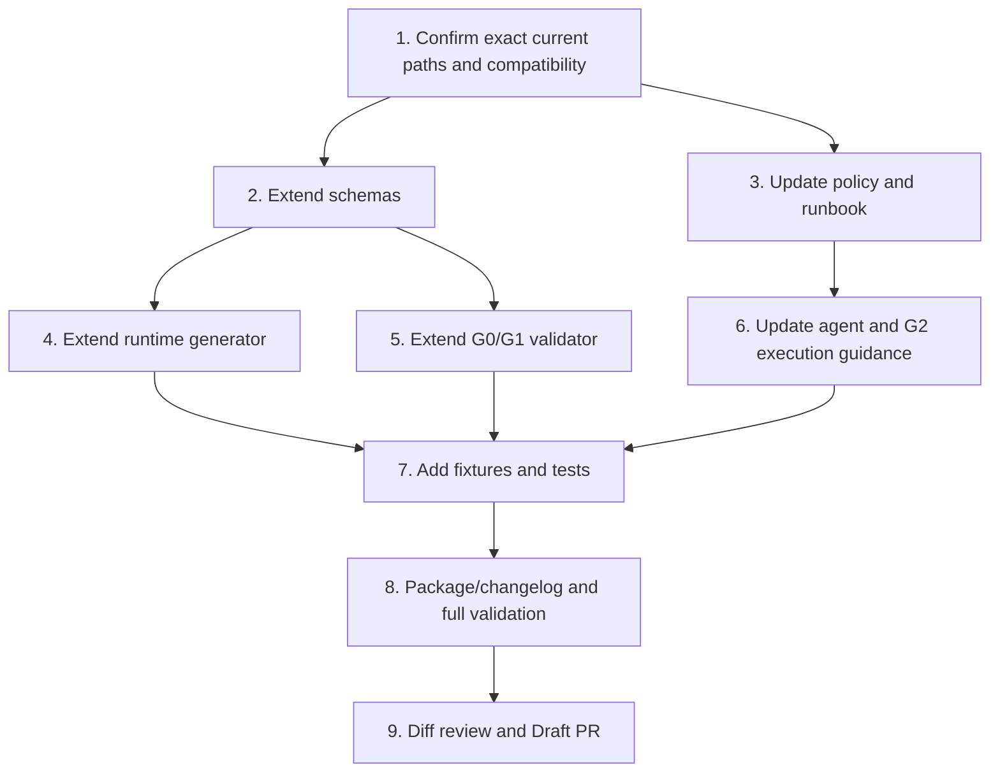

# Implementation Plan

## Overview

Implement the SCRUM-89 handoff in dependency order, keeping current G0/G1 compatibility and adding fail-closed enforcement for new plan-aware artifacts. All repository writes require the SCRUM-89 G2 envelope and must occur on `feat/scrum-89-g1-plan-handoff` or a governance-approved equivalent branch.

## Task Dependency Graph

## Tasks

- [ ] 1. Re-read protected-base implementation targets and freeze file scope
  - Verify `main` still equals the G1 base SHA.
  - Re-read schemas, generator, validator, templates, package and tests before editing.
  - Confirm whether a canonical G2 envelope schema/validator has been added since G1; adapt without duplicating it.
  - Record any scope delta and stop on material drift.
  - Requirements: 2, 5, 6.

- [ ] 2. Extend G0/G1 planning evidence schemas
  - Add observed plan-routing input to `schemas/g01-runtime-input.schema.json`.
  - Add structured implementation-plan evidence to `schemas/g1-preflight-report.schema.json`.
  - Add immutable selected-plan reference to `schemas/g1-decision-record.schema.json`.
  - Update relevant templates if present.
  - Preserve explicit legacy compatibility; reject partial new-format artifacts.
  - Requirements: 1, 2, 3, 4, 6.

- [ ] 3. Clarify canonical policy and operational routing
  - Update `core/KIRO_SPEC_DRIVEN_DELIVERY_RULE_v1.0.md` with applicability, discovery, Task Me-first-when-applicable and Kiro fallback rules.
  - Update `core/runbooks/GATE_G0_G1_OPERATIONAL_RUNBOOK_v1.0.md` with plan discovery/validation and G1→G2 handoff steps.
  - Avoid duplicating full templates; link to canonical schema fields.
  - Requirements: 1, 2, 3, 4, 5.

- [ ] 4. Extend deterministic G0/G1 runtime generation
  - Update `tools/generate_g01_runtime.py` to consume observed planning evidence.
  - Generate plan applicability, discovery and selected-route evidence without performing external Task Me or repository writes.
  - Include route continuation and fallback evidence.
  - Requirements: 1, 2, 3, 4.

- [ ] 5. Add fail-closed G1 and G2 handoff validation
  - Update `tools/validate_g01.py` to enforce completeness, validation, identity/base binding and preflight/decision consistency.
  - For `--gate G2_EXECUTION`, require a non-empty implementation-plan reference and read receipt in the G2 envelope when applicability is required.
  - Return explicit failure codes for missing, stale, invalid, or mismatched evidence.
  - Requirements: 4, 5, 6.

- [ ] 6. Update agent and G2 execution guidance
  - Update `agents/chatgpt-agent/agent-instructions.md` and `agents/dwc/agent-instructions.md` with the routing/read-before-write behavior.
  - Update `libs/g2-skill-library/skills/g2-execution-plan.md` to require the exact plan read receipt before mutation.
  - Update other consumer guidance only where protected-base discovery proves it is the active duplicated instruction surface.
  - Requirements: 3, 4, 5.

- [ ] 7. Add comprehensive tests and fixtures
  - Add a focused test module for plan applicability and handoff.
  - Cover existing-plan reuse, Task Me generation, Kiro fallback, not-applicable, missing plan, invalid plan, stale revision, duplicate/conflicting candidates, base drift and G2 read enforcement.
  - Update existing feasibility and continuation tests where required.
  - Requirements: 1–6.

- [ ] 8. Update package exports, changelog and run validation
  - Export any new reusable schemas/templates/tests required by package rules.
  - Update package version only according to current repository convention.
  - Add changelog evidence.
  - Run YAML/JSON parse checks, focused unit tests, `python tools/validate_instructions.py`, package build, full relevant test suite and `git diff --check`.
  - Requirements: 6.

- [ ] 9. Perform full diff review and assemble G3 Draft PR
  - Verify changed paths match the G2 envelope and this plan.
  - Check no secrets, accidental deletion, generated noise, weakened tests or authority expansion.
  - Record exact head SHA, plan revision, validation results and known limitations.
  - Create or update a Draft PR only after G2 completion and valid G3 evidence.
  - Requirements: 4, 5, 6.

## Notes

- Task Me was applicable for SCRUM-89 because codebase impact, schema changes, dependency ordering and test targeting were required. The current connected runtime did not expose a Task Me action, so this Kiro Spec is the governed fallback.
- The G1 packet for SCRUM-89 uses current legal schema fields to reference this plan; the implementation adds the requested structured `implementation_plan` block for future tasks.
- No merge, deploy, release, production configuration, credential, migration or production-data action is included.
