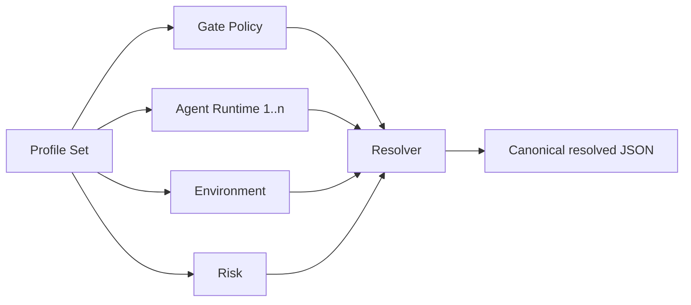

# Design Document

## Overview

Extend the existing protected-base project profile mechanism with typed composition rather than replacing it. `projects/gwc/project-profile.yaml` remains the active project identity; `governance/profile-sets/gwc-standard.yaml` selects reusable runtime policy components.

## Architecture

## Components and Interfaces

- `profile-set.schema.json`: strict composition contract with safe relative references.
- `gate-policy-profile.schema.json`: strict standard G0-G6 authority contract.
- `resolve_profiles.py`: library and CLI resolver; no network or repository writes.
- `validate_profile_set.py`: compact PASS/FAIL validation CLI.
- `gate-response-trace.schema.json`: exact required trace labels.
- `validate_gate_response_trace.py`: schema and chronology validator.
- `gate-response.template.md`: human and machine-readable response shape.

## Data Models

A profile reference is `{id, path}`. A resolved entry contains `profile_type`, `profile_id`, `path`, and parsed `content`. Canonical order is gate policy, agent runtimes sorted by ID, environment, then risk.

## Correctness Properties

1. A path cannot be absolute, traverse parents, use backslashes, or escape repository root.
2. Every reference ID and path is unique within its type-composed set.
3. Actual `profile_type`, `profile_id`, and active status match the reference.
4. Gate policy validates against its strict schema.
5. Resolution is all-or-nothing and deterministic.
6. Gate trace end time is never earlier than start time.

## Error Handling

All resolver or validator failures return exit code `1`, emit a bounded error, and produce no partially successful profile artifact. Configuration and parsing failures are treated as validation failure.

## Testing Strategy

Unit tests cover canonical order, missing references, duplicate references, wrong profile type, valid traces, empty/duplicate skills, non-UTC timestamps, and reversed chronology. Repository validators and package validation remain the integration boundary.

## Implementation Constraints

- Reuse PyYAML and jsonschema already present in `requirements.txt`.
- No new dependency, network call, protected-branch write, merge, deployment, or production operation.
- Preserve current G3 Ready-for-review and G4 merge separation.
