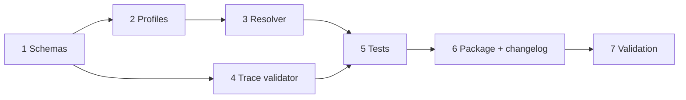

# Implementation Plan

## Overview

Implement typed profile composition and gate response traceability as a bounded extension of current GWC governance assets.

## Task Dependency Graph

## Tasks

- [x] 1. Define strict profile-set, gate-policy, and gate-response-trace schemas. Requirements: 1, 3, 4.
- [x] 2. Add standard profile set and typed gate, agent, environment, and risk profiles. Requirements: 1, 3.
- [x] 3. Implement deterministic fail-closed resolver and profile-set validator. Requirement: 2.
- [x] 4. Add response template and trace chronology validator. Requirement: 4.
- [x] 5. Add focused resolver and trace regression tests. Requirement: 5.
- [x] 6. Update GWC package distribution and changelog. Requirement: 5.
- [ ] 7. Run full repository validation, inspect complete diff, and capture exact-head CI evidence. Requirements: 2, 4, 5.

## Notes

- Task 7 remains open until branch validation and CI evidence exist.
- Merge, deployment, production configuration, credentials, migrations, and production data are out of scope.
