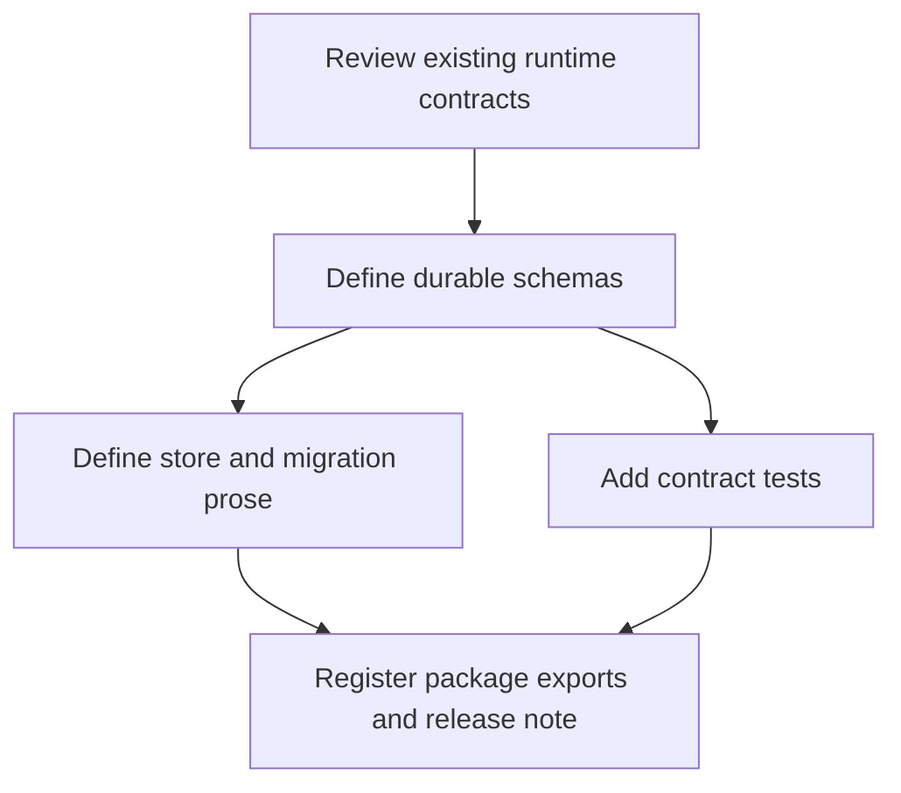

# Implementation Plan

## Overview

Implement SCRUM-105 as a contract-only vertical slice. The first tasks define
the durable models and prose invariants; tests and package registration close
the traceability loop. No task executes a storage migration or runtime node.

## Task Dependency Graph

## Tasks

- [ ] T1 (REQ-1..REQ-5): Re-read existing runtime kernel, event, checkpoint,
  transition, node-pack, registry, and package contracts; record compatibility
  decisions in the durable-store contract.
- [ ] T2 (REQ-1): Add provider-neutral durable run and append-only event schemas
  with exact identity, sequence, causal, actor, gate, and version fields.
- [ ] T3 (REQ-2): Add durable checkpoint schema and document CAS, lease,
  fencing, suspend, resume, and stale-worker rejection semantics.
- [ ] T4 (REQ-3..REQ-4): Add pending-action and node adapter request/result
  schemas, including stable idempotency, unknown-result, readback, capability,
  and typed failure rules.
- [ ] T5 (REQ-5): Add storage migration schema and document SQLite pilot to
  PostgreSQL/Supabase phases, verification, rollback, and explicit non-authority
  boundaries.
- [ ] T6 (REQ-6): Add valid/rejection fixtures and targeted cross-contract
  tests; run schema, runtime, and package validators.
- [ ] T7 (REQ-6): Register only the approved schemas, contract document,
  validator/test entry, and release fragment in the package manifest; review the
  complete diff for scope drift.

## Notes

- Source: `generated_kiro` fallback because the configured `projects/task-me`
  submodule is not initialized and no installed canonical Task Me entrypoint is
  available in this workspace.
- Protected base for this plan: `nhatnguyenquang1838-coder/gwc` `main` at
  `76644885f4b25cb49a2a34bfea0e2ede941caa01`.
- G4 merge, G5 deploy/release, G6 production data/configuration/credentials,
  and all live database migrations are excluded.
