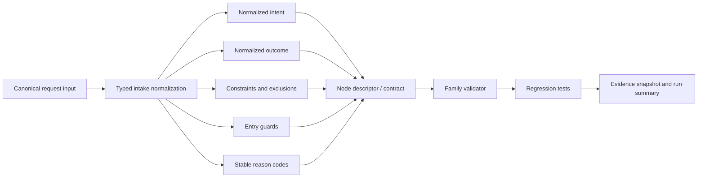

# Design Document

## Overview

Implement the SCRUM-175 typed intake contract in place. Reuse the existing `intake_context` node family, its validator, and its regression tests instead of introducing a new family or a broader workflow surface.

The change path is:

```text
canonical request
  -> typed intake normalization
  -> stable reason code assignment
  -> family validator enforcement
  -> regression tests and evidence snapshot
```

## Architecture



## Components and Interfaces

### 1. Node contract surface

Primary file:

- `core/node-architect/node-catalog/intake_context/request-intake.node.json`

This file currently declares a compact workflow node. The typed-intake contract should extend that node in place and keep the existing family identity, `canonical` classification, and `G0_CONTEXT` gate.

Expected contract additions:

- normalized intent;
- normalized outcome;
- constraints;
- exclusions;
- entry guards;
- stable reason codes;
- deterministic normalization metadata when needed for auditability.

### 2. Family validator

Primary file:

- `tools/node_architect/validate_node_catalog_intake_context.py`

The validator already enforces:

- exactly nine family nodes;
- `G0_CONTEXT` only;
- read-only or none authority;
- no extra node drift.

It should be extended so typed-intake fields are validated rather than rejected, while preserving fail-closed behavior for malformed, ambiguous, or out-of-scope input.

### 3. Regression tests

Primary file:

- `tests/test_node_catalog_intake_context.py`

The test suite should cover:

- canonical typed normalization;
- deterministic re-normalization of equivalent input;
- malformed input rejection;
- ambiguity rejection;
- authority and gate drift rejection;
- current family count validation.

### 4. Family documentation

Primary file:

- `core/node-architect/node-catalog/intake_context/README.md`

The README already states that `request-intake` normalizes a user request into a bounded intake fact set. It should be updated only as needed to reflect the typed contract, not rewritten into a different family design.

### 5. Registry coherence

Related files:

- `core/node-architect/runtime-graph-registry.json`
- `core/node-architect/node-registry.json`

These registries already contain `intake_context.request-intake`. If the descriptor changes materially, the registry entries must remain coherent with the family contract and provenance.

## Data Models

### NormalizedIntake

```yaml
NormalizedIntake:
  intent: string
  outcome: string
  constraints: [string]
  exclusions: [string]
  entry_guards: [string]
  reason_codes: [string]
  source_fingerprint: string
  normalized_at: string
```

### ValidationResult

```yaml
ValidationResult:
  accepted: boolean
  reason_code: string | null
  normalized_intake: NormalizedIntake | null
```

## Correctness Properties

1. **Determinism:** Equivalent inputs normalize to the same typed intake record.
2. **Fail-closed behavior:** Ambiguous or malformed input is rejected, not guessed.
3. **Stable diagnostics:** Reason codes are repeatable and machine-readable.
4. **Authority preservation:** The node remains G0-only and read-only.
5. **Family coherence:** The nine-node `intake_context` family still validates as a whole.

## Error Handling

- Malformed input: reject with a stable reason code.
- Ambiguous scope or intent: reject with a stable reason code.
- Missing guard or insufficient context: reject with a stable reason code.
- Authority or gate drift: reject at family validation time.
- Evidence gap: keep the task blocked until the source state can be audited.

## Testing Strategy

- Positive-case normalization test for the canonical request shape.
- Idempotence test for repeated equivalent requests.
- Malformed-input tests for missing or invalid fields.
- Ambiguity tests for conflicting intent or exclusions.
- Validator regression test for gate and authority drift.
- Family-size regression test to keep the current nine-node boundary intact.

## Implementation Constraints

- Protected base: `main@d4b62295a6d36badca23e9254997e040b0ee19cf`.
- Scope is limited to the existing `intake_context` family.
- Do not create a parallel node family.
- Do not widen gate authority beyond `G0_CONTEXT`.
- Do not add production runtime behavior, deployment logic, migration logic, credentials, or external task-system writes.
- Jira issue `SCRUM-175` is traceability only.

