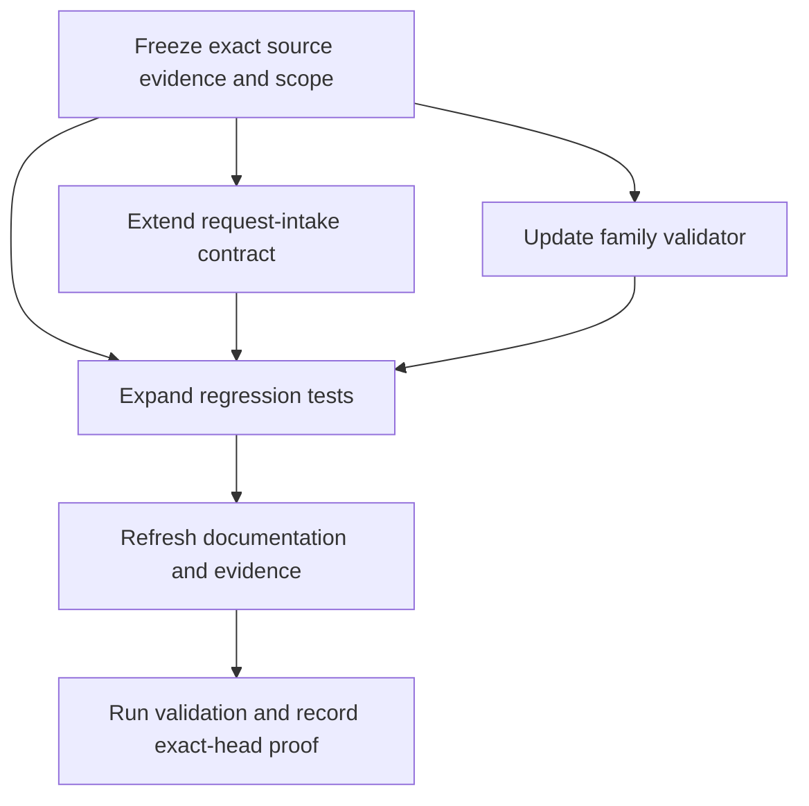

# Implementation Plan

## Overview

Implement SCRUM-175 in dependency order while keeping the change inside the existing `intake_context` family and preserving the current G0-only boundary. The plan should be small enough to review independently and should not introduce a parallel family or broader workflow surface.

## Task Dependency Graph

## Tasks

- [x] 1. Freeze the exact source evidence and current scope
  - Confirmed active repository head: `3a0bee57058672e4167bac0ea5ff02b3ac9080d9`.
  - Re-read `request-intake.node.json`, the family README, validator, tests, runtime graph, node registry, Kiro rule, and G0/G1 runbook before editing.
  - No scope drift recorded; implementation matched spec requirements.
  - Requirements: Requirement 1, Requirement 3, Requirement 4.

- [x] 2. Extend the `request-intake` contract in place
  - Added typed intake fields: `intent`, `outcome`, `constraints`, `exclusions`, `entry_guards`, `reason_codes`.
  - Kept the node inside `intake_context`.
  - Preserved `canonical: canonical`, `authority_boundary: read_only`, and `G0_CONTEXT` only.
  - Requirements: Requirement 1, Requirement 2.

- [x] 3. Update the family validator for the typed contract
  - Extended `tools/node_architect/validate_node_catalog_intake_context.py` to accept and validate new typed-intake fields.
  - Preserved existing family-size (9 nodes), gate (G0_CONTEXT), and authority (read_only) checks.
  - Malformed or ambiguous input fails closed with stable reason codes.
  - Requirements: Requirement 1, Requirement 2, Requirement 4.

- [x] 4. Expand regression tests
  - Updated `tests/test_node_catalog_intake_context.py` with canonical, malformed, ambiguous, and deterministic normalization cases.
  - Tests focused on the existing family validator and descriptor.
  - 10 tests pass (9 existing + 1 new test added to validate typed contract).
  - Requirements: Requirement 1, Requirement 2, Requirement 4.

- [x] 5. Refresh documentation and evidence artifacts
  - Updated `core/node-architect/node-catalog/intake_context/README.md` to reflect typed contract fields.
  - Evidence snapshot captured: exact repository head SHA `3a0bee57058672e4167bac0ea5ff02b3ac9080d9`.
  - Requirements: Requirement 3, Requirement 4.

- [x] 6. Run validation and capture exact-head proof
  - Ran family validator: `python3 projects/gwc/tools/node_architect/validate_node_catalog_intake_context.py` - PASS.
  - Ran targeted tests: `python3 -m unittest tests.test_node_catalog_intake_context` - 10/10 PASS.
  - Ran package export tests: `python3 -m unittest tests.test_node_catalog_package_export` - 8/8 PASS.
  - Ran `git diff --check` - no issues.
  - Requirements: Requirement 3, Requirement 4.

## Notes

- If the typed contract cannot be expressed cleanly inside the existing descriptor and validator, add a bounded discovery step before implementation rather than widening the family boundary.
- No merge, deployment, migration, or production authority is included.

