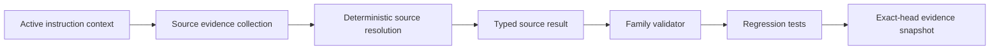

# Design Document

## Overview

Implement SCRUM-176 by extending the existing `intake_context.source-resolution`
descriptor in place. The goal is to turn source selection into a typed,
provenance-backed read-only boundary that deterministically resolves REPO,
PACKAGE, or MIXED source authority while preserving the current 9-node family
and `G0_CONTEXT` gate.

The path is:

```text
active instruction context
  -> source evidence collection
  -> deterministic source-mode resolution
  -> typed provenance result
  -> family validator enforcement
  -> regression tests and exact-head evidence
```

## Architecture



## Components and Interfaces

### 1. Source-resolution node contract

Primary file:

- `core/node-architect/node-catalog/intake_context/source-resolution.node.json`

This node currently only declares a workflow title and description. The typed
contract should extend the descriptor in place and keep the existing family
identity, `canonical` classification, `read_only` boundary, and `G0_CONTEXT`
gate.

Expected additions:

- resolved source mode (`REPO`, `PACKAGE`, `MIXED`);
- source authority classification;
- provenance evidence summary;
- stable reason codes for ambiguous or malformed input;
- deterministic normalization metadata when needed for auditability.

### 2. Family README and node catalog coherence

Primary file:

- `core/node-architect/node-catalog/intake_context/README.md`

The family README already lists `source-resolution` as the node that resolves
`REPO / PACKAGE / MIXED` source instruction. It should be updated only if the
typed contract requires extra user-facing detail or validation notes.

Related files to keep coherent if the descriptor changes materially:

- `core/node-architect/runtime-graph-registry.json`
- `core/node-architect/node-registry.json`

### 3. Family validator

Primary file:

- `tools/node_architect/validate_node_catalog_intake_context.py`

The validator already enforces:

- exactly nine family nodes;
- `G0_CONTEXT` only;
- read-only or none authority;
- no extra node drift.

It should be extended so typed source-resolution fields are validated rather
than rejected, while preserving fail-closed behavior for ambiguous or malformed
source evidence.

### 4. Regression tests

Primary file:

- `tests/test_node_catalog_intake_context.py`

The test suite should cover:

- repository-only resolution;
- package-only resolution;
- mixed-source resolution;
- ambiguous-source rejection;
- malformed evidence rejection;
- provenance evidence retention;
- current family count validation.

## Data Models

### SourceResolutionRecord

```yaml
SourceResolutionRecord:
  source_mode: REPO | PACKAGE | MIXED
  source_authority: string
  provenance_evidence: [string]
  reason_codes: [string]
  normalized_input: string
  evidence_fingerprint: string
  resolved_at: string
```

### SourceResolutionValidationResult

```yaml
SourceResolutionValidationResult:
  accepted: boolean
  reason_code: string | null
  typed_result: SourceResolutionRecord | null
```

## Correctness Properties

1. **Determinism:** Equivalent source contexts normalize to the same typed
   result.
2. **Fail-closed behavior:** Ambiguous or malformed source evidence is rejected,
   not guessed.
3. **Stable diagnostics:** Reason codes are repeatable and machine-readable.
4. **Authority preservation:** The node remains `G0_CONTEXT` only and read-only.
5. **Family coherence:** The 9-node `intake_context` family still validates as a
   whole.

## Error Handling

- Repository/package ambiguity: reject with a stable reason code.
- Missing provenance evidence: reject with a stable reason code.
- Invalid source-mode token: reject with a stable reason code.
- Authority or gate drift: reject at family validation time.
- Evidence gap: keep the task blocked until the source state can be audited.

## Testing Strategy

- Positive-case repository-only source resolution.
- Positive-case package-only source resolution.
- Positive-case mixed-source resolution.
- Negative tests for ambiguous source authority.
- Negative tests for malformed or incomplete provenance evidence.
- Validator regression test for gate and authority drift.
- Family-size regression test to keep the current nine-node boundary intact.

## Implementation Constraints

- Protected base: `main@5aea52a73cfcee02576766db4adf290a94212157`.
- Scope is limited to the existing `intake_context` family.
- Do not create a parallel node family.
- Do not widen gate authority beyond `G0_CONTEXT`.
- Do not add production runtime behavior, deployment logic, migration logic,
  credentials, or external task-system writes.
- Jira issue `SCRUM-176` is traceability only.
