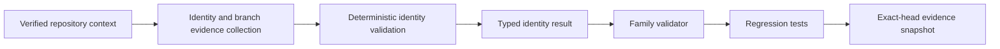

# Design Document

## Overview

Implement SCRUM-177 by extending the existing `intake_context.repo-identity-check`
descriptor in place. The goal is to turn repository identity into a typed,
evidence-backed read-only boundary that deterministically validates repository
identity, default branch, protected branch, and execution-mode assumptions while
preserving the current 9-node family and `G0_CONTEXT` gate.

The path is:

```text
verified repository context
  -> identity and branch evidence collection
  -> deterministic identity validation
  -> typed mismatch result
  -> family validator enforcement
  -> regression tests and exact-head evidence
```

## Architecture



## Components and Interfaces

### 1. Repo-identity node contract

Primary file:

- `core/node-architect/node-catalog/intake_context/repo-identity-check.node.json`

This node currently only declares a workflow title and description. The typed
contract should extend the descriptor in place and keep the existing family
identity, `canonical` classification, `read_only` boundary, and `G0_CONTEXT`
gate.

Expected additions:

- verified repository identity;
- default branch;
- protected branch;
- execution mode;
- stable reason codes for mismatch or ambiguity;
- deterministic normalization metadata when needed for auditability.

### 2. Family README and node catalog coherence

Primary file:

- `core/node-architect/node-catalog/intake_context/README.md`

The family README already lists `repo-identity-check` as the node that verifies
repository identity, default branch, protected branch, and execution mode
assumptions. It should be updated only if the typed contract requires extra
user-facing detail or validation notes.

Related files to keep coherent if the descriptor changes materially:

- `core/node-architect/runtime-graph-registry.json`
- `core/node-architect/node-registry.json`

### 3. Family validator

Primary file:

- `tools/node_architect/validate_node_catalog_intake_context.py`

The validator already enforces:

- exactly nine family nodes;
- `G0_CONTEXT` only;
- read-only or none authority;
- no extra node drift.

It should be extended so typed repo-identity fields are validated rather than
rejected, while preserving fail-closed behavior for mismatch or incomplete
identity evidence.

### 4. Regression tests

Primary file:

- `tests/test_node_catalog_intake_context.py`

The test suite should cover:

- repository identity acceptance;
- default-branch mismatch;
- protected-branch mismatch;
- execution-mode mismatch;
- malformed evidence rejection;
- evidence retention;
- current family count validation.

## Data Models

### RepoIdentityRecord

```yaml
RepoIdentityRecord:
  repository_identity: string
  default_branch: string
  protected_branch: string
  execution_mode: string
  reason_codes: [string]
  normalized_input: string
  evidence_fingerprint: string
  resolved_at: string
```

### RepoIdentityValidationResult

```yaml
RepoIdentityValidationResult:
  accepted: boolean
  reason_code: string | null
  typed_result: RepoIdentityRecord | null
```

## Correctness Properties

1. **Determinism:** Equivalent repository contexts normalize to the same typed
   result.
2. **Fail-closed behavior:** Mismatched or incomplete identity evidence is
   rejected, not guessed.
3. **Stable diagnostics:** Reason codes are repeatable and machine-readable.
4. **Authority preservation:** The node remains `G0_CONTEXT` only and read-only.
5. **Family coherence:** The 9-node `intake_context` family still validates as a
   whole.

## Error Handling

- Repository mismatch: reject with a stable reason code.
- Default-branch mismatch: reject with a stable reason code.
- Protected-branch mismatch: reject with a stable reason code.
- Execution-mode mismatch: reject with a stable reason code.
- Authority or gate drift: reject at family validation time.
- Evidence gap: keep the task blocked until the source state can be audited.

## Testing Strategy

- Positive-case repository identity acceptance.
- Negative tests for repository identity mismatch.
- Negative tests for default-branch mismatch.
- Negative tests for protected-branch mismatch.
- Negative tests for execution-mode mismatch.
- Negative tests for malformed or incomplete evidence.
- Validator regression test for gate and authority drift.
- Family-size regression test to keep the current nine-node boundary intact.

## Implementation Constraints

- Protected base: `main@5aea52a73cfcee02576766db4adf290a94212157`.
- Scope is limited to the existing `intake_context` family.
- Do not create a parallel node family.
- Do not widen gate authority beyond `G0_CONTEXT`.
- Do not add production runtime behavior, deployment logic, migration logic,
  credentials, or external task-system writes.
- Jira issue `SCRUM-177` is traceability only.
