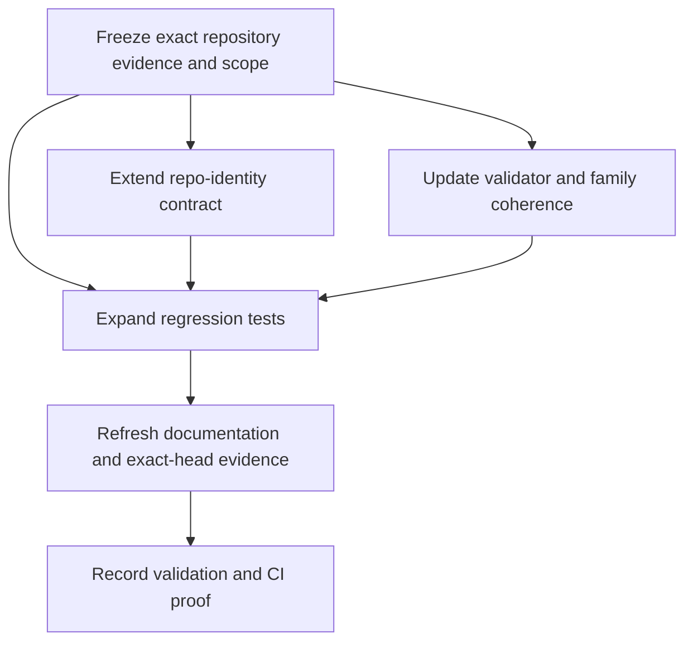

# Implementation Plan

## Overview

Implement SCRUM-177 in dependency order while keeping the change inside the
existing `intake_context` family and preserving the current G0-only boundary.
The plan should be small enough to review independently and should not
introduce a parallel family or broader workflow surface.

## Task Dependency Graph

## Tasks

- [ ] 1. Freeze the exact repository evidence and current scope
  - Confirm the active repository head and parent context for `SCRUM-177`.
  - Re-read `repo-identity-check.node.json`, the family README, validator,
    tests, runtime graph, node registry, and the current GWC maturity task
    before editing.
  - Record the scope as `intake_context.repo-identity-check`, not the entire
    family.
  - Requirements: Requirement 1, Requirement 3, Requirement 4.

- [ ] 2. Extend the `repo-identity-check` contract in place
  - Add typed repository-identity, default-branch, protected-branch,
    execution-mode, and reason-code fields to
    `core/node-architect/node-catalog/intake_context/repo-identity-check.node.json`.
  - Keep the node inside `intake_context`.
  - Preserve `canonical: canonical`, `authority_boundary: read_only`, and
    `G0_CONTEXT` only.
  - Requirements: Requirement 1, Requirement 2, Requirement 3.

- [ ] 3. Update the family validator and coherence checks
  - Extend `tools/node_architect/validate_node_catalog_intake_context.py` to
    accept the typed repo-identity contract.
  - Preserve the existing family-size, gate, and authority checks.
  - Keep runtime-graph and registry references coherent if the descriptor
    changes materially.
  - Requirements: Requirement 2, Requirement 3, Requirement 4.

- [ ] 4. Expand regression tests
  - Update `tests/test_node_catalog_intake_context.py` with repository mismatch,
    default-branch mismatch, protected-branch mismatch, execution-mode
    mismatch, malformed-input, and evidence-retention cases.
  - Keep the tests focused on the existing family validator and descriptor.
  - Requirements: Requirement 1, Requirement 2, Requirement 4.

- [ ] 5. Refresh documentation and exact-head evidence artifacts
  - Update `core/node-architect/node-catalog/intake_context/README.md` only as
    needed to explain the typed repo-identity contract.
  - Capture the exact repository head SHA and the evidence snapshot used to
    derive the spec.
  - Requirements: Requirement 4.

- [ ] 6. Run validation and record exact-head proof
  - Run the family validator against the updated node catalog.
  - Run the focused unittest coverage for the `intake_context` family.
  - Record the exact-head CI PASS evidence for the same repository state used to
    derive the spec.
  - Requirements: Requirement 4.

## Notes

- If the typed contract cannot be expressed cleanly inside the existing
  descriptor and validator, add a bounded discovery step before implementation
  rather than widening the family boundary.
- No merge, deployment, migration, or production authority is included.
