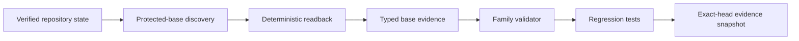

# Design Document

## Overview

Implement SCRUM-178 by extending the existing
`intake_context.protected-base-capture` descriptor in place. The goal is to
turn protected-base capture into a typed, immutable, evidence-backed read-only
boundary that deterministically records the exact protected-base SHA, verifies
it by readback, and rejects stale or drifted evidence while preserving the
current 9-node family and `G0_CONTEXT` gate.

The path is:

```text
verified repository state
  -> protected-base discovery
  -> deterministic readback
  -> typed base evidence
  -> family validator enforcement
  -> regression tests and exact-head evidence
```

## Architecture



## Components and Interfaces

### 1. Protected-base node contract

Primary file:

- `core/node-architect/node-catalog/intake_context/protected-base-capture.node.json`

This node currently only declares a workflow title and description. The typed
contract should extend the descriptor in place and keep the existing family
identity, `canonical` classification, `read_only` boundary, and `G0_CONTEXT`
gate.

Expected additions:

- protected-base SHA;
- evidence source;
- readback status;
- drift state;
- stable reason codes for stale or mismatched evidence;
- deterministic normalization metadata when needed for auditability.

### 2. Family README and node catalog coherence

Primary file:

- `core/node-architect/node-catalog/intake_context/README.md`

The family README already lists `protected-base-capture` as the node that
captures the exact protected-base SHA for later evidence. It should be updated
only if the typed contract requires extra user-facing detail or validation
notes.

Related files to keep coherent if the descriptor changes materially:

- `core/node-architect/runtime-graph-registry.json`
- `core/node-architect/node-registry.json`

### 3. Family validator

Primary file:

- `tools/node_architect/validate_node_catalog_intake_context.py`

The validator already enforces:

- exactly nine family nodes;
- `G0_CONTEXT` only;
- read-only or none authority;
- no extra node drift.

It should be extended so typed protected-base fields are validated rather than
rejected, while preserving fail-closed behavior for stale or drifted base
evidence.

### 4. Regression tests

Primary file:

- `tests/test_node_catalog_intake_context.py`

The test suite should cover:

- exact protected-base readback;
- drift detection;
- schema rejection;
- stale-base rejection;
- malformed evidence rejection;
- evidence retention;
- current family count validation.

## Data Models

### ProtectedBaseRecord

```yaml
ProtectedBaseRecord:
  protected_base_sha: string
  evidence_source: string
  readback_status: VERIFIED | MISMATCH | STALE | UNKNOWN
  drift_state: NONE | STALE | DRIFTED
  reason_codes: [string]
  normalized_input: string
  evidence_fingerprint: string
  captured_at: string
```

### ProtectedBaseValidationResult

```yaml
ProtectedBaseValidationResult:
  accepted: boolean
  reason_code: string | null
  typed_result: ProtectedBaseRecord | null
```

## Correctness Properties

1. **Determinism:** Equivalent repository contexts normalize to the same typed
   base evidence.
2. **Fail-closed behavior:** Stale or mismatched protected-base evidence is
   rejected, not guessed.
3. **Stable diagnostics:** Reason codes are repeatable and machine-readable.
4. **Authority preservation:** The node remains `G0_CONTEXT` only and read-only.
5. **Family coherence:** The 9-node `intake_context` family still validates as a
   whole.

## Error Handling

- Stale protected base: reject with a stable reason code.
- Readback mismatch: reject with a stable reason code.
- Drifted evidence: reject with a stable reason code.
- Schema mismatch: reject with a stable reason code.
- Authority or gate drift: reject at family validation time.
- Evidence gap: keep the task blocked until the source state can be audited.

## Testing Strategy

- Positive-case exact protected-base readback.
- Negative tests for drift detection.
- Negative tests for schema rejection.
- Negative tests for stale-base rejection.
- Negative tests for malformed or incomplete evidence.
- Validator regression test for gate and authority drift.
- Family-size regression test to keep the current nine-node boundary intact.

## Implementation Constraints

- Protected base: `main@5aea52a73cfcee02576766db4adf290a94212157`.
- Scope is limited to the existing `intake_context` family.
- Do not create a parallel node family.
- Do not widen gate authority beyond `G0_CONTEXT`.
- Do not add production runtime behavior, deployment logic, migration logic,
  credentials, or external task-system writes.
- Jira issue `SCRUM-178` is traceability only.
