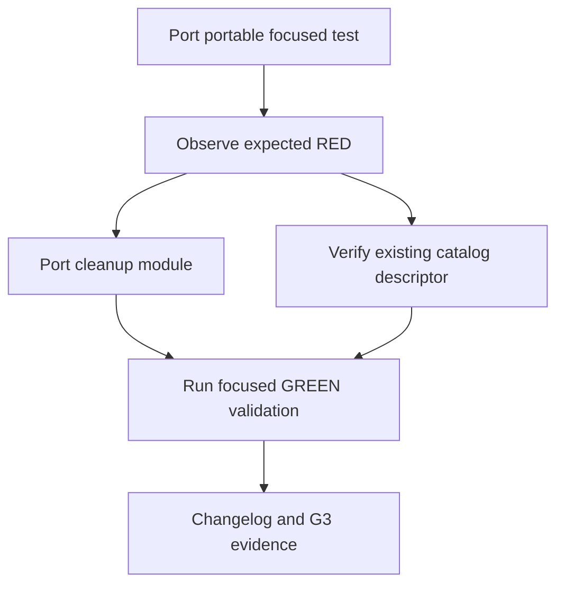

# Implementation Plan

## Overview

This plan ports the PR #195 module/test candidate onto the current protected base with a test-first portability repair, while validating the existing canonical runtime-checkpoint catalog descriptor as a no-change prerequisite.

## Task Dependency Graph

## Tasks

- [ ] **T1 — Port portable focused tests (R1-R4):** Add the 13 focused tests first; insert the repository `tools` path before import and import `node_architect` directly to avoid host `tools` shadowing.
- [ ] **T2 — Verify RED (R1-R4):** Run the focused test before adding the module and confirm it fails specifically because `checkpoint_expiry_cleanup` is absent.
- [ ] **T3 — Port cleanup primitive (R1-R3):** Add `checkpoint_expiry_cleanup.py`, reusing canonical digest conventions and preserving local-only behavior.
- [ ] **T4 — Verify canonical descriptor (R5):** Verify the pre-existing `core/node-architect/node-catalog/runtime_checkpoint/checkpoint-expiry-cleanup.node.json` is byte-identical to PR #195 and metadata-only; do not modify it or wire orchestration.
- [ ] **T5 — Verify GREEN (R1-R5):** Run direct-file and discovery focused tests under Python 3.11; validate catalog metadata and repository instruction checks; record diff/head evidence.
- [ ] **T6 — Changelog and G3 delivery (governance):** Add the scoped changelog. Only after G2 PASS, create a Draft PR and delivery record bound to exact code head, validation, CI, and fresh independent review.

## Notes

This is a proposal artifact only. Completion of planning does not authorize repository changes, Draft PR creation, merge, release, deployment, or production operations.
