# Design Document

## Overview

The change extends the current Gate–Node Runtime Binding vertical slice rather than replacing it. Route selection remains in `resolve_gate_node_route.py`; new instruction validation becomes a mandatory pre-execution stage; a shared ledger writes canonical evidence for every selected node.

## Architecture

```mermaid
flowchart LR
    A[Gate authority verified] --> B[Route resolver]
    B --> C[Descriptor and registry checks]
    C --> D[Node instruction validator]
    D --> E[Implementation and maturity checks]
    E --> F[Node evidence ledger: node-start]
    F --> G[Node implementation]
    G --> H[decision/result/readback/checkpoint/events]
    H --> I[Next-route validation]
    I --> J[Next node/action or exact next gate]
```



Workflow mode is an input to the same runtime. It may adjust validation depth or continuation, but `mode_policy.runtime_required` remains true for normal, fastlane, e2e, hotfix, and rescue.

## Components and Interfaces

### Existing mechanisms retained

- `GATE_NODE_RUNTIME_BINDING_CONTRACT_v1.0.md`: authority/execution plane separation.
- `gate-node-route-profile.json`: deterministic G2 route selection.
- `node-registry.json` and node descriptors: identity, maturity, and gate binding.
- `resolve_gate_node_route.py`: fail-closed route resolver.
- `checkpoint_store.py` and `runtime-event.schema.json`: digest and checkpoint primitives.

### New or extended components

1. `NODE_INSTRUCTION_CONTRACT_v1.0.md` defines semantics, stable errors, evidence paths, and mode invariant.
2. `node-instruction.schema.json` validates the 14 mandatory fields and authority denials.
3. Four explicit instruction cards cover the current executable G2 repository-write route.
4. `validate_node_instruction.py` validates each route-selected node against registry, descriptor, route, gate, evidence/log contracts, next mappings, and mode policy.
5. `node_evidence_ledger.py` emits deterministic task/run/node records and JSONL runtime events using existing digest conventions.
6. `resolve_gate_node_route.py` loads and validates the card before returning `ROUTE_SELECTED`; it returns stable failure codes otherwise.

## Data Models

### Node instruction card

A YAML object with the required fields from SCRUM-263. `next` contains outcome keys (`pass`, `blocked`, `pending`, `retry`) whose values declare exactly one or more of `next_node`, `next_action`, or `next_gate` plus a reason.

### Runtime evidence path

```text
.gwc/tasks/<task-id>/node-runtime/<run-id>/<node-id>/node-start.json
.gwc/tasks/<task-id>/node-runtime/<run-id>/<node-id>/node-decision.json
.gwc/tasks/<task-id>/node-runtime/<run-id>/<node-id>/node-result.json
.gwc/tasks/<task-id>/node-runtime/<run-id>/<node-id>/node-readback.json
.gwc/tasks/<task-id>/node-runtime/<run-id>/<node-id>/checkpoint.json
.gwc/tasks/<task-id>/node-runtime/<run-id>/runtime-events.jsonl
.gwc/tasks/<task-id>/node-runtime/<run-id>/<node-id>/next-route-decision.json
```

Every record binds task ID, run ID, node ID, repository, branch, base/head SHA, scope hash, graph/profile revision where applicable, timestamp, and digest.

## Correctness Properties

1. **MODE_DOES_NOT_BYPASS_NODE_RUNTIME**: supported workflow modes cannot disable route, instruction, evidence, log, or next-route checks.
2. **AUTHORITY_IS_EXTERNAL**: no node instruction, route decision, implementation result, or CI result can set merge/deploy/production authority true.
3. **ROUTE_CARD_IDENTITY_MATCH**: route node ID equals descriptor node ID equals registry ID equals card node ID.
4. **EVIDENCE_BEFORE_EFFECT**: `node-start` and validated evidence/log contracts exist before effectful node execution.
5. **NEXT_ROUTE_TOTALITY**: applicable terminal outcomes have deterministic next handling.
6. **REPLAY_SAFE_LEDGER**: repeated emission with the same idempotency identity either reproduces the same digest or returns a reconciliation conflict; it never silently creates a second effect.

## Error Handling

Stable failures:

- `NODE_INSTRUCTION_MISSING`
- `NODE_INSTRUCTION_INVALID`
- `NODE_EVIDENCE_CONTRACT_MISSING`
- `NODE_LOG_CONTRACT_MISSING`
- `NODE_NEXT_ROUTE_MISSING`
- `MODE_BYPASSES_NODE_RUNTIME`
- `NODE_AUTHORITY_ESCALATION_ATTEMPT`

Existing resolver errors remain compatible and are returned when they occur earlier in the pipeline.

## Testing Strategy

- Schema/validator unit tests for missing fields and cross-source mismatch.
- Authority-negative tests for merge/deploy/production flags.
- Parameterized mode tests for normal, fastlane, e2e, hotfix, and rescue.
- Ledger tests for canonical paths, required records, deterministic digests, JSONL events, replay, and readback.
- End-to-end resolver test for the four-node G2 path ending at `G3_PR` with all authority flags false.
- Full existing Node Architect and governance regression plus instruction validation and compile checks.

## Implementation Constraints

- Preserve protected-main compatibility and current route/profile revision binding.
- Reuse existing digest/checkpoint conventions; do not introduce external dependencies.
- Do not make all 81 catalog slots executable. Nodes outside a validated instruction-backed route remain catalog-only/fail closed.
- Jira, Slack, and Notion remain projection only.
- No PR, merge, deploy, release, production, secret, migration, package/export, force-push, or branch deletion authority is included in G2.
