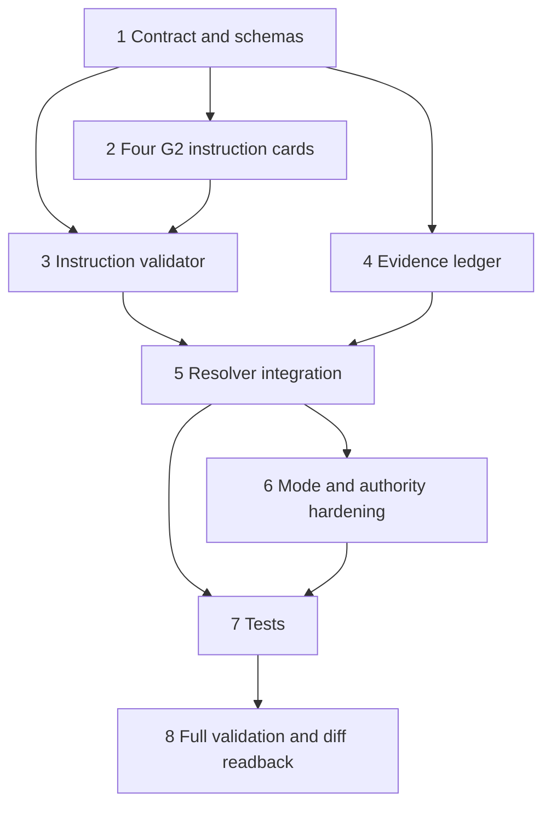

# Implementation Plan

## Overview

Implement the smallest compatible Node Architect maturity increment: define and validate node instruction cards, add a shared evidence ledger, bind both into the existing route resolver, and prove the current G2 repository-write route end-to-end.

## Task Dependency Graph

## Tasks

- [x] 1. Define `NODE_INSTRUCTION_CONTRACT_v1.0.md`, stable failure codes, mode invariant, evidence paths, authority boundary, retry, and rollback semantics. _Requirements: 1, 3, 4, 5, 6, 7, 9_
- [x] 2. Add JSON Schemas for node instruction cards and runtime evidence, then update route profile/decision schemas to carry instruction and validation readback. _Requirements: 1, 2, 3, 4_
- [x] 3. Add explicit instruction cards for gate-state-resolution, scoped-file-write, diff-readback, and gate-transition-decision. _Requirements: 1, 8_
- [x] 4. Implement `validate_node_instruction.py` with registry/descriptor/gate/route/mode/authority/evidence/log/next checks and stable failures. _Requirements: 2, 4, 5, 6_
- [x] 5. Implement `node_evidence_ledger.py` using existing canonical digest/checkpoint conventions and task/run/node scoped paths. _Requirements: 3, 7_
- [x] 6. Integrate instruction validation and ledger prerequisites into `resolve_gate_node_route.py`; preserve existing failure precedence and authority flags. _Requirements: 2, 5, 6, 8_
- [x] 7. Update project runtime instructions and the binding contract without weakening gate authority or projection boundaries. _Requirements: 5, 6, 9_
- [x] 8. Add fail-closed and end-to-end tests covering all ten requested cases, canonical ledger files, replay behavior, and G3 next-gate resolution. _Requirements: 3, 4, 5, 6, 8, 10_
- [x] 9. Run focused tests, available governance regression, schema checks, compileall, complete diff review, and exact-head readback. Repository-wide package/registry validators remain limited by the reduced validator bundle and are recorded separately. _Requirements: 10_
- [ ] 10. Record task-scoped G2/G3 evidence and changelog; stop at the G3 boundary. _Requirements: 8, 9_

## Notes

- The guarded branch is `feature/scrum-263-node-instruction-evidence-ledger` from exact `main@aad17d28be539c88ecef4b9fbaf3eaa08f59461b`.
- Broad 81-node instruction-card rollout is excluded. Current route-backed executable nodes receive explicit cards; unbacked catalog nodes fail closed until separately matured.
- G4 merge, manual G5, and G6 remain exact human-authority boundaries.
