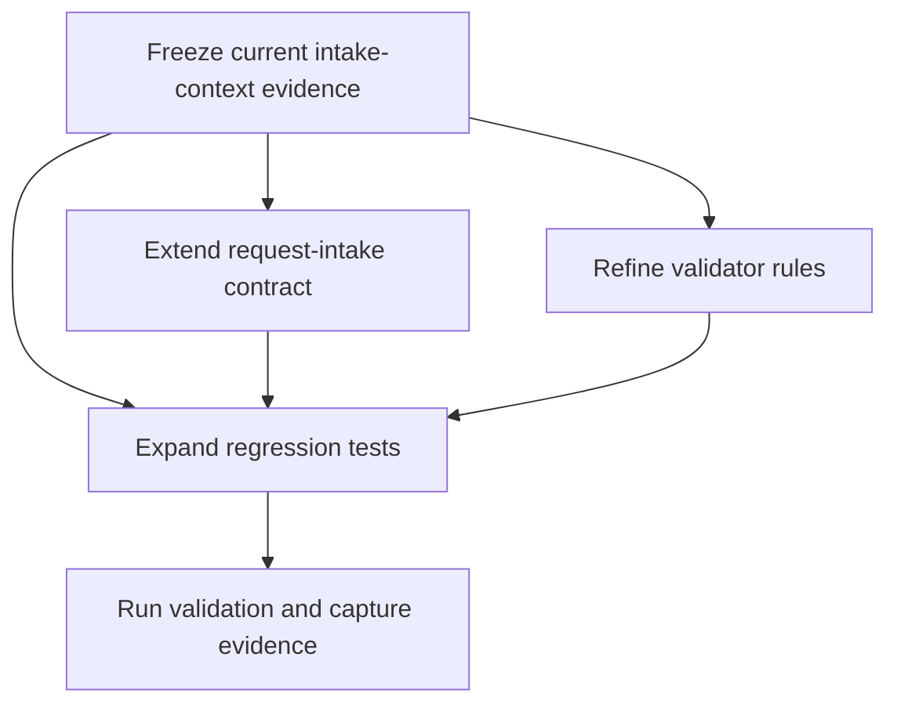

# Implementation Plan

## Overview

Implement the request-intake contract in dependency order, keeping the change inside the existing intake-context family and preserving the current G0-only boundary.

## Task Dependency Graph

## Tasks

- [ ] 1. Re-freeze the exact repository head and intake-context evidence
  - Confirm the task still targets the current `main` base SHA.
  - Re-read the node descriptor, family README, validator, tests, runtime graph, node registry, and governing Kiro/runbook docs before editing.
  - Record any scope drift in the task evidence before writing source changes.
  - Requirements: S175-REQ-1, S175-REQ-4.

- [ ] 2. Extend the `request-intake` node contract
  - Add machine-readable intake fields to `core/node-architect/node-catalog/intake_context/request-intake.node.json`.
  - Keep the node in the `intake_context` family, keep `canonical: canonical`, keep `authority_boundary: read_only`, and keep `G0_CONTEXT` only.
  - Preserve the existing node identity and registration semantics.
  - Requirements: S175-REQ-1, S175-REQ-2.

- [ ] 3. Update the family validator to enforce the richer contract
  - Extend `tools/node_architect/validate_node_catalog_intake_context.py` so the new machine-readable fields are validated instead of rejected.
  - Preserve the existing family-size, gate, and authority checks.
  - Add malformed-input and ambiguity failure paths with stable reason codes.
  - Requirements: S175-REQ-1, S175-REQ-2, S175-REQ-4.

- [ ] 4. Expand tests for deterministic normalization and failure cases
  - Update `tests/test_node_catalog_intake_context.py` with canonical, malformed, and ambiguous request fixtures.
  - Prove deterministic normalization and stable reason-code behavior.
  - Keep the tests focused on the existing family validator and descriptor, not a parallel subsystem.
  - Requirements: S175-REQ-1, S175-REQ-2.

- [ ] 5. Refresh family documentation and evidence
  - Update `core/node-architect/node-catalog/intake_context/README.md` if the new contract wording needs to be reflected.
  - Refresh the task-me evidence files and run summary to capture the exact source set, impact, and validation plan.
  - Requirements: S175-REQ-3, S175-REQ-4.

- [ ] 6. Validate the final head and capture exact evidence
  - Run the family validator and unit tests.
  - Run `git diff --check` and record the exact head SHA used for validation.
  - Mark exact-head CI evidence as required before closing the task, but do not claim it until it exists.
  - Requirements: S175-REQ-3, S175-REQ-4.

## Notes

- The task should stay inside the existing `intake_context` family.
- A new helper or schema file is only justified if the current validator/test surface cannot express the typed intake contract cleanly.
- No merge, deployment, migration, or production authority is included.
