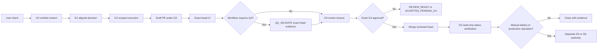

# GWC Project Overview

**Audience:** Technical leaders, delivery teams, platform engineers, reviewers,
and governance stakeholders  
**Status:** Active repository overview  
**Evidence baseline:** `main@16f64a88e0a5a7fc811e32e3acd06cda1301c50c`  
**Last reviewed:** 2026-07-20

## Purpose

GWC turns repository change from an unstructured activity into a governed,
verifiable sequence. It binds intent, evidence, repository state, execution
scope, validation, review, and high-authority actions to explicit artifacts and
gates.

GWC is not a replacement for project requirements, tests, CI, QA, code review,
or human authority. It coordinates those mechanisms and prevents evidence from
one stage being reused as permission for another.

## Operating model



`QA_VALIDATE` is a Pilot or project workflow stage inside the G3 evidence path,
not a new canonical GWC gate. The canonical lifecycle remains
`G0 → G1 → G2 → G3 → G4 → G5 → G6`.

### Authority boundaries

- G0 and G1 establish evidence; they do not grant repository mutation.
- G2 grants only the actions and files listed in the active envelope.
- G3 produces delivery and review evidence for one exact branch head SHA.
- Project QA may be required before G3 can reach review-ready or `PASS`.
- QA `PASS`, CI `PASS`, `REVIEW_READY`, and `ACCEPTED_PENDING_G4` do not grant
  merge, auto-merge, deployment, release, or production authority.
- G4 is a separate exact human merge decision.
- Read-only post-merge G5 status verification is automatic.
- Manual deploy, redeploy, release, publish, or runtime reload requires separate
  G5 authority.
- G6 is generated only when production data, configuration, migrations,
  credentials, or secrets are actually in scope.

### QA evidence freshness invariant

A QA `PASS` without validated, current, exact-head evidence is invalid.

For a workflow that requires QA, G3 cannot reach review-ready or `PASS` unless:

1. the QA payload is schema-valid;
2. the QA agent is the active lease owner and has the required role/capability;
3. repository, PR, scope, and head SHA match the active work binding;
4. required CI has passed for the same head;
5. stale, malformed, secret-bearing, or scope-violating evidence is rejected;
6. the accepted evidence and validation result are preserved in the audit trail.

Any new head SHA invalidates earlier head-bound CI, QA, and reviewer evidence and
requires fresh validation for that head.

## Current capabilities

| Capability | Current state |
|---|---|
| Protected-base boot and instruction precedence | Active |
| Task-scoped G0 context artifacts | Active |
| G1 intake, preflight, options, explicit decision, deterministic validator | Active |
| Capability-aware `chat_connector_only`, `local_agent`, and `repo_ci` modes | Active |
| Guarded branch execution with explicit Files WRITE | Active |
| Draft PR delivery with exact-head evidence | Active |
| Independent read-only G3 review and review closure | Active |
| Automatic Draft → Ready metadata transition after valid G3, when supported | Active contract behavior |
| Exact G4 human-approved merge execution, when connector capability is available | Active contract behavior |
| Automatic read-only G5 status verification after merge | Active contract behavior |
| Structured connector trace contract | Contract defined; backend adoption must be verified separately |
| Context7-first skill resolution with pinned offline fallback | Available in scoped skill-library workflows |

The repository contract describes permitted behavior. Live connector/runtime
capability must still be verified before claiming an operation was performed.

## Current limitations

| Limitation | Operational response |
|---|---|
| Connector or runtime may not expose every declared capability | Use the next verified connector route or stop at the actual authority/capability boundary |
| Connector-fetched validation can be blocked by transport or local DNS | Materialize exact-ref artifacts when possible; preserve limitation; require repository-native CI before completion |
| DS Admin task state can become stale if callbacks are missed | Use legal State Engine transitions and disclose late reconciliation |
| Generated artifacts can drift from sources | Update source first and regenerate through the verified generator |
| Review evidence becomes stale after any new head SHA | Re-run validation, required QA, and independent review for the new head |
| Planning documents can look like completed implementation | Separate `proposal`, `in progress`, and `evidence verified` status explicitly |

## Protected-base drift

Pilot work applies [`docs/base-drift-policy.md`](docs/base-drift-policy.md):

| Drift decision | Required response |
|---|---|
| `SAFE_CONTINUE` | Record old/new base, changed files, overlap, and decision; continue only when scope and authority remain unchanged |
| `REVALIDATE` | Recreate the execution head from the new base when required and rerun affected validation, CI, QA, and G3 review |
| `REAPPROVE` | Refresh G0/G1, scope hash, work binding, and G2 authority; invalidate downstream head-bound evidence |
| `STOP` | Stop execution and obtain a new scope/authority package; do not reuse prior approval or production-sensitive evidence |

Conversation memory, a similarly named task, or a previously completed component
is not protected-base evidence and cannot change Pilot status.

## Current priorities

1. **Documentation integrity** — keep README, overview, plans, package, and current
   gate behavior synchronized with protected `main`.
2. **Runtime observability** — verify connector trace adoption and avoid
   speculative failure attribution.
3. **Operational lifecycle quality** — reduce stale task state, improve callback
   reliability, and preserve auditable transitions.
4. **Pilot evidence before scale** — execute the distributed multi-agent Pilot
   success and failure-recovery runs before starting end-state rollout.
5. **Existing before new** — reuse, extend, or refactor current GWC/DS MCP
   mechanisms before introducing another orchestrator, state engine, or generic
   write service.

## Roadmap principles

The roadmap does **not** include automatic merge without human G4 authority.
Automation should prepare evidence, remove mechanical friction, and execute only
within an exact active authority boundary.

```text
Near term
→ improve documentation, traceability, validation recovery, and connector evidence
→ execute bounded multi-agent Pilot with exact-SHA QA evidence
→ close Pilot with GO / GO_WITH_CONDITIONS / NO_GO

Later, only after Pilot evidence
→ versioned workflow templates
→ validated project adapters
→ stronger role and evidence registries
→ operational SLOs and recovery
→ separately authorized G4/G5/G6 executors
```

## Success measures

- No protected-branch direct write.
- No repository mutation outside the active task and file scope.
- No stale base, CI, QA, review, or head-SHA evidence accepted.
- No CI/QA/reviewer result interpreted as merge or deployment authority.
- Every high-authority action is bound to an exact target, scope, actor, and
  expiry.
- Operators can identify the current task, gate, owner, blocker, evidence, and
  next legal action.
- Pilot preflight addresses the observed naming, workspace, validation,
  traceability, approval, and gate-reporting failure patterns.

## Related documents

- [`README.md`](README.md)
- [`AGENTS.md`](AGENTS.md)
- [`core/GATE_LIFECYCLE_CONTRACT_v1.0.md`](core/GATE_LIFECYCLE_CONTRACT_v1.0.md)
- [`core/E2E_DRAFT_PR_DELIVERY_RULE.md`](core/E2E_DRAFT_PR_DELIVERY_RULE.md)
- [`docs/base-drift-policy.md`](docs/base-drift-policy.md)
- [`docs/gaps/g0-g1-naming-location-convention-gaps.md`](docs/gaps/g0-g1-naming-location-convention-gaps.md)
- [`docs/plan/distributed-multi-agent-sdlc/README.md`](docs/plan/distributed-multi-agent-sdlc/README.md)
