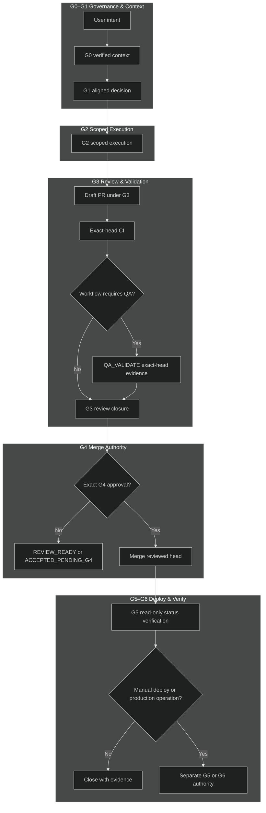

# GWC Project Overview

**Audience:** Technical leaders, delivery teams, platform engineers, reviewers,
and governance stakeholders  
**Status:** Active repository overview  
**Evidence baseline:** `main@16f64a88e0a5a7fc811e32e3acd06cda1301c50c`  
**Last reviewed:** 2026-07-20

gates.
## Purpose

GWC turns repository change from an unstructured activity into a governed,
verifiable sequence. It binds intent, evidence, repository state, execution
scope, validation, review, and high-authority actions to explicit artifacts and
gates.

## Agent‑to‑Agent Task Handover

### Overview
The GWC project now supports a formal, documented task handover capability that allows an authorized agent to transfer the ownership of an active task to another authorized agent.

### How It Works
1. **Ownership Transfer** – The source agent records the handover event, capturing both source and target agent identifiers.
2. **Context Preservation** – The handover event includes the repository, task ID, base SHA, and any other execution context required for the receiving agent to resume work.
3. **State‑Engine Enforcement** – The DS Admin State Engine validates that the source agent holds a valid claim and that the target agent is eligible to receive the task.
4. **Audit Trail** – Immutable log entries are created for each handover event, ensuring traceability.

This design respects GWC governance policies and does not grant merge, deploy, or production authority.

GWC is not a replacement for project requirements, tests, CI, QA, code review,
or human authority. It coordinates those mechanisms and prevents evidence from
one stage being reused as permission for another.

## Operating model



`QA_VALIDATE` is a Pilot or project workflow stage inside the G3 evidence path,
not a new canonical GWC gate. The canonical lifecycle remains
`G0 → G1 → G2 → G3 → G4 → G5 → G6`.

### Authority boundaries

- G0 and G1 establish evidence; they do not grant repository mutation.
- G2 grants only the actions and files listed in the active envelope.
- G3 produces delivery and review evidence for one exact branch head SHA.
- Project QA may be required before G3 can reach review-ready or `PASS`.
- QA `PASS`, CI `PASS`, `REVIEW_READY`, and `ACCEPTED_PENDING_G4` do not grant
  merge, auto-merge, deployment, release, or production authority.
- G4 is a separate exact human merge decision.
- Read-only post-merge G5 status verification is automatic.
- Manual deploy, redeploy, release, publish, or runtime reload requires separate
  G5 authority.
- G6 is generated only when production data, configuration, migrations,
  credentials, or secrets are actually in scope.

### QA evidence freshness invariant

A QA `PASS` without validated, current, exact-head evidence is invalid.

For a workflow that requires QA, G3 cannot reach review-ready or `PASS` unless:

1. the QA payload is schema-valid;
2. the QA agent is the active lease owner and has the required role/capability;
3. repository, PR, scope, and head SHA match the active work binding;
4. required CI has passed for the same head;
5. stale, malformed, secret-bearing, or scope-violating evidence is rejected;
6. the accepted evidence and validation result are preserved in the audit trail.

Any new head SHA invalidates earlier head-bound CI, QA, and reviewer evidence and
requires fresh validation for that head.

## Skill library resolution

Each GWC gate resolves its skill bundle using a common pattern that favors verified live guidance before falling back to pinned offline artifacts. All gates follow the same resolution order, retry policy, and bundle-atomic rule documented below.

### Resolution order (all gates)

```text
1. Query Context7 with library ID /obra/superpowers for latest compatible guidance.
2. Confirm the complete gate-compatible bundle is present.
3. If Context7 is forbidden, unavailable, timeout, empty, incomplete, or incompatible,
   load the offline pinned library for that gate.
4. Verify every offline file against the gate library manifest.yaml.
5. If neither source is valid, stop with the gate-specific SKILL_SOURCE_BLOCKED code.
```

### Retry policy

- `forbidden` or hard `unavailable`: fallback immediately to offline pinned.
- `timeout`: retry once, then fallback.
- `empty_result`, `incomplete_bundle`, or `incompatible_bundle`: retry once with deeper research when available, then fallback.
- Never exceed two live queries per gate run.

### Bundle-atomic rule

A gate run uses exactly one source mode:

```text
CONTEXT7_LIVE    — all skills resolved from Context7
   or
OFFLINE_PINNED   — all skills resolved from the local libs/ manifest
```

Live and offline skill cards must never be mixed in a single gate run. Record `source_mix: NONE`.

### Gate-specific skill bundles

Each gate requires a specific set of compatible skills. The bundle is complete only when all required skills for that gate are present from the same source.

| Gate   | Library path                | Required skills                                                                                                             | Optional skills               |
| ------ | --------------------------- | --------------------------------------------------------------------------------------------------------------------------- | ----------------------------- |
| **G0** | `libs/g0-g1-skill-library/` | `g0-context-loading`                                                                                                        | —                             |
| **G1** | `libs/g0-g1-skill-library/` | `g1-intake-options-preflight`, `g1-decision-record`, `g0-g1-approval-envelope`                                              | —                             |
| **G2** | `libs/g2-skill-library/`    | `g2-execution-plan`, `g2-approval-envelope`, `g2-repository-interaction` + domain-specific (e.g. `g2-react-vite-*`)         | —                             |
| **G3** | `libs/g3-skill-library/`    | `requesting-code-review`, `receiving-code-review`, `verification-before-completion`, `finishing-development-branch-pr-only` | `dispatching-parallel-review` |

### G0 skill calling pattern

G0 loads the `g0-context-loading` skill to activate or reconstruct project context. The skill:

1. Resolves exactly one active project profile.
2. Verifies repository identity and protected-base SHA.
3. Resolves applicable governance sources and their hashes.
4. Verifies connector identity and write-enabled declaration.
5. Classifies evidence as `OBSERVED`, `REPOSITORY_DECLARED`, `USER_PROVIDED`, `INFERRED`, `MISSING`, or `UNVERIFIED`.
6. Produces a G0 context snapshot.
7. Hands verified context to G1.

Evidence markers: `G0_PROJECT_RESOLVED`, `G0_REPOSITORY_VERIFIED`, `G0_SOURCES_READY`, `G0_RUNTIME_CONTEXT_READY`, `G0_CONTEXTUAL_DISCOVERY_COMPLETE` (or their `_BLOCKED` variants).

Stop conditions include ambiguous project identity, missing governance sources, stale evidence, or requests for later-phase authority.

### G1 skill calling pattern

G1 loads three skills sequentially from the same source (Context7 or `libs/g0-g1-skill-library/`):

1. **`g1-intake-options-preflight`** — Builds intake from the user request (problem, scope, stakeholders, acceptance criteria), inspects existing mechanisms before proposing changes, brainstorms at least two viable options, and runs preflight reasoning against the verified G0 context.

2. **`g1-decision-record`** — Consumes the completed intake, options, and preflight; captures the selected option, rationale, scope hash, authority boundaries, acceptance criteria refs, and G2 handoff candidate. Requires explicit user decision.

3. **`g0-g1-approval-envelope`** — Prepares the approval envelope with scope hash, expiry (≤ 24 h), authorized/excluded actions, and formats the exact `APPROVE` command string. Does not grant the approved actions — the envelope is a request for human authority only.

All three skills must resolve from the same source and manifest. G1 never grants G2 execution, G3 PR authority, G4 merge, G5 deploy, or G6 production authority.

Output markers: `G1_INTAKE_READY`, `G1_OPTIONS_READY`, `G1_DECISION_ACCEPTED_FOR_G2_PLANNING`, `G2_EXECUTION_NOT_GRANTED`.

### G2 skill calling pattern

G2 resolves its skill bundle from Context7 or `libs/g2-skill-library/`. The bundle is complete only when all required skills are present from the same source. G2 operates as a transactional sequence — each action is atomic, verified against the G1 approval envelope before execution, and never performed in batch.

1. **`g2-execution-plan`** — Converts the G1 decision into a machine-readable, step-by-step transactional sequence. The blueprint follows five ordered steps:
   - **Identify Target** — Locate file paths and line ranges affected by the G1 approval hash.
   - **Generate Delta** — Compute the required diff between approved intent and current base SHA.
   - **Apply Change** — Apply the patch/diff to a new, isolated working tree branch.
   - **Validate Action** — Run local checks against `g2-repository-interaction` constraints (scope, path, action type).
   - **Finalize Transaction** — Create a commit object mapped to the G2 execution record.

2. **`g2-repository-interaction`** — Acts as an immutable constraint layer that maps all proposed actions against the G1 approval envelope boundaries. Allowed actions are restricted to:
   - `Add/Modify File` — Only within paths and line ranges approved in G1.
   - `Commit` — Single, logical, atomic commit representing the culmination of G2 work.
   - `Create Branch/Worktree` — Initiated from a known, valid base SHA (G0 verification).
   - `Push/Update Ref` — Authorized only as the final step of G2, transitioning to a guarded state ready for G3 review.

   Hard exclusions (immediate failure and G2 rollback): direct write to protected branches, squashing/rewriting shared history (`git reset --hard`, `amend`), changing target base branch/SHA after G1 approval, merging, or tagging releases.

3. **`g2-approval-envelope`** — Captures the culmination of all successful G2 execution steps into a reviewable, auditable package. The envelope contains:
   - G0/G1 provenance linking back to the G1 approval hash.
   - Execution log — timeline of all successful low-level transactions.
   - Head SHA — the unique SHA of the resulting branch tip (the artifact submitted for G3 review).
   - Diff artifact — complete machine-generated diff between base SHA and current HEAD SHA.
   - Validation receipt — proof that isolation checks passed (no accidental deletion, no secrets introduced).

   **Transition rule:** G2 execution is complete and ready for G3 handover only when this envelope exists, is schema-valid, and has been checked into the repository. G2 cannot proceed to G3 until the envelope is present, validated against G1 intent, and signed off as complete.

4. **Domain-specific skills** (e.g. `g2-react-vite-component-structure`, `g2-react-vite-state-management`, `g2-react-vite-performance`, `g2-react-vite-testing`) — Provide technology-specific implementation guidance within the G2 execution boundary. These are loaded from the same source bundle and follow the same atomic execution model.

All G2 skills must resolve from the same source and manifest. G2 never grants G3 PR authority, G4 merge, G5 deploy, or G6 production authority.

Output markers: `G2_EXECUTION_COMPLETE`, `G2_ENVELOPE_VALIDATED`, `G3_ELIGIBLE_TO_START`, `G2_ACTION_NOT_AUTHORIZED` (on constraint violation).

### G3 skill calling pattern

G3 resolves its skill bundle from Context7 or `libs/g3-skill-library/`. The bundle is complete only when all four required skills are present:

1. **`requesting-code-review`** — Builds a read-only review request for the exact current PR head SHA. Includes task ID, base SHA, head SHA, scope hash, changed paths, requirements, validation evidence, CI evidence, acceptance criteria, and GWC review lanes (requirement, design, code, test, governance, delivery, CI). Reviewer verdict uses `BLOCKER`, `MAJOR`, `MINOR`, or `NIT`.

2. **`receiving-code-review`** — Verifies each review finding against the actual diff, requirements, tests, and governance. `BLOCKER` prevents G3 PASS; `MAJOR` must be fixed or covered by exact-head human risk acceptance; `MINOR` may be fixed or deferred with traceability; `NIT` is recorded as non-blocking.

3. **`verification-before-completion`** — Before claiming G3 PASS, verifies fresh evidence for the exact current head SHA: validator output, CI conclusion, review verdict, acceptance criteria, finding closure, and delivery record validation. Any new commit invalidates prior evidence and requires re-run of all checks.

4. **`finishing-development-branch-pr-only`** — Limited to verifying guarded branch identity, protected base, current head SHA, changed paths, Draft PR metadata, and delivery evidence. Must not merge, enable auto-merge, mark ready for review, force-push, rewrite history, change PR base, deploy, or publish.

The optional `dispatching-parallel-review` skill is used only when review lanes are independent and each reviewer acts on the same immutable evidence package.

G3 never grants merge, auto-merge, deploy, release, or production authority.

## Current capabilities

| Capability                                                                      | Current state                                                  |
| ------------------------------------------------------------------------------- | -------------------------------------------------------------- |
| Protected-base boot and instruction precedence                                  | Active                                                         |
| Task-scoped G0 context artifacts                                                | Active                                                         |
| G1 intake, preflight, options, explicit decision, deterministic validator       | Active                                                         |
| Capability-aware `chat_connector_only`, `local_agent`, and `repo_ci` modes      | Active                                                         |
| Guarded branch execution with explicit Files WRITE                              | Active                                                         |
| Draft PR delivery with exact-head evidence                                      | Active                                                         |
| Independent read-only G3 review and review closure                              | Active                                                         |
| Automatic Draft → Ready metadata transition after valid G3, when supported      | Active contract behavior                                       |
| Exact G4 human-approved merge execution, when connector capability is available | Active contract behavior                                       |
| Automatic read-only G5 status verification after merge                          | Active contract behavior                                       |
| Structured connector trace contract                                             | Contract defined; backend adoption must be verified separately |
| Context7-first skill resolution with pinned offline fallback                    | Available in scoped skill-library workflows                    |

The repository contract describes permitted behavior. Live connector/runtime
capability must still be verified before claiming an operation was performed.

## Current limitations

| Limitation                                                            | Operational response                                                                                               |
| --------------------------------------------------------------------- | ------------------------------------------------------------------------------------------------------------------ |
| Connector or runtime may not expose every declared capability         | Use the next verified connector route or stop at the actual authority/capability boundary                          |
| Connector-fetched validation can be blocked by transport or local DNS | Materialize exact-ref artifacts when possible; preserve limitation; require repository-native CI before completion |
| DS Admin task state can become stale if callbacks are missed          | Use legal State Engine transitions and disclose late reconciliation                                                |
| Generated artifacts can drift from sources                            | Update source first and regenerate through the verified generator                                                  |
| Review evidence becomes stale after any new head SHA                  | Re-run validation, required QA, and independent review for the new head                                            |
| Planning documents can look like completed implementation             | Separate `proposal`, `in progress`, and `evidence verified` status explicitly                                      |

## Protected-base drift

Pilot work applies [`docs/base-drift-policy.md`](docs/base-drift-policy.md):

| Drift decision  | Required response                                                                                                     |
| --------------- | --------------------------------------------------------------------------------------------------------------------- |
| `SAFE_CONTINUE` | Record old/new base, changed files, overlap, and decision; continue only when scope and authority remain unchanged    |
| `REVALIDATE`    | Recreate the execution head from the new base when required and rerun affected validation, CI, QA, and G3 review      |
| `REAPPROVE`     | Refresh G0/G1, scope hash, work binding, and G2 authority; invalidate downstream head-bound evidence                  |
| `STOP`          | Stop execution and obtain a new scope/authority package; do not reuse prior approval or production-sensitive evidence |

Conversation memory, a similarly named task, or a previously completed component
is not protected-base evidence and cannot change Pilot status.

## Current priorities

1. **Documentation integrity** — keep README, overview, plans, package, and current
   gate behavior synchronized with protected `main`.
2. **Runtime observability** — verify connector trace adoption and avoid
   speculative failure attribution.
3. **Operational lifecycle quality** — reduce stale task state, improve callback
   reliability, and preserve auditable transitions.
4. **Pilot evidence before scale** — execute the distributed multi-agent Pilot
   success and failure-recovery runs before starting end-state rollout.
5. **Existing before new** — reuse, extend, or refactor current GWC/DS MCP
   mechanisms before introducing another orchestrator, state engine, or generic
   write service.

## Roadmap principles

The roadmap does **not** include automatic merge without human G4 authority.
Automation should prepare evidence, remove mechanical friction, and execute only
within an exact active authority boundary.

```text
Near term
→ improve documentation, traceability, validation recovery, and connector evidence
→ execute bounded multi-agent Pilot with exact-SHA QA evidence
→ close Pilot with GO / GO_WITH_CONDITIONS / NO_GO

Later, only after Pilot evidence
→ versioned workflow templates
→ validated project adapters
→ stronger role and evidence registries
→ operational SLOs and recovery
→ separately authorized G4/G5/G6 executors
```

## Success measures

- No protected-branch direct write.
- No repository mutation outside the active task and file scope.
- No stale base, CI, QA, review, or head-SHA evidence accepted.
- No CI/QA/reviewer result interpreted as merge or deployment authority.
- Every high-authority action is bound to an exact target, scope, actor, and
  expiry.
- Operators can identify the current task, gate, owner, blocker, evidence, and
  next legal action.
- Pilot preflight addresses the observed naming, workspace, validation,
  traceability, approval, and gate-reporting failure patterns.

## Related documents

- [`README.md`](README.md)
- [`AGENTS.md`](AGENTS.md)
- [`core/GATE_LIFECYCLE_CONTRACT_v1.0.md`](core/GATE_LIFECYCLE_CONTRACT_v1.0.md)
- [`core/E2E_DRAFT_PR_DELIVERY_RULE.md`](core/E2E_DRAFT_PR_DELIVERY_RULE.md)
- [`docs/base-drift-policy.md`](docs/base-drift-policy.md)
- [`docs/gaps/g0-g1-naming-location-convention-gaps.md`](docs/gaps/g0-g1-naming-location-convention-gaps.md)
- [`docs/plan/distributed-multi-agent-sdlc/README.md`](docs/plan/distributed-multi-agent-sdlc/README.md)
