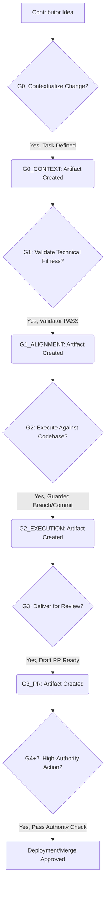
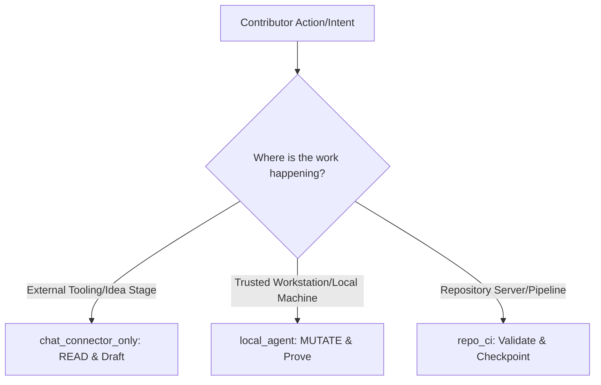

# GWC Project Overview: Establishing a Robust Governance Workflow

**Target Audience:** Stakeholders, Technical Leaders, Compliance/Security Teams
**Document Status:** Finalized Draft – Ready for Advisor Review

---

## Section I: Introduction and Conceptual Overview
### The Governance Workflow (GWC): Ensuring High-Assurance Contributions

**1.1 The Challenge: Uncontrolled Velocity $\rightarrow$ Enterprise Risk**

In modern, high-velocity development environments, the ability to integrate external contributions rapidly introduces critical points of friction and risk. Without stringent control, code contribution becomes an unstructured exchange susceptible to accidental breaches, security vulnerabilities, and compliance gaps.

**The Goal of GWC is to transform contribution from an *unstructured activity* into a *governed, verifiable process*.**

**1.2 What is GWC? (The Core Concept)**

GWC provides a formalized, mandatory lifecycle management system that treats code contribution not as a single event, but as a series of checkpoints. It is the automated compliance layer that guides a feature from an initial idea through rigorous vetting into a deployable, auditable artifact.

### **1.3 The GWC Flow Diagram (Conceptual Model)**

GWC establishes a **State Machine** where the contributor artifact exists in defined states until it achieves validation at each gate. The flow is a structured progression of maturity and authority, enforced by mandatory artifacts.

---

## Section II: Architecture and Operational Mechanics
### The GWC Engine: Translating Intent into Actionable Compliance

The GWC architecture is not a single piece of software; it is an enforced *contract* between the contributor's intent and the repository's compliance requirements. This contract is governed by three primary elements: **Execution Modes, Gate Artifacts, and the Sequence Contract.**

**2.1 The Three Operating Contexts (Execution Modes)**

The system adapts its level of authority based on where the contributor is operating. This prevents unauthorized actions by restricting capabilities until the correct operational context is established.

**2.2 The Gate Artifacts (The Proof)**

A "Gate" is not just a step; it is a requirement for producing and proving specific, schema-validated artifacts.

*   **G0 Context:** Proves *why* we are touching the code (Task ID, Risk Profile, Base SHA).
    *   *(Analogous to: Filling out the "Project Charter".)*
*   **G1 Alignment:** Proves *that* the proposed change is technically sound and compliant (Validator `PASS`, detailed Preflight Report).
    *   *(Analogous to: The Technical Review and Security Vetting.)*
*   **G2 Execution:** Proves *the action itself* (Scoped commits, Guarded Branch/Worktree). This is the first boundary crossing into executable code.
    *   *(Analogous to: The "Engineering Build" phase.)*

**2.3 The Sequence Contract (The Guardrails)**

The GWC mandates a strict, one-way flow. This is the system's fundamental security guarantee against shortcuts.

**Flow:** $\text{G0\_CONTEXT} \rightarrow \text{G1\_ALIGNMENT} \rightarrow \text{G2\_EXECUTION} \rightarrow \text{G3\_PR} \rightarrow \text{[G4/G5/G6...] }$

*   **Implication:** No gate may be skipped. The system does not accept *reasoning* of success; it requires the objective, artifact-backed output (like `tools/validate_g01.py` returning `PASS`) to prove successful transition.
*   **The Role of Gates:** Each gate acts as a mandatory "handshake" between the contributor's intent and the repository's acceptance.

---

## Section III: Current State – Where We Are Today
### Achievements and Proven Capabilities

The current iteration of GWC has successfully moved beyond conceptual design into operational reality. We have proven the core mechanism—the gating process—works as designed, even if we are still optimizing workflows.

**3.1 Core Achieved Milestones (The Wins)**

*   **Artifact Traceability:** We have successfully mandated and enforced the production of auditable artifacts for G0 through G3. The system definitively tracks *why* a change was made and *how* it progressed through the lifecycle.
*   **Risk Isolation:** The mandatory segregation into `chat_connector_only` and `local_agent` modes has proven highly effective in preventing low-authority interactions from translating into high-risk repository mutations.
*   **Strict Sequencing:** The enforcement of the linear $\text{G0} \rightarrow \text{G1} \rightarrow \text{G2}$ sequence has successfully prevented contributor bypass of necessary compliance checks, forcing a high bar for contribution acceptance.
*   **Drafting Pipeline:** The system reliably supports the journey from initial concept to a runnable Draft Pull Request (G3), minimizing wasted effort on unvetted ideas.

**3.2 Limitations & Known Constraints (The Reality Check)**

Transparency on limitations is key to effective advice. These are the friction points we are actively seeking input on:

*   **Human Velocity Bottleneck:** The transition into the G4/G5/G6 stages relies heavily on sequential human approvals, which is a necessary safety control but creates velocity slowdowns.
*   **Contextual Drag:** The required artifact generation process for G1 and G2 can introduce significant cognitive load on contributors if not perfectly aligned with the workflow.
*   **Optimal Tooling Dependency:** The reliability and speed of GWC are tied to the effectiveness of underlying tools. We are seeking advice on enhancing these low-level tools to minimize contributor friction without compromising security.

---

## Section IV: Future Vision and Roadmap
### Scaling Velocity Without Compromising Integrity through Intelligent Augmentation

Our vision for GWC is not merely to enforce boundaries; it is to **automate the friction points** of quality control, leveraging advanced intelligence to bind high-velocity development with maximum safety.

### **4.1 Short-Term Goals (Phase 2: Friction Reduction)**

*   **Goal:** Automating G4 Merge Approval Velocity.
    *   **Action:** Developing mechanisms to allow trusted merges *without* requiring manual sign-off for low-risk, compliant changes.
    *   **Impact:** Translates G3 success into faster integration timelines.
*   **Goal:** Enhancing `chat_connector_only` intelligence.
    *   **Action:** Deepening the context awareness in read-mode to provide more actionable, higher-fidelity feedback loops.
    *   **Impact:** Maximizes the utility of the most restricted mode, turning suggestion into execution plan efficiently.

### **4.2 Long-Term Goals (Phase 3: Predictive Assurance & Acceleration)**

This phase introduces the concept of **AI-Augmented Review**, transforming GWC from a compliance checkpoint into an intelligent pipeline accelerator.

*   **Goal: Implement the Scoring & Review Engine.**
    *   **Action:** Introduce an AI Agent trained on past successful contributions. This engine independently reviews deliverables and assigns a **Risk/Complexity Score**.
    *   **Impact:** This triage mechanism filters the noise, elevating genuinely complex or high-risk items to the decision-maker while automatically signing off on low-risk, simple tasks.
*   **Goal: Smarter Gate Transitions.**
    *   **Action:** The GWC system uses the Scoring Engine's output to guide the human reviewer. Instead of a binary PASS/FAIL, the system presents actionable data: "Low Risk: Auto-Sign-Off Recommended" vs. "High Risk: Manual Deep Dive Required."
    *   **Impact:** The human decision-maker shifts from being a mechanical approver to a strategic oversight body, dramatically accelerating throughput.

### **4.3 The Ideal State (The Vision)**
GWC becomes an invisible, hyper-efficient layer between human intent and machine execution. The combination of the strict GWC contract and the AI Scoring Engine creates a virtuous cycle: rigorous safety for compliance, intelligent augmentation for speed.

---
## Section V: Seeking Guidance and Contributors (Call to Action)
### Our Ask

We are entering a critical phase where the next leap forward requires external expertise. We invite advisors in specific domains to join us:

*   **Compliance & Policy Experts:** To help define the optimal G4/G5/G6 workflows in high-speed scenarios.
*   **ML/AI Specialists:** To accelerate the development of the Scoring and Review Engine (Phase 3).
*   **DevX Engineers:** To ensure that GWC remains a facilitator of flow, not merely a barrier.

**Contact us to explore how your unique expertise can define the next generation of high-assurance development.**