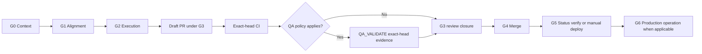

# GWC — Governed Workflow Control

Central Git-based control plane for project instructions, governance policies,
agent contracts, project profiles, gate evidence, release packages, rollout
verification, and rollback evidence.

## Current status

| Item | Current repository state |
|---|---|
| Repository | `nhatnguyenquang1838-coder/gwc` |
| GWC package | `1.13.0` |
| Canonical core policy | Version `1.0` |
| Canonical core SHA-256 | `04cd33bbaff66f44917199e6bbb8355a1e956edb9c474e6c8e664ed8d0ed41c1` |
| Protected branch | `main` |
| Delivery model | Guarded branch → validation → Draft PR → exact-head CI/QA when required → independent review |

Projects pin a package version and source commit. They must not consume an
unqualified `latest` package automatically.

## Core model

```text
GWC repository = governance source of truth
Project repository = pinned consumer
DS Admin task = runtime traceability
Guarded branch = execution boundary
Pull Request = review boundary
Manifest and SHA-256 = integrity boundary
Approval envelope = authority boundary
```

## Gate lifecycle



`QA_VALIDATE` is a project or workflow stage inside the G3 evidence path. It is
not a new canonical GWC gate and does not change the sequence
`G0 → G1 → G2 → G3 → G4 → G5 → G6`.

| Gate | Purpose | Required evidence or authority |
|---|---|---|
| `G0_CONTEXT` | Reconstruct verified context | READY context snapshot, exact repository and base SHA |
| `G1_ALIGNMENT` | Select bounded outcome | Intake, preflight, options, explicit decision, validator `PASS` |
| `G2_EXECUTION` | Perform scoped repository work | Valid execution envelope, exact Files WRITE and allowed actions |
| `G3_PR` | Deliver and review exact branch head | Draft PR, validation, CI, delivery record, independent read-only review; exact-head QA evidence when the active workflow requires QA |
| `G4_MERGE` | Merge reviewed head | Separate exact human approval bound to PR and head SHA |
| `G5_STATUS_VERIFY` | Verify post-merge automation | Automatic read-only verification for the approved merge commit |
| `G5` manual action | Deploy, redeploy, release, publish, or reload runtime | Separate exact human approval for that action |
| `G6_PRODUCTION` | Production data/config/migration/credential operation | Separate exact human approval; otherwise `not_applicable` |

Approval for one gate never grants another gate. CI success, QA `PASS`, and
reviewer `PASS` are evidence only.

### Evidence freshness

For workflows that require QA, a QA `PASS` is invalid unless the evidence is:

- schema-valid and accepted by the active QA evidence validator;
- bound to the current repository, PR, scope, lease owner, and exact head SHA;
- produced after the required CI result for the same head;
- free of unresolved scope, secret, or authority violations.

Any head change invalidates prior head-bound CI, QA, and G3 review evidence.
`REVIEW_READY` or `ACCEPTED_PENDING_G4` means the evidence package is ready for a
separate G4 decision; it does not authorize merge, deployment, or production
operations.

## Execution modes

| Mode | Source of truth | Repository mutation |
|---|---|---|
| `chat_connector_only` | Verified repository connector | Only through verified gate artifacts, envelope, and connector capability |
| `local_agent` | Trusted checkout and isolated worktree | Scoped local Git execution after gate validation |
| `repo_ci` | CI checkout for the exact commit | Validation only; CI does not grant later authority |

Execution mode is selected from verified capabilities, not from the agent product
name.

## Start here

| Need | Document |
|---|---|
| Repository authority and boot sequence | [`AGENTS.md`](AGENTS.md) |
| Runtime behavior | [`core/Agent_Operating_Runtime_Contract_v1.0.md`](core/Agent_Operating_Runtime_Contract_v1.0.md) |
| Coding governance | [`core/Coding_Project_Governance_v1.0.md`](core/Coding_Project_Governance_v1.0.md) |
| Gate lifecycle | [`core/GATE_LIFECYCLE_CONTRACT_v1.0.md`](core/GATE_LIFECYCLE_CONTRACT_v1.0.md) |
| Draft PR delivery | [`core/E2E_DRAFT_PR_DELIVERY_RULE.md`](core/E2E_DRAFT_PR_DELIVERY_RULE.md) |
| G0/G1 operations | [`core/runbooks/GATE_G0_G1_OPERATIONAL_RUNBOOK_v1.0.md`](core/runbooks/GATE_G0_G1_OPERATIONAL_RUNBOOK_v1.0.md) |
| G0/G1 artifact guide | [`docs/g01-lifecycle.md`](docs/g01-lifecycle.md) |
| Base drift decisions | [`docs/base-drift-policy.md`](docs/base-drift-policy.md) |
| Observed G0/G1 failure patterns | [`docs/gaps/g0-g1-naming-location-convention-gaps.md`](docs/gaps/g0-g1-naming-location-convention-gaps.md) |
| GWC project profile | [`projects/gwc/project-profile.yaml`](projects/gwc/project-profile.yaml) |
| GWC package | [`projects/gwc/package.yaml`](projects/gwc/package.yaml) |
| Project overview | [`GWC_Project_Overview.md`](GWC_Project_Overview.md) |
| Distributed multi-agent plan | [`docs/plan/distributed-multi-agent-sdlc/README.md`](docs/plan/distributed-multi-agent-sdlc/README.md) |
| Release history | [`releases/changelog.md`](releases/changelog.md) |

## Quick validation

Install dependencies:

```bash
python -m pip install -r requirements.txt
```

Validate repository instructions and packages:

```bash
python tools/validate_instructions.py
```

Validate a task-scoped G0/G1 workspace:

```bash
python tools/validate_g01.py --workspace .gwc/tasks/<task-id>
```

Validate a G3 delivery record:

```bash
python tools/validate_g3_delivery.py \
  --record .gwc/tasks/<task-id>/g3/delivery-record.yaml \
  --json
```

Run unit tests:

```bash
python -m unittest discover -s tests -p "test_*.py"
```

Build a project package:

```bash
python tools/build_project_package.py <project-id> --output dist
```

## Repository write model

For this repository, verified read-only inspection is automatic. Bounded writes
require one active DS Admin task, task-scoped G0/G1 evidence, an explicit file
scope, a valid execution envelope, a guarded branch, validation, and a Draft PR.

```text
Inspect
→ G0 READY
→ G1 PASS
→ exact G2 authority when required
→ guarded branch execution
→ Draft PR and exact-head CI
→ QA_VALIDATE when the active workflow requires it
→ G3 delivery record and independent review
→ exact G4 approval before merge
```

Do not infer readiness or completion from conversation memory, a similarly named
task, or a previously passing head. Task state and evidence must be resolved from
the protected base, DS Admin, the current branch head, and repository-native
validation.

Direct pushes to protected branches, auto-merge, unapproved merge, deployment,
release, production configuration/data, credentials, migrations, force-push,
branch deletion, and shared-history rewrite remain prohibited or separately
gated.

## Project packages

| Project | Package state | Write enabled |
|---|---|---|
| `gwc` | active | yes |
| `ds-mcp` | active | yes |
| `rental-home` | active | yes |
| `pm-skills` | pending repository assignment | no |

The active project profile and package are authoritative when this summary drifts.

## Release model

- `PATCH`: wording or typo changes that do not alter behavior.
- `MINOR`: additive rule, check, command, capability, or gate behavior.
- `MAJOR`: breaking workflow, authority, schema, or compatibility change.

## No implicit production action

Building or publishing a package, passing CI or QA, completing review, or
creating a Draft PR does not merge a Pull Request, deploy an application, modify
production configuration, rotate credentials, run migrations, or read/write
production data.
