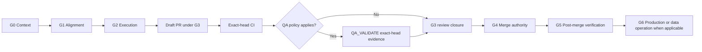

# GWC — Governed Workflow Control

GWC is a Git-based governance and delivery control plane for project instructions, gate policy, authority checks, task evidence, deterministic runtime routing, validation, release packages, projections, and post-merge verification.

## Current status

| Item | Current repository state |
|---|---|
| Repository | `nhatnguyenquang1838-coder/gwc` |
| GWC package | `1.16.0` |
| Package state | `active` |
| Canonical core policy | Version `1.0` |
| Protected branch | `main` |
| Delivery model | Guarded branch → validation → Draft PR → exact-head CI/QA when required → independent review |
| Distribution model | Pinned package version and source commit; no automatic unqualified `latest` consumption |

The protected contract hash is maintained in [`AGENTS.md`](AGENTS.md) and verified by repository validators. Do not copy a hash from this README into an approval or validation decision.

## Authority model

```text
GWC repository       governance source of truth
Project repository   pinned consumer and project evidence
Task workspace       task-scoped G0–G6 artifacts
Runtime state store  deterministic node and transition state
Guarded branch       execution boundary
Pull Request         review boundary
Manifest + SHA-256   integrity boundary
Approval envelope    authority boundary
CI / QA              evidence, not authority
Jira / Notion        planning and management projections
Slack                 communication and visibility only
```

## Gate lifecycle


```mermaid
flowchart LR
  G0[G0 Context] --> G1[G1 Alignment]
  G1 --> G2[G2 Execution]
  G2 --> P[Draft PR under G3]
  P --> CI[Exact-head CI]
  CI --> Q{QA policy applies?}
  Q -- Yes --> QA[QA_VALIDATE exact-head evidence]
  Q -- No --> G3[G3 review closure]
  QA --> G3
  G3 --> G4[G4 Merge authority]
  G4 --> G5[G5 Post-merge verification]
  G5 --> G6[G6 Production or data operation when applicable]
```

`QA_VALIDATE` is an evidence stage inside G3. It is not an additional canonical gate.

| Gate | Purpose | Required evidence or authority |
|---|---|---|
| `G0_CONTEXT` | Reconstruct verified context | READY context snapshot, repository identity, exact protected base SHA |
| `G1_ALIGNMENT` | Select a bounded outcome | Intake, options, preflight, explicit decision, validator `PASS` |
| `G2_EXECUTION` | Perform scoped repository work | Valid execution envelope, exact write scope, allowed actions |
| `G3_PR` | Deliver and review the exact branch head | Draft PR, diff readback, validation, exact-head CI, delivery record, independent review; QA when required |
| `G4_MERGE` | Merge the reviewed head | Separate exact human approval bound to the PR and current head SHA |
| `G5_POST_MERGE` | Verify the approved merge result | Read-only verification bound to the merge commit |
| `G6_PRODUCTION` | Deploy, release, migrate, change secrets/config/data, or perform destructive operations | Separate exact human approval; otherwise `not_applicable` |

Approval for one gate never grants another gate. CI success, QA `PASS`, reviewer `PASS`, and a Draft PR are evidence only.

## Evidence freshness

Head-bound evidence is valid only when it:

- matches the current repository, task, branch, PR, scope, lease owner, and exact head SHA;
- is produced in the required order;
- passes the active schema and validator;
- contains no unresolved scope, secret, authority, or integrity violation.

Any head change invalidates prior head-bound CI, QA, and G3 review evidence.

## Execution modes

| Mode | Source of truth | Repository mutation |
|---|---|---|
| `chat_connector_only` | Verified repository connector and exact-ref readback | Guarded connector writes only after task evidence and authority validation |
| `local_agent` | Trusted checkout and isolated worktree | Scoped local Git execution after gate validation |
| `repo_ci` | CI checkout for the exact commit | Validation only; CI grants no later authority |

Execution mode is selected from verified capabilities, not from the agent product name.

## Runtime architecture

The current package exposes the following governed surfaces.

### Canonical registry and node packs

- schema-validated node definitions and node packs;
- deterministic registry compiler and validator;
- typed gate, authority, repository-delivery, checkpoint, projection, and package-export families;
- a controlled 81-node catalog expansion plan.

The registry and validators are authoritative for the implemented node count. The expansion plan is not evidence that every planned node is executable.

### Scenario routing and simulation

- typed guards and deterministic route selection;
- backward planning and profile overlays;
- all-path scenario evaluation;
- gate-runtime simulation with schema-valid results;
- mock/human-envelope simulation only where the active profile permits it.

Simulation never grants approval, merge, deployment, production, or data authority.

### Checkpoint, resume, and leases

- checkpoint capture and persistence;
- resume token generation and validation;
- lease acquisition and renewal;
- compare-and-swap write guards;
- stale-session cleanup under the applicable rule.

### Projections

- DS Admin / task-control synchronization;
- external audit projection;
- Jira, Notion, and Slack adapters where configured.

Projection systems do not replace repository evidence, state-engine artifacts, audit records, or exact-head CI.

### Distribution and runtime tooling

- consumer package export and smoke verification;
- Kiro local-agent execution package rendering and validation;
- package manifests, checksums, and pinned source refs;

## Kiro spec-driven delivery

Material feature work uses:

```text
.kiro/specs/<SPEC-ID>/
  requirements.md
  design.md
  tasks.md
```

Kiro specs and task state provide traceability. They do not grant repository write, Draft PR, merge, deployment, release, migration, credential, production configuration, or production-data authority.

## Start here

| Need | Document |
|---|---|
| Repository authority and boot sequence | [`AGENTS.md`](AGENTS.md) |
| Runtime behavior | [`core/Agent_Operating_Runtime_Contract_v1.0.md`](core/Agent_Operating_Runtime_Contract_v1.0.md) |
| Coding governance | [`core/Coding_Project_Governance_v1.0.md`](core/Coding_Project_Governance_v1.0.md) |
| Gate lifecycle | [`core/GATE_LIFECYCLE_CONTRACT_v1.0.md`](core/GATE_LIFECYCLE_CONTRACT_v1.0.md) |
| Draft PR delivery | [`core/E2E_DRAFT_PR_DELIVERY_RULE.md`](core/E2E_DRAFT_PR_DELIVERY_RULE.md) |
| Kiro spec-driven delivery | [`core/KIRO_SPEC_DRIVEN_DELIVERY_RULE_v1.0.md`](core/KIRO_SPEC_DRIVEN_DELIVERY_RULE_v1.0.md) |
| G0/G1 operations | [`core/runbooks/GATE_G0_G1_OPERATIONAL_RUNBOOK_v1.0.md`](core/runbooks/GATE_G0_G1_OPERATIONAL_RUNBOOK_v1.0.md) |
| G0/G1 artifact guide | [`docs/g01-lifecycle.md`](docs/g01-lifecycle.md) |
| Node architecture | [`core/node-architect/`](core/node-architect/) |
| GWC project profile | [`projects/gwc/project-profile.yaml`](projects/gwc/project-profile.yaml) |
| GWC package | [`projects/gwc/package.yaml`](projects/gwc/package.yaml) |
| Release history | [`releases/changelog.md`](releases/changelog.md) |

## Quick validation

Install dependencies:

```bash
python -m pip install -r requirements.txt
```

Validate repository instructions and packages:

```bash
python tools/validate_instructions.py
```

Validate a task-scoped G0/G1 workspace:

```bash
python tools/validate_g01.py --workspace .gwc/tasks/<task-id>
```

Validate a G3 delivery record:

```bash
python tools/validate_g3_delivery.py \
  --record .gwc/tasks/<task-id>/g3/delivery-record.yaml \
  --json
```

Run unit tests:

```bash
python -m unittest discover -s tests -p "test_*.py"
```

Build a project package:

```bash
python tools/build_project_package.py <project-id> --output dist
```

## Repository write model

For this repository, read-only inspection is automatic. Bounded writes require one active task, task-scoped G0/G1 evidence, an explicit file scope, a valid execution envelope, a guarded branch, validation, and a Draft PR.

```text
Inspect
→ G0 READY
→ G1 PASS
→ G2 authority
→ guarded branch execution
→ Draft PR and exact-head CI
→ QA_VALIDATE when required
→ G3 delivery record and independent review
→ exact G4 approval before merge
```

Direct pushes to protected branches, auto-merge, unapproved merge, deployment, release, production configuration/data, credentials, migrations, force-push, branch deletion, and shared-history rewrite remain prohibited or separately gated.

## Project packages

| Project | Package state | Write enabled |
|---|---|---|
| `gwc` | active | yes |
| `ds-mcp` | active | yes |
| `rental-home` | active | yes |
| `pm-skills` | pending repository assignment | no |

The active project profile and package are authoritative when this summary drifts.

## Release model

- `PATCH`: wording or typo changes that do not alter behavior.
- `MINOR`: additive rule, check, command, capability, or gate behavior.
- `MAJOR`: breaking workflow, authority, schema, or compatibility change.

## No implicit production action

Building or publishing a package, passing CI or QA, completing review, or creating a Draft PR does not merge a Pull Request, deploy an application, modify production configuration, rotate credentials, run migrations, or read/write production data.
