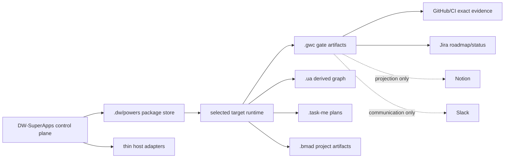

# DW SUPER APP integration topology v1.0

Status: implementation contract for SCRUM-116, bound to `nhatnguyenquang1838-coder/gwc@main:32d8c308f7d67de3dbd914a19837871d99c22ab4` and the read-only DW-SuperApps input `main:fc93228c721b59a5ac1de7e916a615eb452ef70a`.

## Scope and authority

GWC gate artifacts and exact repository/CI evidence are the authority for G0-G6. Jira is the roadmap/status authority. Notion and Slack are human-readable/visibility projections. UA, Task-Me and BMAD are analysis/planning providers whose outputs belong to the selected target runtime and cannot grant gate authority or mutate product source by themselves.

## Ownership rules

The machine-readable ownership matrix is `core/integration/dw-super-app-integration-contract.json`. Each artifact class has one canonical owner and storage root. Package implementation stays in the DW-SuperApps package store; target systems receive runtime outputs only. Native adapters route to the canonical package and do not copy its implementation.

UA, Task-Me and BMAD may write only their selected target-owned roots. They may read GWC contracts and source evidence, but cannot write `.gwc` gate state, protected main, product source or another provider's output. Existing legacy `<system>/.dw/powers` installations are preserved; migration requires a separate authorized task.

## Provenance envelope

Every generated artifact records `artifact_id`, `parent_artifact_id`, `source_repo`, `source_ref`, `source_sha`, `tool_package`, `tool_source_commit`, `schema_version`, `owner_root` and `generated_at`. A positive example and a rejected stale-fencing example are included in the machine-readable contract. The envelope is reproducible from repository/tool refs; conversation memory is never a provenance source.

## Parallel-write protocol

Before mutation, the executor resolves the canonical owner root and compares the requested `scope_hash` and `checkpoint_revision`. It must hold a valid `lease_token` and current `fencing_token`, and supply a unique `idempotency_key`. Any owner-root collision, scope mismatch, checkpoint mismatch, stale lease/fence or duplicate idempotency key is rejected without merge/overwrite. Projection failures do not change canonical state.

The rule reuses the existing durable-runtime checkpoint/CAS/lease/fencing mechanisms from SCRUM-105 and SCRUM-108. It does not introduce a second concurrency protocol.

## Compatibility matrix

| Input mode | Canonical source | Allowed fallback | Prohibited behavior |
| --- | --- | --- | --- |
| submodule | pinned gitlink/ref | read-only compatibility source | silently initialize or copy private submodules |
| power-dist | validated package distribution | existing local package store | unverified package overwrite |
| immutable-release | manifest/checksum/source lock | previous validated release | mutate release contents in place |
| offline-zip | supplied validated ZIP and evidence | preserved prior runtime | acquire through Git, curl, wget or remote power-dist |

`DW-SuperApps/boilerplate` is an explicit absent input state. BMAD `ready-unpublished` is an explicit provider state, not a published package. Both states must be surfaced in provenance/compatibility evidence rather than filled with invented artifacts.

## Downstream contract

SCRUM-117, SCRUM-118 and SCRUM-119 may proceed in parallel against this boundary. SCRUM-120 remains blocked until the topology/ownership/provenance contract is reviewed and versioned. SCRUM-121 consumes the same exact ownership and provenance rules.
