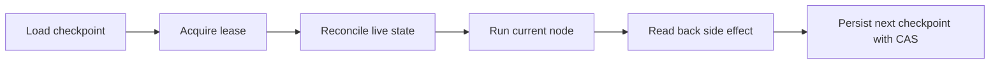

# Checkpoint Runtime Engine Contract v0.1

Status: draft-contract  
Scope: REVAMP-GWC-012 contract only

## Purpose

This contract defines the minimum behavior for a future checkpoint runtime engine. It does not implement a production runtime engine.

The engine must coordinate node execution through durable checkpoint state, compare-and-swap revision control, lease ownership, and live-state reconciliation.

## Required phases



## Invariants

1. **CAS required** — every checkpoint write must include the expected checkpoint revision.
2. **Lease required** — only the active lease holder may execute a node that can advance state.
3. **Reconcile before retry** — unknown side-effect results must be reconciled before any retry.
4. **Checkpoint before suspend** — suspend/resume nodes must persist checkpoint before emitting an approval command or wait state.
5. **No false pass** — PASS cannot be emitted when live state, checkpoint state, and expected node exit disagree.
6. **No production authority** — this contract does not grant runtime deployment, production configuration, credentials, migrations, production data, merge, or release authority.

## Engine state fields

Minimum engine state:

```text
run_id
checkpoint_id
checkpoint_revision
lease_owner
lease_expires_at_utc
current_node_id
current_node_version
parent_head_sha
pending_action
last_reconciled_at_utc
next_node_id
status
```

## Failure routing

| Failure | Required route |
|---|---|
| CAS mismatch | reload checkpoint and reconcile |
| expired lease | stop or acquire new lease after readback |
| unknown write result | reconcile live state before retry |
| node version drift | pin old node version or restart with new run |
| stale approval | regenerate approval request |
| live state mismatch | fail closed or return to earlier gate |

## Explicit exclusions

This PR does not implement the engine loop, scheduler, storage adapter, webhook runtime, background worker, deployment, production configuration, secrets, migrations, production data, merge, auto-merge, force-push, branch deletion, or PR base change.
