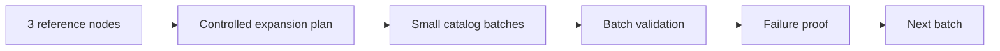
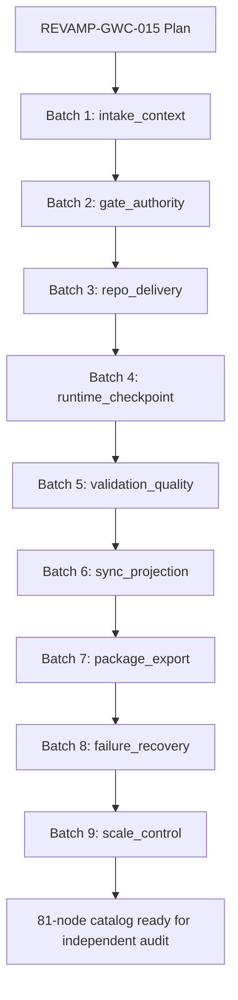

# Controlled 81-Node Catalog Expansion Plan v0.1

## Purpose

This document defines the controlled scale-out plan for the GWC runtime node catalog after the runtime kernel, reference nodes, checkpoint engine contract, and failure simulation matrix have landed.

This is a planning and guardrail artifact only.

```text
Task: REVAMP-GWC-015
Status: plan-only
Scale target: 81 runtime nodes
Implementation allowed by this artifact: no
```

## Current mechanism

| Mechanism | Purpose | Current status |
|---|---|---|
| Runtime Kernel | Defines node/event/transition boundaries | Landed |
| Reference Nodes | Proves read-only, scoped-write, suspend/resume patterns | Landed |
| Checkpoint Engine Contract | Defines CAS, lease, reconcile, and no-false-pass invariants | Landed |
| Failure Simulation Matrix | Defines failure proof gates before scale-out | Landed |

## Why controlled expansion is required

Scaling directly from three reference nodes to an 81-node catalog would create review, rollback, and validation risk.



The catalog must therefore expand through small batches with explicit admission criteria, scope limits, validation lanes, and rollback boundaries.

## Non-goals

```text
❌ Do not implement 81 nodes in this PR.
❌ Do not implement runtime scheduler, worker, or storage adapter.
❌ Do not modify production runtime behavior.
❌ Do not deploy, release, or change production configuration.
❌ Do not merge without G4 authority.
```

## Catalog expansion model

The target catalog is divided into nine families of nine nodes each.

| Family | Planned count | Intent |
|---|---:|---|
| intake_context | 9 | request intake, context capture, source resolution |
| gate_authority | 9 | gate state, approval, evidence, scope enforcement |
| repo_delivery | 9 | branch, diff, PR, CI, and review workflow |
| runtime_checkpoint | 9 | checkpoint, resume, lease, CAS, reconciliation |
| validation_quality | 9 | validators, test mapping, evidence quality |
| sync_projection | 9 | DS Admin, task center, external audit projections |
| package_export | 9 | package build, export, smoke verification |
| failure_recovery | 9 | timeout, crash, stale session, retry, rollback |
| scale_control | 9 | batch control, readiness, throttle, observability |

Total planned nodes: **81**.

## Batch admission rule

Each batch may add at most nine nodes and must satisfy:

```text
✅ previous batch merged into main
✅ exact post-merge CI evidence available
✅ schema validation passes
✅ node registry compile passes
✅ failure simulation matrix updated or explicitly unchanged
✅ no unresolved BLOCKER or MAJOR finding
✅ no merge/deploy/prod authority bundled into implementation approval
```

## Required batch PR structure

Each implementation batch should include:

```text
core/node-architect/node-catalog/<family>/*.node.json
core/node-architect/node-catalog/<family>/README.md
schemas/node-architect/<family>-node-pack.schema.json   # only if a stricter family schema is needed
tests/test_node_catalog_<family>.py
releases/changelog.d/<date>-revamp-gwc-<id>-<family>.md
projects/gwc/package.yaml
```

## Validation lanes

| Lane | Required check |
|---|---|
| Schema | every node validates against runtime-node/node-pack contract |
| Registry | generated registry has unique IDs and valid dependencies |
| Gate | node authority boundary matches allowed gate |
| Side effect | write-capable nodes declare idempotency and rollback behavior |
| Suspend/resume | suspendable nodes declare checkpoint and resume token behavior |
| Failure | declared failure modes map to the simulation matrix |
| Package | package manifest exports newly required governance artifacts |

## Stop conditions

```text
STOP if:
- total planned nodes changes from 81 without new G1 decision
- a batch wants to exceed 9 nodes
- a batch includes production engine implementation
- a node crosses authority boundary without an explicit gate
- package export cannot include the new artifacts safely
- validation cannot be reproduced from repo or CI evidence
```

## Rollout sequence



## Compatibility

This plan does not replace the runtime kernel, schemas, reference nodes, checkpoint engine contract, or failure simulation matrix. It extends them by defining the controlled rollout boundary for later implementation PRs.

## Impact

```text
Current PR impact:
✅ adds expansion plan
✅ adds machine-readable plan
✅ adds schema
✅ adds validator/tests
❌ does not add catalog nodes
❌ does not change runtime behavior
```
