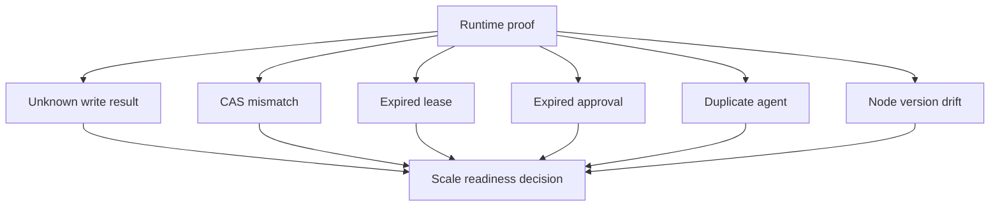

# Failure Simulation and Scale Readiness v0.1

Status: draft-contract  
Scope: REVAMP-GWC-013 failure proof before catalog scale

## Purpose

This rule defines the minimum failure simulation matrix required before scaling the runtime node catalog.

It does not implement the 81-node catalog. It defines proof obligations that must pass before catalog expansion can be treated as ready.

## Required failure cases

## Scale readiness rule

`scale_81_nodes_allowed` must remain `false` until all required failure cases have:

- a deterministic trigger;
- an expected engine response;
- a forbidden behavior list;
- evidence requirements;
- validator coverage.

## Required cases

| Case ID | Expected behavior |
|---|---|
| `unknown_write_result_reconciles_before_retry` | reconcile live state before retry |
| `cas_mismatch_reloads_checkpoint` | reload checkpoint and reconcile |
| `lease_expired_stops_or_reacquires` | stop or safely reacquire lease after readback |
| `approval_expired_regenerates_request` | regenerate approval request, no side effect |
| `duplicate_agent_blocked_by_lease` | only lease holder advances node |
| `node_version_drift_pins_or_restarts` | pin old version or restart with explicit new run |

## Explicit exclusions

No merge, auto-merge, deploy, release, production configuration, credentials, secrets, migrations, production data, direct main push, force-push, branch deletion, PR base change, scheduler, production engine, or 81-node catalog implementation.
