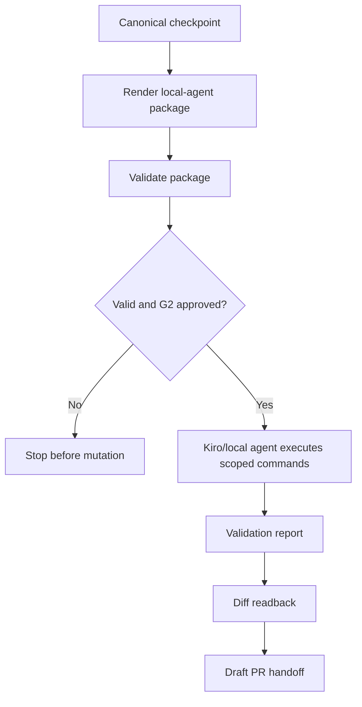

# Kiro Local-Agent Execution Package v0.1

## Status

- Rule ID: `KIRO_LOCAL_AGENT_EXECUTION_PACKAGE`
- Version: `0.1`
- Scope: `REVAMP_UPGRADE_GWC`
- Introduced by: `REVAMP-GWC-005`
- Applies to: Kiro and local coding agents receiving GWC-governed handoff packs.

## Purpose

This rule defines the concrete package a ChatGPT-style orchestrator must hand to
Kiro or another local coding executor before repository-mutating work.

It turns the existing strict Kiro state rule into an executable artifact that a
local agent can validate, run, and report against without widening scope.

## Core principle

```text
Local execution package = canonical checkpoint + approved write scope + exact local commands.
```

A package is only a local execution input. It never grants merge, deployment,
production, credential, migration, force-push, branch deletion, or protected-base
change authority.

## Package lifecycle



## Required package content

Every Kiro local-agent execution package MUST include:

| Field | Meaning |
|---|---|
| `package_id` | Stable package identifier |
| `package_type` | Must be `kiro_local_agent_execution_package` |
| `task.id` | GWC task/work item |
| `checkpoint.checkpoint_id` | Canonical checkpoint reference |
| `repository.full_name` | Target repository |
| `repository.base_branch` | Protected base branch |
| `repository.base_sha` | Protected base SHA |
| `repository.working_branch` | Dedicated task branch |
| `authority.gate` | Gate authorizing local mutation |
| `authority.approval_request_id` | Agent-generated approval request |
| `authority.scope_hash_16` | Scope hash bound to package |
| `authority.expires_at_utc` | Approval/package expiry |
| `scope.files_read` | Files used for context |
| `scope.files_write` | Only files local agent may change |
| `commands` | Exact local commands allowed |
| `validation.required` | Required local validation steps |
| `reporting.required_fields` | Required report fields after execution |
| `prohibited_actions` | Hard-stop action set |

## Required command model

Local-agent commands MUST be declarative and bounded.

Allowed command categories:

```text
read_context
create_worktree
modify_scoped_files
run_validation
readback_diff
prepare_draft_pr_handoff
```

Forbidden command categories:

```text
merge
enable_auto_merge
deploy
release
production_config
production_data
secret_or_credential
migration
direct_push_main
force_push
delete_branch
rewrite_history
change_pr_base
```

A package containing a forbidden command category is invalid even when a human
previously approved G2.

## Scope rules

```text
No Files WRITE -> invalid package.
Command touches path outside Files WRITE -> invalid package.
Files WRITE widening -> new G2 package required.
Protected base SHA missing -> invalid package.
G2 expired -> invalid package.
Merge/deploy/prod next action -> invalid package.
```

## Execution mode boundaries

| Mode | Package behavior |
|---|---|
| `chat_connector_only` | May render package only; must not claim local execution pass |
| `local_agent` | May execute after package validation and current G2 authority |
| `repo_ci` | May validate committed artifacts; CI does not grant pre-write authority |

## Required local-agent report

After execution, Kiro/local agent MUST return:

```text
package_id:
task_id:
checkpoint_id:
repository:
base_sha:
branch:
files_read_actual:
files_write_actual:
changed_files:
commands_executed:
validation_performed:
validation_skipped:
evidence:
limitations:
scope_drift: NONE | DETECTED
prohibited_action_detected: true | false
next_gate:
```

## Compatibility

This rule is additive. It does not replace:

- the GWC gate lifecycle;
- `KIRO_STRICT_CODING_STATE_RULE`;
- checkpoint/resume requirements;
- DS Admin / TC projection rules;
- exact G2/G4 human approval boundaries.
