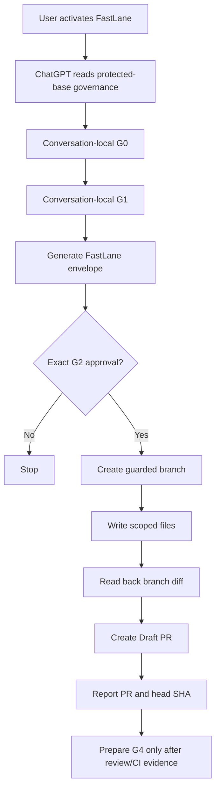

# GWC FastLane Bootstrap Workflow v0.1

## Status

- Workflow ID: `GWC_FASTLANE_BOOTSTRAP`
- Version: `0.1`
- Lifecycle: `temporary`
- Scope: `nhatnguyenquang1838-coder/gwc`
- Primary agent: ChatGPT-style agent in `chat_connector_only`
- Primary repository connector: GitHub / Codex connector
- Fallback repository connectors: DWC, then DW1
- Sunset condition: remove or supersede after `REVAMP_UPGRADE_GWC` is merged and validated.

## Purpose

FastLane Bootstrap is a temporary workflow for accelerating GWC self-upgrade work when the normal DS Admin / task artifact path is slowing down governance development.

It allows a ChatGPT-style agent to act as the primary delivery agent for bounded GWC governance changes by creating:

1. a conversation-local G0 context;
2. a conversation-local G1 alignment;
3. an LLM-generated FastLane execution envelope;
4. a guarded branch;
5. scoped repository file changes;
6. a Draft Pull Request to `main`.

FastLane does not grant merge, deployment, release, production configuration, credential, migration, or production-data authority.

## Activation

FastLane may be used only when the user explicitly requests temporary FastLane execution for GWC governance development.

Accepted activation wording includes:

```text
proceed with fastlane
tiến hành thực hiện fastlane
GWC_FASTLANE_BOOTSTRAP
```

The activation phrase itself is not G2 or G4 approval. The agent must still generate the exact approval command required by the active runtime contract.

## Authority model

FastLane is a bootstrap workflow, not a permanent policy relaxation.

| Area | FastLane behavior |
|---|---|
| G0 | ChatGPT may complete conversation-local G0 for this workflow. |
| G1 | ChatGPT may complete conversation-local G1 for this workflow. |
| G2 | Requires a FastLane envelope and exact user approval. |
| G3 | Draft PR only. |
| G4 | Separate exact human approval required before merge. |
| G5 | Not applicable unless manual deploy/release is explicitly introduced. |
| G6 | Not applicable; production data/config/credential/secret scope is forbidden. |

Connector capability never grants gate authority. A full-permission connector is only an execution route after the gate is approved.

## Connector route

FastLane uses this connector precedence:

```text
GitHub / Codex connector
→ DWC connector
→ DW1 connector
```

The selected connector must be recorded in the FastLane envelope before write-capable action.

Allowed connector actions after G2 approval:

- create a dedicated guarded branch;
- create or update scoped files;
- open or update a Draft Pull Request;
- read back branch, PR, head SHA, diff, and CI evidence.

Blocked connector actions unless later gates explicitly authorize them:

- direct write to `main`;
- force-push;
- branch deletion;
- PR base change;
- merge;
- auto-merge;
- deploy;
- release;
- production configuration;
- credentials or secrets;
- migration;
- production data.

## Canonical state split

FastLane treats coding delivery evidence and audit projection separately.

| State | Role |
|---|---|
| Git branch / PR / diff / CI | Delivery evidence for the scoped change. |
| FastLane envelope | Temporary execution authority record. |
| Jira | Optional audit trail when a connector is available. |
| TC / DS MCP | Optional visualization or projection only. |
| ChatGPT conversation | G0/G1 preparation and user authority source for this temporary workflow. |

Jira, Git comments, TC, or DS MCP state do not become merge authority.

## FastLane sequence



## FastLane envelope requirements

A FastLane envelope must include:

- task ID;
- repository;
- base branch and base SHA;
- working branch;
- selected connector route;
- files read;
- files write;
- authorized actions;
- excluded actions;
- risk class;
- expiry;
- scope hash.

The envelope must state that it is temporary and must include a sunset condition.

## Evidence requirements

Before branch creation:

- protected-base governance has been read;
- repository identity and connector permissions are verified;
- files write scope is explicit;
- exact G2 approval command has been received.

Before Draft PR:

- all changed files are inside the approved scope;
- no protected branch was written;
- no prohibited action was attempted;
- diff readback is available;
- validation status is reported honestly.

## Validation policy

In `chat_connector_only`, the agent must not claim local validator PASS unless trusted evidence exists.

FastLane PR descriptions must separate:

```text
Validation performed:
Validation skipped:
Evidence:
Limitations:
```

Repository CI remains a second boundary and never grants G4 merge authority.

## Draft PR requirements

The Draft PR must contain:

- objective;
- workflow ID;
- G2 approval ID and scope-hash prefix;
- base SHA;
- working branch;
- files changed;
- validation performed/skipped;
- known limitations;
- explicit exclusions;
- statement that merge, deploy, release, production configuration, credentials, migrations, and production data are not authorized.

## Sunset rule

FastLane is temporary.

After the GWC revamp workflow is merged and validated, FastLane must be:

1. removed; or
2. marked deprecated with a replacement workflow reference; and
3. excluded from normal project-consumer packages unless explicitly retained by a later approved governance decision.

## Non-goals

FastLane does not:

- replace GWC gate lifecycle;
- weaken G4/G5/G6;
- make Jira or TC source of truth;
- allow direct main push;
- authorize broad refactors;
- authorize architecture/security/production changes without separate user direction.
