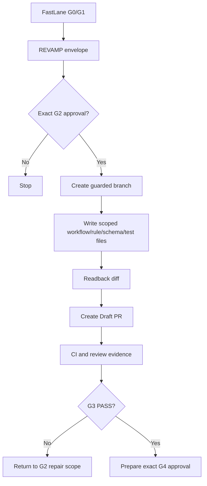

# REVAMP_UPGRADE_GWC Workflow v0.1

## Status

- Workflow ID: `REVAMP_UPGRADE_GWC`
- Version: `0.1`
- Scope: `nhatnguyenquang1838-coder/gwc`
- Introduced by: `REVAMP-GWC-001`
- Bootstrap route: `GWC_FASTLANE_BOOTSTRAP`
- Lifecycle: foundational workflow for the GWC re-architecture series

## Purpose

`REVAMP_UPGRADE_GWC` defines the next controlled workflow for upgrading GWC from a document-heavy governance package into a node-oriented execution architecture that still works with ChatGPT-style agents.

The workflow is designed to speed up governance development without making Jira, TC, DS MCP, or connector state the authority for coding gates.

## Core principle

```text
Canonical coding state = GWC/Kiro checkpoint + Git delivery evidence.
External systems = audit projection, visualization, or resume hint.
```

## Actor split

| Actor | Responsibility | Authority boundary |
|---|---|---|
| ChatGPT | FastLane G0/G1, envelope generation, branch/PR orchestration through connector | No write before G2; no merge before G4 |
| GitHub Codex connector | Primary repository write route | Executes only approved scoped actions |
| DWC | Fallback connector route | Same GWC authority rules |
| DW1 | Second fallback connector route | Same GWC authority rules |
| Kiro | Strict coding executor for bounded node packs | Must obey Files WRITE and checkpoint state |
| Jira | Optional audit trail | Non-blocking unless a future gate explicitly requires it |
| TC / DS MCP | Optional projection and visualization | Not canonical coding authority |
| Git / PR / CI | Delivery evidence | CI is evidence only, not G4 authority |

## Workflow sequence



## State model

`REVAMP_UPGRADE_GWC` introduces three state lanes:

| Lane | Meaning | Blocking? |
|---|---|---|
| `canonical_gate_state` | Current GWC gate/checkpoint state for coding | Yes |
| `git_delivery_state` | Branch, diff, PR, head SHA, CI evidence | Yes when required by G2/G3/G4 |
| `external_audit_projection` | Jira, TC, DS MCP, comments, labels, dashboards | No by default |

## Gate behavior

| Gate | Revamp behavior |
|---|---|
| G0 | Read protected-base governance, FastLane workflow, project profile, active task context |
| G1 | Select bounded revamp option, file scope, non-goals, acceptance criteria |
| G2 | Create guarded branch and write scoped workflow/rule/schema/test files |
| G3 | Draft PR, exact-head evidence, CI/review/status reporting |
| G4 | Merge only after exact approval for current PR head SHA |
| G5 | Read-only post-merge status verification unless deploy/release is explicitly introduced |
| G6 | Not applicable; production data/config/secrets/migration are forbidden |

## Revamp foundation deliverables

The foundation step SHOULD add:

1. this workflow document;
2. external audit projection rule;
3. Kiro strict coding state rule;
4. schemas for the revamp envelope, audit projection, and Kiro coding state;
5. a runbook for ChatGPT-led use;
6. regression tests that preserve hard gate boundaries.

## Non-goals

This workflow does not:

- remove the existing GWC gate lifecycle;
- grant protected branch direct push;
- permit broad refactors;
- merge without G4;
- deploy, release, or touch production systems;
- make Jira, TC, DS MCP, or connector output source of truth;
- remove FastLane yet.

## Sunset dependency

After `REVAMP_UPGRADE_GWC` is implemented, validated, and accepted as the replacement execution path, `GWC_FASTLANE_BOOTSTRAP` must be removed or explicitly deprecated in a follow-up governance PR.
