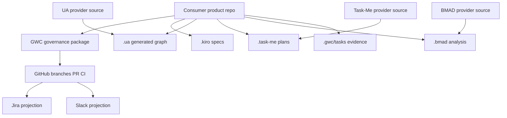

# DW SUPER APP Source-of-Truth and Authority Matrix

**Task:** SCRUM-101  
**Repository:** `nhatnguyenquang1838-coder/gwc`  
**Base:** `main@319e611d1a318df8ec5eccd3210078652e01369d`

## Purpose

DW SUPER APP composes product source, GWC, UA, Task-Me, BMAD, GitHub/CI, deployment state, Jira and Slack. This matrix prevents accidental authority drift by assigning every stateful artifact to exactly one canonical owner.

## Authority principles

1. Every artifact or state has exactly one canonical authority.
2. Projection systems may mirror, summarize or notify; they must not approve gates or mutate governed state by implication.
3. Provider source is packaged separately from consumer runtime data.
4. Generated knowledge is evidence only until its generator, input SHA and validation result are recorded.
5. Optional connector failure cannot silently change canonical state.
6. Human approval is required at G2/G4/G5/G6 boundaries according to the GWC gate contract.

## Canonical matrix

| Artifact / state | Canonical authority | Readers | Writers / mutators | Projection-only surfaces | Explicit denials |
|---|---|---|---|---|---|
| Product source code | Product repository protected base and guarded branches | GWC, Task-Me, UA, BMAD, CI | Human-authorized agent under G2 scope | Jira, Slack, dashboards | Jira/Slack cannot mutate source or approve changes |
| `.kiro` specs | Consumer project repository | GWC, Task-Me, implementation agents | Human-authorized agent under G2 scope | Jira links, Slack summaries | Generated plan text cannot bypass GWC gates |
| `.ua` generated graph | Consumer project repository or UA output store declared by profile | GWC, Task-Me, BMAD, dashboards | UA generator through approved refresh path | Dashboards, Slack | UA graph cannot become product source or gate authority |
| `.task-me` plans | Consumer project repository or Task-Me run store | GWC, implementation agents | Task-Me generator or approved agent refresh | Jira, Slack | Task-Me output cannot mutate canonical GWC state |
| `.bmad` analysis | BMAD output store or consumer repo path declared by profile | GWC, Task-Me, humans | BMAD generator or approved agent refresh | Slack, dashboards | BMAD advice cannot approve implementation or merge |
| `.gwc/tasks/<task-id>` gate evidence | GWC-governed repository/task workspace | GWC agents, reviewers, humans | Current gate owner under valid envelope | Jira, Slack | External task status cannot replace gate evidence |
| GitHub branches / PR / CI | GitHub repository | GWC, Jira, Slack | Human-authorized agent or human according to gate | Jira links, Slack notifications | CI success is evidence, not merge/deploy authority |
| Deployment/runtime state | Deployment provider declared in active profile | GWC, operators, dashboards | Human-authorized deploy actor under G5 if manual | Slack/Jira | G4 merge does not imply deploy or runtime reload |
| Jira status | Jira project `SCRUM` | GWC, humans | Jira workflow actor | Dashboards | Jira is work-tracking projection only |
| Slack messages | Slack workspace/channel/thread | Humans, agents | Slack adapter after canonical state is recorded | Slack itself | Slack approval text does not grant gate authority |
| GWC source contracts | `nhatnguyenquang1838-coder/gwc` protected base | Consumers, agents, CI | GWC guarded PR lifecycle | Packages, docs | Consumer projects cannot override core GWC authority |
| UA provider source | UA provider repository/package | Consumers, GWC | UA provider lifecycle | Consumer `.ua` output | Consumer runtime data must not be packaged as UA source |
| Task-Me provider source | Task-Me provider repository/package | Consumers, GWC | Task-Me provider lifecycle | Consumer `.task-me` output | Consumer plans must not be packaged as provider source |
| BMAD provider source | BMAD provider repository/package | Consumers, GWC | BMAD provider lifecycle | Consumer `.bmad` output | BMAD outputs are advisory unless promoted by gate evidence |

## Operation permission model

| Component | Read | Propose | Mutate source | Approve | Validate | Merge | Deploy / publish |
|---|---:|---:|---:|---:|---:|---:|---:|
| GWC | Yes | Yes | Only in GWC repo under G2 | Gate artifacts only; human grants authority | Yes | No without G4 | No without G5 |
| UA | Yes | Knowledge graph refresh proposals | Only UA-owned outputs through approved path | No | Graph validation | No | No |
| Task-Me | Yes | Implementation plans | Only Task-Me-owned plan outputs through approved path | No | Plan validation | No | No |
| BMAD | Yes | Analysis/design recommendations | Only BMAD-owned outputs through approved path | No | Advisory checks | No | No |
| GitHub | Hosts source, branch, PR, CI | N/A | Through branch/PR operations | No human intent by itself | CI evidence | Merge API only after G4 | CI/CD only when profile permits |
| Jira | Reads/projected state | Work tracking | Jira fields only | No | No | No | No |
| Slack | Reads/projected notifications | Conversation | Slack messages only | No | No | No | No |

## Consumer-owned vs provider-owned data

Consumer-owned data includes product code, product `.kiro`, generated `.ua`, `.task-me`, `.bmad`, `.gwc/tasks`, runtime history and deployment status for that product. Provider-owned data includes reusable GWC, UA, Task-Me and BMAD source packages, schemas, validators and contracts.

A provider package must not include consumer runtime data, credentials, environment-specific deployment state, Jira status, Slack messages or generated knowledge unless it is explicitly labelled fixture/test data.

## Runtime-generated vs source-controlled artifacts

| Artifact class | Source-controlled? | Rule |
|---|---:|---|
| Governance contracts, schemas, validators | Yes | Protected-base source of truth |
| Gate evidence under `.gwc/tasks` | Yes when published by approved task | Append-only or task-scoped mutation only |
| UA / Task-Me / BMAD generated outputs | Yes only when profile declares repo ownership | Must record generator, input SHA and validation evidence |
| CI logs, workflow run status | No, externally hosted | Cite exact run/job/commit; do not copy as authority |
| Slack/Jira projections | No canonical authority | Link or summarize only after canonical state exists |

## Optional connector failure behavior

If Jira, Slack, UA, Task-Me, BMAD, dashboard or notification connectors fail, the governed repository workflow continues only inside the active gate authority. The failure must be recorded as projection or tool observability evidence. It must not silently change GWC state, branch state, approval status, merge eligibility or deployment status.

## Canonical topology

## Rules for SCRUM-103 / SCRUM-104 consumers

- SCRUM-103 may repair executable blockers only inside GWC-owned authority and validator scope.
- SCRUM-104 may consume this matrix to encode machine-readable authority fields, but it must not redefine ownership in a conflicting schema.
- Runtime edges, histories and profiles must cite this authority matrix when distinguishing authoritative state from projections.
