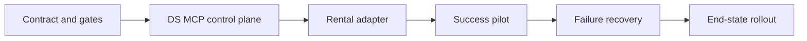

# Distributed Multi-Agent SDLC Program Plan

## 1. Decision

Use **DS MCP as the single execution control plane**. Do not introduce a second orchestrator or a new generic file-writing MCP.

Repository specs remain the source of truth for requirements and design. DS Admin/AgentOps becomes the source of truth for runtime execution state, role ownership, leases, PR/head-SHA binding, CI state, QA evidence, and stage transitions.

## 2. Current-to-Target Assessment

### 2.1 Runtime Source of Truth

**Current mechanism:** DS Admin/AgentOps tracks durable workflows, while Rental Home also treats `TASK.md` and Kiro task files as workflow state.

**Purpose:** Coordinate tasks and retain project-local traceability.

**Limitation:** Runtime state can drift between Task Server and repository Markdown.

**Improvement:** Introduce `tracking_mode: ds_admin_runtime` for Pilot v1. DS Admin is canonical for runtime state; repository task files are projections/evidence for Pilot tasks.

**Compatibility:** Existing non-pilot tasks continue their current repository-driven workflow until migrated.

**Impact:** Removes split-brain execution without a big-bang migration.

### 2.2 Workflow Engine

**Current mechanism:** A linear State Engine creates `analyze_repo → plan_changes → modify_code → create_pr → wait_github_ci → final_report`, with CI failure routed through `fix_ci`.

**Purpose:** Durable asynchronous execution.

**Limitation:** No distinct QA stage or role-bound handoff.

**Improvement:** Pilot adds `qa_validate` and role capability enforcement. End-state moves to versioned declarative workflow templates.

**Compatibility:** Preserve current task types and transition semantics; add one bounded stage first.

**Impact:** Enables a real Dev-to-QA handoff without replacing the State Engine.

### 2.3 File and Action Boundaries

**Current mechanism:** Repository allowlist, protected-branch blocks, branch prefix rules, exact task scope, GWC envelopes, and isolated worktrees.

**Purpose:** Prevent unsafe writes.

**Limitation:** Boundaries are not yet tied consistently to agent role and claimed stage.

**Improvement:** Bind role, stage, repository, branch, exact file set, and authorized action set to the task claim and G2 envelope.

**Compatibility:** Reuses existing GitHub gateway and GWC action-to-gate validation.

**Impact:** Stronger than regex-only directory guards.

### 2.4 QA Evidence

**Current mechanism:** Local test commands, CI status, reviewer gate, and free-form task result artifacts.

**Purpose:** Demonstrate correctness.

**Limitation:** No canonical QA evidence schema tied to exact PR head SHA.

**Improvement:** Add `QaEvidence` with exact repo, PR, head SHA, agent, commands, test/coverage results, diff-scope result, findings, and disposition.

**Compatibility:** Store under existing task result artifacts and event log in Pilot v1.

**Impact:** Makes QA auditable and prevents stale-head approval.

### 2.5 Merge and Deployment

**Current mechanism:** GWC separates G4 merge, G5 deployment, and G6 production authority.

**Purpose:** Preserve human authority for high-impact operations.

**Limitation:** The original guide collapses QA pass, Done, and merge.

**Improvement:** End Pilot at `REVIEW_READY` or `ACCEPTED_PENDING_G4`. Merge remains a separate exact human decision.

**Compatibility:** Fully aligned with existing GWC.

**Impact:** Prevents CI or QA from implicitly granting merge/deploy authority.

## 3. Pilot v1 Outcome

Pilot v1 is complete only when both runs succeed:

1. **Success run**
   - Lead creates the root work item and workflow.
   - Dev claims the exact `modify_code` task.
   - Dev implements the Rental Home validation adapter in an isolated worktree.
   - A Draft PR is created and CI passes for the exact head SHA.
   - QA claims the exact `qa_validate` task.
   - QA validates the same head SHA and submits structured QA evidence.
   - Reviewer/human receives the final report.
   - No merge or deployment is performed without separate authority.

2. **Controlled failure-recovery run**
   - A deterministic test failure is introduced in a pilot-only branch or fixture.
   - QA reports `failed` with structured findings.
   - State Engine returns work to Dev within a bounded repair loop.
   - Dev fixes the exact finding.
   - CI and QA pass on the new exact head SHA.
   - The audit trail shows both attempts and no stale evidence reuse.

## 4. Pilot Scope

### In Scope

- `qa_validate` async stage.
- Role-to-capability policy.
- Targeted task claim and lease checks.
- Exact repository/branch/PR/head-SHA binding.
- Structured `QaEvidence`.
- Machine-readable Rental Home workflow validation output.
- Heartbeat and scheduler operational checks.
- Success and failure-recovery pilot runs.
- Dashboard visibility for stage, owner, stale status, CI, and QA result.
- Tests, OpenAPI/MCP capability documentation, and handoff documentation.

### Out of Scope

- Merge automation.
- Deployment automation.
- Production data or configuration.
- Supabase schema changes unless later proven necessary and separately scoped.
- Rental Home business behavior changes.
- Generic DAG engine replacement in Pilot v1.
- Jira/Linear integration.
- Multi-repository parallel fan-out.
- Cost-based model routing.
- Autonomous security, architecture, or migration approval.

## 5. Program Workstreams



### Workstream A — Governance and Contract

- Reconcile profile/package/extension contradictions before G2.
- Materialize G0/G1 task workspaces.
- Define role, stage, evidence, and authority boundaries.
- Generate separate G2/G3 packages per repository.
- Keep G4/G5/G6 excluded.

### Workstream B — DS MCP Pilot Capability

- Extend async stage schema with `qa_validate`.
- Add role/capability policy.
- Bind claims to task/repository/branch/PR/head SHA.
- Add QA evidence validation and storage.
- Add deterministic transitions for QA pass/fail.
- Add dashboard and API/MCP projections.
- Add tests.

### Workstream C — Rental Home Adapter

- Add deterministic JSON output to the existing repository workflow validator.
- Preserve human-readable output.
- Add tests for pass/fail and malformed state.
- Add adapter documentation.
- Do not change app runtime, Supabase, RLS, auth, or production data.

### Workstream D — Pilot Execution

- Create DS Admin root task and child tasks.
- Register/heartbeat Lead, Dev, and QA identities.
- Execute success path.
- Execute controlled failure-recovery path.
- Produce evidence report.

### Workstream E — End-State

- Versioned workflow templates.
- Multi-project adapters.
- Policy packs and QA profiles.
- Artifact registry.
- Operations, scheduler, SLOs, and recovery.
- Gradual runtime-SSOT migration.

## 6. Proposed Task Tree

```text
MAS-PILOT-00  Epic: Distributed Multi-Agent SDLC Pilot v1
├── MAS-PILOT-01  Freeze contracts and evidence schemas
├── MAS-PILOT-02  DS MCP role/stage policy
├── MAS-PILOT-03  DS MCP QA stage and transitions
├── MAS-PILOT-04  DS MCP PR/head/QA evidence binding
├── MAS-PILOT-05  DS MCP dashboard/API/MCP projections
├── MAS-PILOT-06  DS MCP focused tests and Draft PR
├── MAS-PILOT-07  Rental Home JSON validation adapter
├── MAS-PILOT-08  Rental Home tests and Draft PR
├── MAS-PILOT-09  Operational activation under separate G5 if required
├── MAS-PILOT-10  Execute success run
├── MAS-PILOT-11  Execute failure-recovery run
└── MAS-PILOT-12  Pilot report and end-state go/no-go
```

Each repository-changing task requires its own task-scoped G0/G1 evidence, valid claim, G2 envelope, isolated branch/worktree, validation, and G3 delivery record.

## 7. Release Strategy

| Release | Scope | Exit |
|---|---|---|
| R0 | Specs and contracts | Approved spec package |
| R1 | DS MCP Pilot capability | Draft PR, local tests, CI green |
| R2 | Rental Home adapter | Draft PR, local tests, CI green |
| R3 | Runtime activation | Separate G4/G5 authority where applicable |
| R4 | Success pilot | Complete exact-SHA audit trail |
| R5 | Failure-recovery pilot | Bounded recovery proven |
| R6 | End-state decision | Scale, revise, or stop |

## 8. Go/No-Go Criteria

### Go

- No illegal transition.
- No unclaimed write.
- No protected-branch write.
- No stale PR/CI/QA evidence accepted.
- All stage changes recorded by State Engine.
- Success and failure-recovery runs complete.
- No G4/G5/G6 authority leakage.
- Operators can identify current owner, stage, blocker, and next action.

### No-Go

- Runtime state diverges between DS Admin and repository projection.
- QA validates a different head SHA.
- Agent can claim a task outside its role.
- Lease expiry is silently ignored.
- Repair loop exceeds three attempts.
- Pilot requires production data, secret changes, or unplanned architecture changes.
