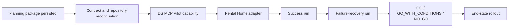

# Distributed Multi-Agent SDLC Program Plan

**Plan status:** Approved direction; Pilot completion not verified  
**Status reviewed:** 2026-07-20  
**Current GWC evidence baseline:** `main@16f64a88e0a5a7fc811e32e3acd06cda1301c50c`

## 1. Decision

Use **DS MCP as the single execution control plane**. Do not introduce a second
orchestrator or a generic file-writing MCP.

Repository specs remain the source of truth for requirements and design. DS
Admin/AgentOps becomes the source of truth for runtime execution state, role
ownership, claims, leases, PR/head-SHA binding, CI state, QA evidence, and stage
transitions.

## 2. Current status



| Phase | Status | Evidence rule |
|---|---|---|
| Planning package | Complete | GWC plan files exist on protected `main` |
| Contract and baseline reconciliation | Pending per implementation task | Must be proven against each repository's current protected base |
| DS MCP Pilot capability | Not verified complete | Requires exact PR/head, CI, runtime activation, and capability evidence |
| Rental Home adapter | Not verified complete | Requires separate exact PR/head and validation evidence |
| Success Pilot run | Not started/verified | Requires end-to-end task, claim, CI, QA, and transition audit trail |
| Failure-recovery Pilot run | Not started/verified | Requires stale-evidence rejection and bounded repair evidence |
| End-state rollout | Deferred | Starts only after recorded Pilot go/no-go |

No unchecked task in this package may be marked complete from conversation memory,
a similarly named task, or evidence bound to another base, branch, PR, or head.

## 3. Current-to-target assessment

### 3.1 Runtime source of truth

**Current mechanism:** DS Admin/AgentOps tracks durable workflow state while some
project repositories also maintain Markdown task projections.

**Purpose:** Coordinate execution and retain project-local traceability.

**Limitation:** Runtime state and repository projection can drift.

**Improvement:** Use `tracking_mode: ds_admin_runtime` for Pilot tasks. DS Admin
is canonical for runtime state; repository task files are requirements,
projections, and evidence.

**Compatibility:** Non-pilot tasks retain their current mode until explicitly
migrated.

**Impact:** Removes split-brain execution without a big-bang migration.

### 3.2 Workflow engine

**Current mechanism:** DS MCP provides durable tasks, legal State Engine
transitions, async workflows, claims/leases, callbacks, CI continuation, and
operational projections.

**Purpose:** Provide durable asynchronous execution.

**Limitation:** The Pilot still needs exact evidence that role-separated QA and
head-bound evidence work together end to end.

**Improvement:** Add or verify a bounded `qa_validate` stage and role-capability
enforcement before considering generic workflow-template expansion.

**Compatibility:** Preserve existing task types and transition semantics.
`qa_validate` remains a Pilot workflow stage inside the G3 evidence path and does
not become a canonical GWC gate.

**Impact:** Enables auditable Dev-to-QA handoff without replacing the State
Engine or changing `G0 → G1 → G2 → G3 → G4 → G5 → G6`.

### 3.3 File and action boundaries

**Current mechanism:** Protected-branch blocks, branch-prefix rules, task scope,
GWC envelopes, exact Files WRITE, and isolated worktrees/sessions.

**Purpose:** Prevent unsafe or unrelated writes.

**Limitation:** Role, claimed stage, branch, file set, and action set must be
verified consistently at each write boundary.

**Improvement:** Bind those dimensions to the task claim and execution envelope.

**Compatibility:** Reuse the GitHub gateway and GWC action-to-gate checks.

**Impact:** Stronger than directory or regex guards alone.

### 3.4 QA evidence

**Current mechanism:** Pilot requirements and design already specify
`qa_validate`, role-capability enforcement, exact PR/head binding, structured
`QaEvidence`, stale-head rejection, and explicit non-grant of G4/G5/G6
authority.

**Purpose:** Demonstrate quality for the exact current revision.

**Limitation:** The planning narrative must state the same fail-closed evidence
strictness as G0/G1: no QA `PASS` without accepted, current validator evidence.

**Improvement:** A Pilot QA `PASS` requires:

1. exact repository, PR, scope, and current head binding;
2. active lease ownership and the required QA role/capability;
3. required CI success for the same head;
4. schema-valid, bounded, secret-safe evidence;
5. rejection of stale, malformed, mismatched, or scope-violating evidence;
6. preserved validator result and accepted evidence in task artifacts/events.

Any new head invalidates prior CI, QA, and G3 review evidence.

**Compatibility:** Store normalized evidence through existing task artifacts and
events. Do not add another evidence store.

**Impact:** Prevents stale-head acceptance without overstating a missing
`QaEvidence` architecture gap.

### 3.5 Merge and deployment

**Current mechanism:** GWC separates G4 merge, G5 status/deployment, and G6
production authority.

**Purpose:** Preserve explicit authority for high-impact operations.

**Improvement:** End the Pilot at `REVIEW_READY` or `ACCEPTED_PENDING_G4` only
after exact-head CI, required QA, and G3 review evidence are complete. Merge
remains an exact human decision. After merge, read-only G5 status verification is
automatic; manual deploy/redeploy/release/publish/runtime reload still requires
separate G5 authority.

**Compatibility:** No new authority state is introduced. These labels describe
review readiness only.

**Impact:** CI, QA, G3 `PASS`, `REVIEW_READY`, and `ACCEPTED_PENDING_G4` can never
implicitly grant merge, deployment, or production authority.

## 4. Pilot evidence and drift controls

### 4.1 Protected-base drift

Apply [`../../base-drift-policy.md`](../../base-drift-policy.md) after the
approved protected base changes:

| Decision | Pilot action | Required evidence response |
|---|---|---|
| `SAFE_CONTINUE` | Continue only when changed files do not overlap scope or authority boundaries | Record the drift evaluation; preserve G0/G1 and G2; retain head-bound evidence only when the execution head remains valid |
| `REVALIDATE` | Reconstruct/rebase the execution head when needed and rerun affected checks | Regenerate validation, CI, QA, and G3 review evidence for the new head |
| `REAPPROVE` | Refresh alignment and authority before further writes | Regenerate G0/G1, scope hash, work binding, G2 envelope, and approval; invalidate downstream evidence |
| `STOP` | Stop the Pilot slice | Require a new bounded scope/authority package; reuse no prior approval or production-sensitive evidence |

A drift decision records old/new base SHAs, changed files, scope overlap, risk,
and evaluator decision. QA evidence is never “reapproved”; it is either still
valid for the unchanged head or regenerated for the new exact head.

### 4.2 Pilot preflight checklist

The implementation checklist in
[`pilot-v1/ds-mcp/tasks.md`](pilot-v1/ds-mcp/tasks.md) addresses the observed
failure patterns in
[`../../gaps/g0-g1-naming-location-convention-gaps.md`](../../gaps/g0-g1-naming-location-convention-gaps.md).
Before Pilot execution, verify:

- deterministic run/task identity and collision-free task-scoped workspace;
- a real DS Admin task in a legal state;
- current protected-base SHA and complete G0/G1 evidence;
- `tools/validate_g01.py --workspace <workspace>` with preserved stdout, exit code,
  and workspace path;
- non-placeholder scope hash, approval ID, and UTC expiry;
- visible gate-transition reporting;
- no use of conversation memory as completion or authority evidence.

## 5. Pilot completion outcome

Pilot v1 is complete only when both runs succeed.

### Success run

- Lead creates the root work item and workflow.
- Dev claims the exact scoped modification task.
- Dev implements the Rental Home validation adapter in an isolated worktree.
- A Draft PR is created and CI passes for the exact head SHA.
- QA claims the exact QA task and validates the same head SHA.
- Structured QA evidence is accepted for that head.
- G3 delivery/review evidence reaches review-ready state.
- Reviewer/human receives the final report.
- No merge or manual deployment occurs without separate authority.

### Controlled failure-recovery run

- A deterministic failure is introduced in a Pilot-only branch or fixture.
- QA returns structured failed evidence.
- State Engine creates or routes a bounded Dev repair task.
- Dev fixes the exact finding.
- Prior CI/QA/G3 review evidence is rejected after the head changes.
- CI and QA pass for the new exact head SHA.
- The audit trail preserves both attempts and all legal transitions.

## 6. Pilot scope

### In scope

- Role-to-capability policy and targeted task claims.
- Lease and heartbeat enforcement.
- Exact repository/branch/PR/head-SHA binding.
- Structured QA evidence and freshness validation.
- Protected-base drift classification and evidence response.
- Machine-readable Rental Home workflow validation output.
- Bounded repair and stale-evidence rejection.
- Dashboard visibility for stage, owner, stale status, CI, QA, retries, blockers,
  and next action.
- Success and controlled failure-recovery runs.

### Out of scope

- A new canonical `QA_VALIDATE` gate.
- Automatic merge without exact G4 approval.
- Manual deployment without exact G5 approval.
- Production data/configuration, credentials, secrets, or migrations.
- Rental Home business behavior changes.
- Generic DAG replacement during Pilot v1.
- Multi-repository parallel fan-out.
- Autonomous security, architecture, migration, or production approval.

## 7. Program workstreams

| Workstream | Scope | Exit evidence |
|---|---|---|
| A — Governance and contract | Reconcile profiles, packages, gates, roles, evidence, drift, exclusions | Valid task-scoped G0/G1, preflight checklist, and repository-specific delivery scope |
| B — DS MCP capability | QA stage, role policy, evidence binding, API/MCP/dashboard, tests | Draft PR, exact head CI/QA/review, separate runtime activation evidence |
| C — Rental Home adapter | JSON validation output and focused tests | Separate Draft PR, exact head CI, no app/DB/auth/RLS scope drift |
| D — Pilot execution | Success and failure-recovery runs | Complete transition, claim, CI, QA, stale-evidence, and drift audit trail |
| E — End-state | Templates, adapters, policies, registry, SLOs, rollout | Starts only after Pilot go/no-go |

## 8. Proposed task tree

```text
MAS-PILOT-00  Epic: Distributed Multi-Agent SDLC Pilot v1
├── MAS-PILOT-01  Freeze contracts and evidence schemas
├── MAS-PILOT-02  DS MCP role/stage policy
├── MAS-PILOT-03  DS MCP QA stage and transitions
├── MAS-PILOT-04  DS MCP PR/head/QA evidence binding
├── MAS-PILOT-05  DS MCP dashboard/API/MCP projections
├── MAS-PILOT-06  DS MCP focused tests and Draft PR
├── MAS-PILOT-07  Rental Home JSON validation adapter
├── MAS-PILOT-08  Rental Home tests and Draft PR
├── MAS-PILOT-09  Runtime activation when required
├── MAS-PILOT-10  Execute success run
├── MAS-PILOT-11  Execute failure-recovery run
└── MAS-PILOT-12  Pilot report and end-state go/no-go
```

Each repository-changing task requires its own DS Admin traceability, current
protected-base G0/G1 evidence, execution envelope, isolated branch/worktree,
validation, applicable QA evidence, and G3 delivery record.

## 9. Release strategy

| Release | Scope | Exit |
|---|---|---|
| R0 | Specs and contracts | Planning package reviewed and persisted |
| R1 | DS MCP Pilot capability | Draft PR, validation, exact-head CI/QA and review |
| R2 | Runtime activation | Separate G4 and manual G5 authority where applicable |
| R3 | Rental Home adapter | Separate Draft PR, validation, exact-head CI and review |
| R4 | Success Pilot | Complete exact-SHA audit trail |
| R5 | Failure-recovery Pilot | Bounded recovery and stale-evidence rejection proven |
| R6 | End-state decision | `GO`, `GO_WITH_CONDITIONS`, or `NO_GO` |

## 10. Go/no-go criteria

### Go

- Pilot preflight checklist is complete with repository evidence.
- No illegal transition or unclaimed write.
- No protected-branch direct write.
- No stale PR, CI, QA, review, or head-SHA evidence accepted.
- Base drift is classified and handled according to policy.
- All stage changes are recorded by the State Engine.
- Success and failure-recovery runs are complete.
- No G4/G5/G6 authority leakage.
- Operators can identify current owner, stage, blocker, evidence, and next action.

### No-go

- Runtime state diverges from its declared source of truth.
- QA validates a different head SHA or reports `PASS` without accepted fresh evidence.
- An agent can claim work outside its role or scope.
- Lease expiry or callback failure is silently ignored.
- Base drift is unclassified or required revalidation/reapproval is skipped.
- Repair exceeds its bounded attempt budget.
- Pilot requires unplanned production, credential, secret, migration, or broad
  architecture scope.
