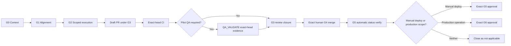

# Distributed Multi-Agent SDLC — Planning Package

**Document type:** Planning evidence  
**Current phase:** Pre-pilot implementation  
**Status reviewed:** 2026-07-20  
**GWC refresh baseline:** `main@16f64a88e0a5a7fc811e32e3acd06cda1301c50c`

## Status

This package defines the intended Pilot and end-state architecture. It does not
prove that the Pilot capabilities, Rental Home adapter, success run, or
failure-recovery run are complete.

All task checkboxes remain open until exact repository, PR/head SHA, CI, QA, DS
Admin transition, and runtime evidence is recorded. Historical SHAs in the
original planning package are reference points only and must not be treated as
current protected bases. Conversation memory or a similarly named task is not
completion evidence.

## Package contents

| Area | Purpose | Current status |
|---|---|---|
| [`PROGRAM_PLAN.md`](PROGRAM_PLAN.md) | Program decision, workstreams, releases, go/no-go | Approved planning direction; execution evidence pending |
| [`pilot-v1/ds-mcp/`](pilot-v1/ds-mcp/) | DS MCP control-plane Pilot requirements, design, tasks | Planned; completion not verified |
| [`pilot-v1/rental-home/`](pilot-v1/rental-home/) | Rental Home validation adapter requirements, design, tasks | Planned; completion not verified |
| [`end-state/`](end-state/) | Multi-project target architecture and rollout tasks | Deferred until Pilot closure |

## Decision

Use **DS MCP as the single execution control plane**. Do not introduce a second
orchestrator or generic file-writing MCP without evidence that existing GWC and
DS MCP mechanisms cannot be safely extended.

Repository specs remain the source of truth for requirements and design. DS
Admin/AgentOps is the intended source of truth for runtime execution state,
ownership, claims, leases, PR/head-SHA binding, CI, QA evidence, and transitions.

## Ownership

| Scope | Repository owner |
|---|---|
| Control plane, workflow stages, claims, leases, evidence binding, scheduler, dashboard | `dw18031988/ds_mcp_server` |
| Project adapter and machine-readable project validation | `nhatnguyenquang1838-coder/rental_home` |
| Governance contracts only when a concrete cross-project gap is proven | `nhatnguyenquang1838-coder/gwc` |

## Gate boundary

`QA_VALIDATE` is a Pilot workflow stage within the G3 evidence path, not a new
canonical GWC gate. Pilot implementation must stop at validated Draft
PR/review-ready evidence unless separate authority exists. Automatic read-only
G5 status verification does not authorize a manual deploy, release, publish, or
runtime reload.

`REVIEW_READY` or `ACCEPTED_PENDING_G4` means that exact-head delivery, CI, QA
when required, and review evidence are ready for a separate G4 decision. It does
not authorize merge, auto-merge, deployment, release, or production operations.

## QA evidence freshness

A QA `PASS` without validated, current, exact-head evidence is invalid.

For Pilot workflows:

- create `qa_validate` only after required CI passes for the exact current head;
- accept evidence only from the active QA lease owner with the required
  role/capability;
- validate schema, repository, PR, scope, head SHA, findings, and redaction;
- reject stale, malformed, mismatched, secret-bearing, or scope-violating
  evidence;
- preserve accepted evidence and the validator result in bounded artifacts and
  audit events;
- invalidate prior CI, QA, and G3 review evidence after any head change.

QA evidence is quality evidence only and grants no G4, G5, or G6 authority.

## Baseline and drift rule

Every repository-changing Pilot task must resolve its own current protected base
during G0. Do not copy historical package baselines or conversation memory into
a new execution envelope.

Apply [`../../base-drift-policy.md`](../../base-drift-policy.md) after an approved
base changes:

| Classification | Pilot response | Evidence impact |
|---|---|---|
| `SAFE_CONTINUE` | Record old/new base, changed files, overlap, risk, and decision; continue only when scope and authority are unchanged | Preserve G0/G1 and G2 authority; update drift evidence; retain head-bound evidence only if the execution head is unchanged and still valid |
| `REVALIDATE` | Reconstruct or rebase the execution head when required and rerun affected repository validation | Regenerate CI, QA, and G3 review evidence for the new head; preserve G0/G1 only when intent, scope, and risk remain aligned |
| `REAPPROVE` | Refresh G0/G1, scope hash, work binding, execution envelope, and exact G2 approval | Invalidate prior G2 authority and all downstream head-bound evidence |
| `STOP` | Stop the Pilot slice and request a new bounded scope/authority package | Reuse no prior approval or production-sensitive evidence |

Every drift evaluation records `old_base_sha`, `new_base_sha`, changed files,
scope overlap, risk assessment, and evaluator decision.

## Pilot preflight reference

Before execution, use the checklist in
[`pilot-v1/ds-mcp/tasks.md`](pilot-v1/ds-mcp/tasks.md). It directly addresses the
observed failure patterns documented in
[`../../gaps/g0-g1-naming-location-convention-gaps.md`](../../gaps/g0-g1-naming-location-convention-gaps.md):
run identity, workspace location, validator evidence, DS Admin traceability,
approval command integrity, and gate reporting.

Required GWC references:

- [`../../../AGENTS.md`](../../../AGENTS.md)
- [`../../../core/GATE_LIFECYCLE_CONTRACT_v1.0.md`](../../../core/GATE_LIFECYCLE_CONTRACT_v1.0.md)
- [`../../../core/E2E_DRAFT_PR_DELIVERY_RULE.md`](../../../core/E2E_DRAFT_PR_DELIVERY_RULE.md)
- [`../../base-drift-policy.md`](../../base-drift-policy.md)
- [`../../gaps/g0-g1-naming-location-convention-gaps.md`](../../gaps/g0-g1-naming-location-convention-gaps.md)
- [`../../../projects/ds-mcp/admin-task-claim-rule.md`](../../../projects/ds-mcp/admin-task-claim-rule.md)
- [`../../../projects/rental-home/spec-driven-format.md`](../../../projects/rental-home/spec-driven-format.md)

## Evidence required to change status

A plan item may move from `planned` only when evidence identifies:

- DS Admin task and legal transitions;
- repository and exact protected-base SHA;
- task-scoped G0/G1 workspace and validator result;
- guarded branch and exact file scope;
- PR number and exact current head SHA;
- validation commands and results;
- required CI checks for the same head;
- QA/reviewer evidence for the same head;
- base-drift decision when the approved base changed;
- residual risks and exclusions;
- next legal gate or explicit `not_applicable` result.
