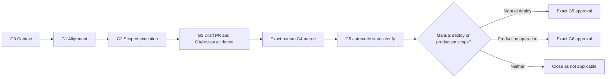

# Distributed Multi-Agent SDLC — Planning Package

**Document type:** Planning evidence  
**Current phase:** Pre-pilot implementation  
**Status reviewed:** 2026-07-20  
**GWC refresh baseline:** `main@16f64a88e0a5a7fc811e32e3acd06cda1301c50c`

## Status

This package defines the intended Pilot and end-state architecture. It does not
prove that the Pilot capabilities, Rental Home adapter, success run, or
failure-recovery run are complete.

All task checkboxes remain open until exact repository, PR/head SHA, CI, QA, DS
Admin transition, and runtime evidence is recorded. Historical SHAs in the
original planning package are reference points only and must not be treated as
current protected bases.

## Package contents

| Area | Purpose | Current status |
|---|---|---|
| [`PROGRAM_PLAN.md`](PROGRAM_PLAN.md) | Program decision, workstreams, releases, go/no-go | Approved planning direction; execution evidence pending |
| [`pilot-v1/ds-mcp/`](pilot-v1/ds-mcp/) | DS MCP control-plane Pilot requirements, design, tasks | Planned; completion not verified |
| [`pilot-v1/rental-home/`](pilot-v1/rental-home/) | Rental Home validation adapter requirements, design, tasks | Planned; completion not verified |
| [`end-state/`](end-state/) | Multi-project target architecture and rollout tasks | Deferred until Pilot closure |

## Decision

Use **DS MCP as the single execution control plane**. Do not introduce a second
orchestrator or generic file-writing MCP without evidence that existing GWC and
DS MCP mechanisms cannot be safely extended.

Repository specs remain the source of truth for requirements and design. DS
Admin/AgentOps is the intended source of truth for runtime execution state,
ownership, claims, leases, PR/head-SHA binding, CI, QA evidence, and transitions.

## Ownership

| Scope | Repository owner |
|---|---|
| Control plane, workflow stages, claims, leases, evidence binding, scheduler, dashboard | `dw18031988/ds_mcp_server` |
| Project adapter and machine-readable project validation | `nhatnguyenquang1838-coder/rental_home` |
| Governance contracts only when a concrete cross-project gap is proven | `nhatnguyenquang1838-coder/gwc` |

## Gate boundary

Pilot implementation must stop at validated Draft PR/review-ready evidence unless
separate authority exists. Automatic read-only G5 status verification does not
authorize a manual deploy, release, publish, or runtime reload.

## Baseline rule

Every repository-changing Pilot task must resolve its own current protected base
during G0. Do not copy the historical package baselines into a new execution
envelope.

Required GWC references:

- [`../../../AGENTS.md`](../../../AGENTS.md)
- [`../../../core/GATE_LIFECYCLE_CONTRACT_v1.0.md`](../../../core/GATE_LIFECYCLE_CONTRACT_v1.0.md)
- [`../../../core/E2E_DRAFT_PR_DELIVERY_RULE.md`](../../../core/E2E_DRAFT_PR_DELIVERY_RULE.md)
- [`../../../projects/ds-mcp/admin-task-claim-rule.md`](../../../projects/ds-mcp/admin-task-claim-rule.md)
- [`../../../projects/rental-home/spec-driven-format.md`](../../../projects/rental-home/spec-driven-format.md)

## Evidence required to change status

A plan item may move from `planned` only when evidence identifies:

- DS Admin task and legal transitions;
- repository and exact base SHA;
- guarded branch and exact file scope;
- PR number and exact current head SHA;
- validation commands and results;
- required CI checks for the same head;
- QA/reviewer evidence for the same head;
- residual risks and exclusions;
- next legal gate or explicit `not_applicable` result.
