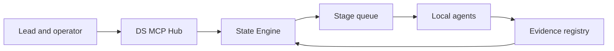
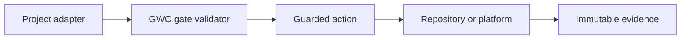
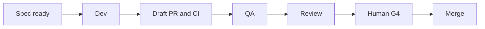

# Design Document

## Overview

The end-state is a control-plane platform, not a single long prompt. DS MCP provides durable orchestration and integration. Local agents perform bounded work in isolated worktrees. GWC provides gate and authority contracts. Project adapters translate repository-specific specs, commands, and evidence into canonical runtime contracts.

The architecture evolves from the existing AgentOps implementation. It does not discard the current State Engine, scheduler, agent registry, GitHub gateway, audit model, or Supabase/memory paths.

## Architecture

### Control Plane



### Authority Plane



### Delivery Flow



## Components and Interfaces

### Workflow Template Registry

Suggested path:

```text
src/workflows/
```

Responsibility:

- Store versioned templates.
- Validate stage graph, roles, transitions, schemas, retry, and gate requirements.
- Prevent mutation of in-flight template versions.

Core model:

```ts
type WorkflowTemplate = {
  id: string;
  version: string;
  project_adapter_id: string;
  stages: StageDefinition[];
  transitions: TransitionDefinition[];
  policy_pack_id: string;
  active: boolean;
};
```

### Stage Definition

```ts
type StageDefinition = {
  id: string;
  task_type: string;
  required_role: AgentRole;
  input_schema: string;
  output_schema: string;
  minimum_gate: "G0" | "G1" | "G2" | "G3" | "G4" | "G5" | "G6";
  retry_policy_id?: string;
  timeout_seconds?: number;
  write_capable: boolean;
};
```

### Project Adapter Registry

Suggested path:

```text
src/projects/
```

Responsibility:

- Load validated project profiles and adapter contracts.
- Resolve commands, spec format, file boundaries, CI mapping, and evidence conversion.
- Fail closed on missing or conflicting project identity.

```ts
type ProjectAdapter = {
  id: string;
  version: string;
  repository: string;
  protected_branches: string[];
  spec_contract: Record<string, unknown>;
  command_contract: Record<string, unknown>;
  quality_policy_id: string;
  evidence_mappers: string[];
  exclusions: string[];
};
```

### Agent Identity and Role Service

Suggested path:

```text
src/agents/
```

Responsibility:

- Register agent identity, runtime type, role, capabilities, project access, and heartbeat.
- Enforce role separation and least privilege.

```ts
type AgentIdentity = {
  id: string;
  runtime: "kiro" | "codex" | "claude" | "chatgpt" | "custom";
  roles: AgentRole[];
  capabilities: string[];
  allowed_projects: string[];
  status: string;
};
```

### Durable Task and Lease Service

Suggested path:

```text
src/tasks/
src/leases/
```

Responsibility:

- Atomic targeted claim.
- Owner-only renew/release.
- Idempotent result submission.
- Scheduler recovery.
- Dead-letter and human intervention.

### Evidence and Artifact Registry

Suggested path:

```text
src/evidence/
```

Responsibility:

- Normalize and index bounded evidence.
- Reference external logs/artifacts.
- Enforce exact SHA/scope binding and retention.

```ts
type EvidenceRecord = {
  id: string;
  type: "plan" | "gate" | "commit" | "pr" | "ci" | "qa" | "review" | "merge" | "deploy" | "production";
  workflow_id: string;
  task_id?: string;
  repository?: string;
  immutable_ref?: string;
  scope_hash?: string;
  metadata: Record<string, unknown>;
  artifact_ref?: string;
  created_at: string;
};
```

### Gate Enforcement Adapter

Suggested path:

```text
src/governance/
```

Responsibility:

- Invoke GWC action validation before write-capable operations.
- Validate G0/G1/G2/G3 artifacts and later human authority.
- Map connector action to minimum gate.
- Fail closed when validator evidence is unavailable.

### Git Provider Adapter

Suggested path:

```text
src/git/
```

Responsibility:

- Abstract GitHub/GitLab provider differences.
- Preserve guarded branches, expected SHA, Draft PR, review, CI, and exact-head contracts.
- Keep merge separate under G4.

### Quality Policy Engine

Suggested path:

```text
src/quality/
```

Responsibility:

- Resolve required validation based on project, risk, files, and change type.
- Validate QA evidence completeness.
- Record skipped checks and reasons.

### Projection and Sync Service

Suggested path:

```text
src/projections/
```

Responsibility:

- Render DS Admin runtime state into repository/task-board projections.
- Detect conflicts.
- Never allow projection writes to override runtime state.

### Operator Dashboard

Suggested paths:

```text
src/dashboard/
public/admin/
```

Responsibility:

- Portfolio, workflow, task, agent, queue, lease, CI, QA, dead-letter, and authority views.
- Actionable links.
- Role-controlled recovery actions.
- SLO and audit reporting.

## Data Models

### Workflow Run

```ts
type WorkflowRun = {
  id: string;
  template_id: string;
  template_version: string;
  project_adapter_id: string;
  root_task_id: string;
  status: string;
  current_stage_ids: string[];
  context: Record<string, unknown>;
  created_at: string;
  updated_at: string;
};
```

### Stage Task

```ts
type StageTask = {
  id: string;
  workflow_id: string;
  stage_id: string;
  required_role: AgentRole;
  status: string;
  payload: Record<string, unknown>;
  result?: Record<string, unknown>;
  lease_owner?: string;
  lease_expires_at?: string;
  attempt: number;
  root_cause_fingerprint?: string;
};
```

### Human Authority Record

```ts
type HumanAuthority = {
  gate: "G4" | "G5" | "G6";
  approval_id: string;
  repository: string;
  task_id: string;
  immutable_target: string;
  scope_hash: string;
  actions: string[];
  issued_at: string;
  expires_at: string;
  approved_by: string;
};
```

### Projection State

```ts
type ProjectionState = {
  workflow_id: string;
  project: string;
  target: string;
  source_event_cursor: string;
  rendered_hash: string;
  conflict: boolean;
};
```

## Correctness Properties

### One Runtime State Engine

Only validated State Engine transitions can mutate workflow runtime state.

### Immutable Template Binding

An in-flight run always uses the template version selected at creation.

### One Active Lease

A claimable stage task has at most one effective lease owner at a time.

### Exact Evidence

Evidence for one immutable code revision cannot approve or transition another revision.

### Role Separation

A role cannot claim or submit results for a stage it is not permitted to execute.

### Human Authority Isolation

G4, G5, and G6 are never inferred from earlier gates or automation results.

### Project Isolation

One project's task, credentials, evidence, or repository permissions cannot be used for another project.

### Projection Non-Authority

Generated repository views cannot override DS Admin runtime state.

### Bounded Automation

Retry, repair, callback, logs, artifacts, and loops are bounded by policy.

## Error Handling

Error families:

```text
TEMPLATE_*
PROJECT_ADAPTER_*
ROLE_*
CLAIM_*
LEASE_*
STATE_*
EVIDENCE_*
GATE_*
GIT_*
CI_*
QA_*
REVIEW_*
AUTHORITY_*
PROJECTION_*
SCHEDULER_*
SECURITY_*
```

Every failure must include:

- Stable code.
- Human summary.
- Retryable flag.
- Workflow/task/actor context.
- Bounded metadata.
- Recommended next allowed action.
- No secrets.

## Testing Strategy

Contract tests:

- Template and adapter schemas.
- GWC gate action mappings.
- Evidence schemas.
- Provider adapter contracts.

State-model tests:

- Legal and illegal transitions.
- Branch/join behavior.
- Idempotency.
- Lease race conditions.
- Retry/dead-letter/human intervention.

Security tests:

- Auth and role denial.
- Project/repository isolation.
- Secret redaction.
- Rate limiting.
- Prompt/repository content cannot grant authority.

Integration tests:

- Lead → Dev → PR/CI → QA → Review.
- Dev/QA failure loops.
- Agent crash and lease recovery.
- Duplicate webhook and result submission.
- Stale head and ambiguous CI.
- Projection conflict.
- Human G4 merge executor with exact approval.
- G5/G6 denial without separate authority.

Operational tests:

- Scheduler lock.
- Heartbeat stale detection.
- Queue pressure.
- Evidence retention.
- Dashboard degraded dependencies.
- Supabase and memory/local fallback compatibility where supported.

## Implementation Constraints

- Evolve current DS MCP components; do not rewrite the platform in one release.
- Preserve GWC as the authority contract.
- Keep project-specific conventions in adapters.
- Do not centralize source workspaces or production credentials.
- Default to Draft PR delivery and human review.
- Use transactional operations for consistency-critical state.
- Use bounded payloads and external artifact references.
- Support gradual template/adapter rollout and rollback.
