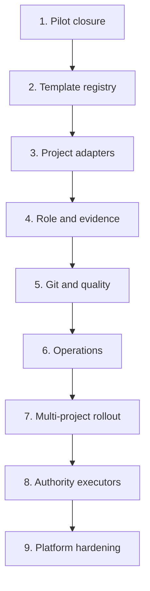

# Implementation Plan

## Overview

Deliver the end-state in incremental releases after Pilot v1. Each release must reuse existing DS MCP/GWC mechanisms, preserve compatibility, and have an explicit go/no-go. Do not start a later wave merely because the previous code was merged; require operational evidence.

## Task Dependency Graph

## Tasks

- [ ] 1. Close Pilot v1 and freeze lessons
  - Complete success and controlled failure-recovery runs.
  - Measure manual interventions, stale agents, lease recovery, evidence mismatches, retries, and operator usability.
  - Reconcile repository projections and DS Admin state.
  - Decide `GO`, `GO_WITH_CONDITIONS`, or `NO_GO`.
  - Convert proven gaps into atomic end-state tasks.
  - _Requirements: 4, 5, 6, 9, 12_

- [ ] 2. Introduce versioned workflow templates
  - Extract hard-coded transitions into validated versioned templates.
  - Bind in-flight runs to immutable template versions.
  - Support bounded branch/join transitions.
  - Add template validation, activation, deprecation, and rollback.
  - Preserve legacy template compatibility.
  - _Requirements: 1, 6, 12_

- [ ] 3. Introduce validated project adapters
  - Define adapter schema.
  - Migrate DS MCP and Rental Home profiles into adapter-compatible form without duplicating GWC.
  - Add command, spec, quality, Git/CI, evidence, boundary, and exclusion contracts.
  - Add adapter conflict and missing-context failure behavior.
  - Add one additional low-risk project only after Rental Home stabilizes.
  - _Requirements: 2, 7, 8, 10, 12_

- [ ] 4. Harden role-separated agent identity
  - Add versioned role and capability policies.
  - Add project access and least-privilege credential mapping.
  - Add conflict-of-duty rules.
  - Add agent registration attestation and heartbeat SLOs.
  - Add runtime adapters for Kiro, Codex, Claude, ChatGPT, and custom workers.
  - _Requirements: 3, 4, 10_

- [ ] 5. Build the evidence and artifact registry
  - Add normalized evidence records and immutable references.
  - Bind evidence to workflow, task, repository, scope hash, and SHA.
  - Add retention, cleanup, redaction, and external artifact references.
  - Add evidence queries and reviewer views.
  - Preserve required audit history while cleaning transient noise.
  - _Requirements: 5, 7, 9, 10_

- [ ] 6. Harden State Engine transactional integrity
  - Prevent generic CRUD from mutating workflow-critical state.
  - Add transactional RPCs for consistency-critical transitions.
  - Add idempotency and duplicate-delivery handling.
  - Add concurrency and race-condition tests.
  - Add state repair and operator recovery flows.
  - _Requirements: 4, 6, 9_

- [ ] 7. Generalize Git provider and exact CI binding
  - Formalize provider adapter contract.
  - Add review-request and review-evidence support without merging authority.
  - Strengthen exact run/check/PR/head matching.
  - Add rich bounded CI diagnostics and secret-safe log references.
  - Add GitLab only when a real project requires it.
  - _Requirements: 5, 7, 10, 11_

- [ ] 8. Add quality policy profiles
  - Define quality policy schema by risk, modules, and change type.
  - Add required/optional/skipped check semantics.
  - Add QA evidence completeness validation.
  - Add security, migration, denial-case, UI, and performance policy modules.
  - Add project-specific policy mappings.
  - _Requirements: 8, 10_

- [ ] 9. Build operations, SLOs, and recovery
  - Define queue, stale-agent, lease-recovery, evidence-freshness, and workflow-duration SLOs.
  - Activate scheduler and heartbeat operational jobs.
  - Add actionable alerts and drilldowns.
  - Add dead-letter triage and safe requeue/retry controls.
  - Add bounded cleanup for transient records.
  - _Requirements: 4, 5, 9_

- [ ] 10. Migrate runtime SSOT project by project
  - Add explicit `tracking_mode` migration.
  - Generate repository task-board projections from runtime events.
  - Detect and block conflicts.
  - Preserve rollback to repository-driven mode for non-migrated tasks.
  - Remove manual duplicate state only after operational acceptance.
  - _Requirements: 2, 6, 12_

- [ ] 11. Add separately authorized G4/G5/G6 executors
  - Implement merge executor only with exact, unexpired G4 authority.
  - Implement deployment executor only with exact G5 authority.
  - Implement production-operation executor only with exact G6 authority.
  - Add immutable target, scope, expiry, actor, result, and rollback evidence.
  - Keep these executors disabled until platform controls and human procedures are reviewed.
  - _Requirements: 10, 11_

- [ ] 12. Execute multi-project rollout
  - Run one project at a time through readiness assessment.
  - Validate adapter, agent identities, quality policy, and rollback.
  - Pilot one bounded workflow.
  - Review SLO and evidence.
  - Scale only after go/no-go.
  - _Requirements: 2, 3, 8, 9, 12_

- [ ] 13. Platform hardening and external audit
  - Run threat modeling and security review.
  - Test privilege boundaries and project isolation.
  - Run failure injection for agent, scheduler, DB, webhook, and provider outages.
  - Validate evidence retention and recovery.
  - Review GWC compatibility and instruction drift.
  - Publish versioned operating runbook.
  - _Requirements: 4, 5, 6, 9, 10, 11, 12_

## Notes

- End-state work is a program, not one PR.
- Use multiple atomic specs/PRs after Pilot closure.
- Prefer Reuse → Extend → Refactor → Replace.
- Do not replace the State Engine or adapter model without evidence that extension cannot satisfy the requirement.
- Every repository-changing slice requires separate task-scoped gates and claims.
- G4, G5, and G6 remain separate exact human authority.
