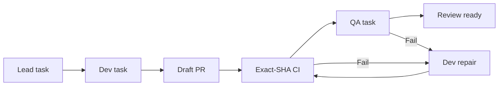
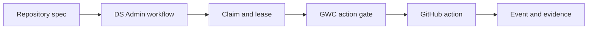

# Design Document

## Overview

Pilot v1 extends the existing DS MCP AgentOps control plane with one new role-separated stage: `qa_validate`.

The design reuses:

- Existing async workflow store and State Engine.
- Existing targeted claim filters and leases.
- Existing agent registry and heartbeat.
- Existing GitHub repository, branch, file, PR, and CI surfaces.
- Existing retry, scheduler, dead-letter, audit event, REST, MCP, dashboard, and Supabase/memory fallback patterns.
- Existing GWC task claim and gate contracts.

The design does not add a second orchestrator and does not add a generic unrestricted file-writing server.

## Architecture



Runtime authority remains:



## Components and Interfaces

### Workflow Template Version

Suggested path:

```text
src/workflows/workflowTemplates.ts
```

Responsibility:

- Define a versioned Pilot v1 stage sequence.
- Preserve the current legacy workflow sequence.
- Provide deterministic next-stage selection.

Interface:

```ts
type WorkflowTemplateId = "legacy-v1" | "multi-agent-pilot-v1";

type WorkflowStage =
  | "analyze_repo"
  | "plan_changes"
  | "modify_code"
  | "create_pr"
  | "wait_github_ci"
  | "fix_ci"
  | "qa_validate"
  | "final_report";

type WorkflowTemplate = {
  id: WorkflowTemplateId;
  stages: WorkflowStage[];
  transitions: Record<string, Record<string, WorkflowStage | "complete" | "needs_attention">>;
};
```

Existing mechanism to reuse:

- `evaluateNextTaskType`.
- `applyTaskResultTransition`.

Pilot implementation MAY keep transition logic in the existing State Engine if a separate template module would add unnecessary scope, but the behavior SHALL be versioned.

### Role Capability Policy

Suggested path:

```text
src/agents/roleCapabilityPolicy.ts
```

Responsibility:

- Map registered roles to claimable task types.
- Deny role/stage mismatches.
- Produce stable reason codes.

Interface:

```ts
type AgentRole = "lead" | "dev" | "qa" | "reviewer" | "operator" | "system";

type RoleCapabilityPolicy = {
  role: AgentRole;
  claimable_task_types: WorkflowStage[];
  allowed_result_statuses: ("succeeded" | "failed")[];
};

function assertRoleCanClaim(role: AgentRole, taskType: WorkflowStage): void;
```

Compatibility:

- Existing agent `capabilities` remain required.
- Role policy is an additional server-side check.

### Pilot Work Binding

Suggested path:

```text
src/agentops/pilotWorkBinding.ts
```

Responsibility:

- Normalize repository and PR identity.
- Bind workflow, task, repository, base SHA, branch, PR, head SHA, and scope hash.
- Validate the binding before claim result, PR event, CI event, and QA evidence acceptance.

Interface:

```ts
type PilotWorkBinding = {
  workflow_id: string;
  root_task_id: string;
  spec_id: string;
  repository: string;
  base_ref: string;
  base_sha: string;
  working_branch: string;
  scope_hash: string;
  pr_number?: number;
  head_sha?: string;
};
```

### QA Evidence Validator

Suggested path:

```text
src/qa/qaEvidence.ts
```

Responsibility:

- Validate versioned QA evidence.
- Reject stale-head submissions.
- Cap logs and redact secrets.
- Store normalized evidence in task artifacts/events.

Interface:

```ts
type QaCheckResult = {
  name: string;
  command?: string;
  status: "passed" | "failed" | "skipped";
  duration_ms?: number;
  summary?: string;
  artifact_ref?: string;
};

type QaEvidenceV1 = {
  schema_version: "1.0";
  workflow_id: string;
  task_id: string;
  repository: string;
  pr_number: number;
  head_sha: string;
  qa_agent_id: string;
  claimed_at: string;
  submitted_at: string;
  result: "passed" | "failed" | "blocked";
  checks: QaCheckResult[];
  findings: Array<{
    code: string;
    severity: "info" | "warning" | "error";
    summary: string;
    path?: string;
    line?: number;
  }>;
  diff_scope: {
    reviewed: boolean;
    unexpected_files: string[];
    production_code_modified_by_qa: boolean;
  };
};
```

### QA Stage Service

Suggested path:

```text
src/qa/qaStageService.ts
```

Responsibility:

- Create `qa_validate` after exact-SHA CI success.
- Accept QA result only from the active lease owner.
- On pass, create final report/review-ready task.
- On fail, create bounded Dev repair task containing findings.
- Track repair root-cause fingerprints.

Interface:

```ts
async function createQaTaskForCiSuccess(...): Promise<AsyncTask>;
async function submitQaEvidence(...): Promise<StateEngineTransitionResult>;
```

### Pilot Status Projection

Suggested path:

```text
src/agentops/pilotStatusProjection.ts
```

Responsibility:

- Produce compact operator state.
- Expose current owner, stage, lease, PR/head SHA, CI, QA, retries, blockers, and next action.

Interface:

```ts
type PilotStatus = {
  workflow_id: string;
  template_id: "multi-agent-pilot-v1";
  stage: WorkflowStage | "complete" | "needs_attention";
  current_task_id?: string;
  current_owner?: string;
  lease_expires_at?: string;
  repository: string;
  branch: string;
  pr_number?: number;
  head_sha?: string;
  ci?: { status: string; conclusion?: string };
  qa?: { status: "pending" | "passed" | "failed" | "blocked"; evidence_task_id?: string };
  repair_attempts: number;
  needs_attention: boolean;
  attention_reasons: string[];
};
```

### REST and MCP Surfaces

Suggested paths:

```text
src/agentops/router.ts
src/agentops/mcpTools.ts
src/server.ts
openapi.yaml
```

Minimum additions:

```text
GET  /api/workflows/{workflow_id}/pilot-status
POST /api/async-tasks/{task_id}/qa-result
```

MCP additions:

```text
pilot_status_get
qa_evidence_submit
```

The existing generic `async_task_submit_result` MAY accept QA evidence instead of adding a new write tool when that produces a smaller and clearer contract. In either case, server-side schema and role checks are mandatory.

### Dashboard Projection

Suggested paths:

```text
src/dashboard/orchestrationDashboard.ts
public/admin/
```

Responsibility:

- Display stage, role owner, stale status, lease expiry, PR/head SHA, CI status, QA status, retry count, and `needs_attention`.
- Do not add destructive control actions in Pilot v1.

## Data Models

### Workflow Context Additions

```ts
type PilotWorkflowContext = {
  template_id: "multi-agent-pilot-v1";
  tracking_mode: "ds_admin_runtime";
  root_task_id: string;
  spec_id: string;
  repository: string;
  base_ref: string;
  base_sha: string;
  working_branch: string;
  scope_hash: string;
  allowed_files: string[];
  excluded_actions: string[];
  max_repair_attempts: 3;
};
```

### Task Payload Additions

```ts
type PilotTaskPayload = {
  required_role: AgentRole;
  work_binding: PilotWorkBinding;
  previous_stage_result?: Record<string, unknown>;
  qa_findings?: QaEvidenceV1["findings"];
  root_cause_fingerprint?: string;
};
```

### Audit Events

Minimum event types:

```text
pilot_workflow_created
role_claim_rejected
pilot_task_claimed
pilot_binding_verified
pilot_binding_mismatch
pilot_pr_bound
pilot_ci_matched
pilot_qa_task_created
pilot_qa_evidence_accepted
pilot_qa_evidence_rejected
pilot_repair_created
pilot_repair_budget_exhausted
pilot_review_ready
```

## Correctness Properties

### Claim Safety

An agent cannot successfully claim a stage unless both its registered role and advertised capability allow the task type.

### Exact Revision Safety

CI or QA evidence for head SHA A cannot change the state of a workflow currently bound to head SHA B.

### State Engine Ownership

Only the State Engine creates the next stage task.

### Runtime SSOT

For Pilot workflows, repository Markdown cannot transition runtime state.

### Lease Safety

An expired or non-owner lease cannot submit a successful task result.

### Repair Bound

No Pilot workflow can create more than three automatic repair tasks.

### Authority Boundary

QA pass cannot merge a PR, enable auto-merge, deploy, or authorize production operations.

### Compatibility

Legacy workflow runs remain interpretable and do not gain a QA stage unless explicitly created with the Pilot template.

## Error Handling

Stable reason codes should include:

```text
PILOT_TEMPLATE_INVALID
PILOT_ROLE_REQUIRED
PILOT_ROLE_CAPABILITY_MISMATCH
PILOT_TASK_TARGET_MISMATCH
PILOT_BINDING_MISSING
PILOT_BINDING_MISMATCH
PILOT_LEASE_INVALID
PILOT_PR_HEAD_MISMATCH
PILOT_CI_HEAD_MISMATCH
PILOT_QA_SCHEMA_INVALID
PILOT_QA_AGENT_MISMATCH
PILOT_QA_HEAD_MISMATCH
PILOT_QA_SCOPE_VIOLATION
PILOT_REPAIR_BUDGET_EXHAUSTED
PILOT_HUMAN_INTERVENTION_REQUIRED
```

Errors must be structured, auditable, bounded, and secret-safe.

## Testing Strategy

Unit tests:

- Workflow template transition matrix.
- Lead/Dev/QA role policy.
- Targeted claim no-fallback behavior.
- Lease owner and expiry validation.
- PR/head-SHA binding.
- CI exact-head matching.
- QA evidence schema.
- Stale-head QA rejection.
- QA pass transition.
- QA fail to Dev repair transition.
- Root-cause repetition limit.
- Three-attempt repair exhaustion.
- Audit event emission.
- Legacy workflow compatibility.

Integration-style tests:

1. Success path:
   `plan → dev → PR → CI pass → QA pass → final report`.
2. QA failure-recovery:
   `QA fail → Dev repair → new head → CI pass → QA pass`.
3. Stale evidence:
   old QA evidence rejected after a new commit.
4. Wrong role:
   Dev cannot claim QA task; QA cannot claim Dev task.

Validation commands:

```text
npm test
npm run typecheck
npm run build
```

Command definitions and lifecycle behavior must be inspected before execution.

## Implementation Constraints

- Reuse the current State Engine, repositories, schemas, route policy, audit events, scheduler, and GitHub gateway.
- Preserve Supabase and memory fallback behavior where practical.
- No direct write to `main`.
- Use one isolated worktree per branch.
- No merge, deployment, release, production configuration, credentials, migrations, or production-data access in G2/G3.
- Keep payloads bounded and secret-safe.
- Do not introduce a new unrestricted file-writing MCP.
- Do not allow generic CRUD to mutate workflow state.
- Do not accept stale or ambiguous CI/QA evidence.
