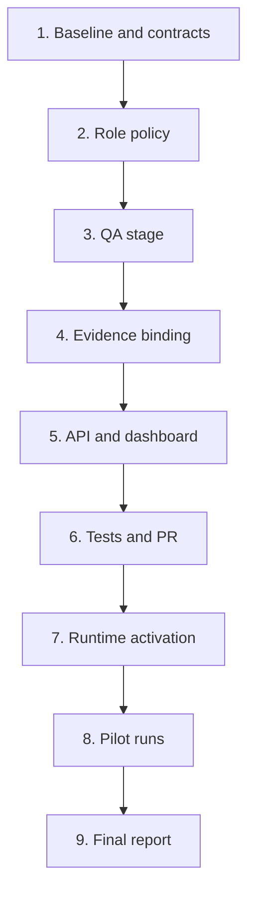

# Implementation Plan

## Overview

Implement Pilot v1 in bounded slices. First freeze contracts and compatibility. Then add role-bound QA workflow behavior, exact evidence binding, projections, and tests. After the DS MCP Draft PR is reviewed and separately merged/deployed, implement the Rental Home adapter and execute two controlled Pilot runs.

Repository changes must follow task-scoped G0/G1, valid DS Admin claim, G2 envelope, isolated branch/worktree, validation, and G3 Draft PR delivery.

## Task Dependency Graph

## Tasks

- [ ] 1. Inspect and freeze the Pilot baseline
  - Read protected-base `AGENTS.md`, GWC package, DS MCP profile/instructions/extension/claim rule, package scripts, workflows, State Engine, async workflow store, task schemas, agent registry, scheduler, dashboard, GitHub gateway, route policy, tests, and OpenAPI.
  - Confirm current default branch and full base SHA.
  - Confirm whether existing Phase 7 code already implements any proposed component.
  - Resolve existing profile/package/extension contradictions before G2.
  - Produce versioned Pilot contracts for workflow context, work binding, role policy, and QA evidence.
  - Record non-goals and compatibility strategy.
  - _Requirements: 1, 2, 3, 4, 7, 10_

- [ ] 2. Add role and stage contracts
  - Add `qa_validate` to the Pilot workflow template only.
  - Add Lead, Dev, QA, Reviewer, Operator, and System role definitions.
  - Map roles to claimable task types.
  - Enforce role plus advertised capability on claim.
  - Emit stable rejection reason codes and audit events.
  - Preserve current legacy workflow behavior.
  - _Requirements: 1, 2, 10_

- [ ] 3. Implement deterministic QA stage transitions
  - Create `qa_validate` only after exact-SHA CI success.
  - Accept QA result only from the active lease owner.
  - On QA pass, create final-report or review-ready stage.
  - On QA failure, create a Dev repair task with findings.
  - Preserve existing CI repair behavior.
  - Ensure only State Engine code creates next tasks.
  - _Requirements: 1, 2, 5, 9_

- [ ] 4. Implement exact work and evidence binding
  - Add normalized Pilot work binding.
  - Bind workflow/task to repository, base SHA, working branch, scope hash, PR number, and current head SHA.
  - Validate binding before claim result, CI transition, and QA evidence acceptance.
  - Add versioned `QaEvidence` schema and validator.
  - Reject stale-head, wrong-agent, malformed, oversized, secret-bearing, or scope-violating evidence.
  - Store normalized evidence in bounded artifacts and events.
  - _Requirements: 3, 4, 9_

- [ ] 5. Implement bounded repair and human-intervention state
  - Track repair attempt count and root-cause fingerprint.
  - Allow at most three automatic repairs.
  - Allow at most one repeated attempt for an unchanged root cause.
  - Set `needs_attention` with stable reason when budget is exhausted.
  - Ensure expired leases are recovered through scheduler policy.
  - _Requirements: 5, 6, 9_

- [ ] 6. Add REST, MCP, capability, and dashboard projections
  - Add compact Pilot status projection.
  - Expose Pilot status through REST and MCP.
  - Accept QA evidence through the smallest compatible write contract.
  - Register sensitive operations in route policy.
  - Preserve auth, role, rate limits, request IDs, and secret redaction.
  - Update capabilities and OpenAPI.
  - Display stage, owner, stale state, lease, PR/head SHA, CI, QA, retries, blockers, and next action.
  - Do not add merge/deploy/destructive controls.
  - _Requirements: 6, 7, 8, 9_

- [ ] 7. Add focused tests
  - Add unit tests for role policy and stage transitions.
  - Add tests for targeted claim no-fallback.
  - Add lease owner/expiry tests.
  - Add exact PR/head/CI binding tests.
  - Add QA schema and stale-head rejection tests.
  - Add success and QA failure-recovery integration tests.
  - Add repair exhaustion tests.
  - Add legacy compatibility tests.
  - _Requirements: 1, 2, 3, 4, 5, 9, 10_

- [ ] 8. Validate and deliver the DS MCP Draft PR
  - Inspect selected package scripts and lifecycle hooks.
  - Run `npm test`.
  - Run `npm run typecheck`.
  - Run `npm run build`.
  - Review the complete diff for secrets, scope drift, accidental deletion, generated noise, weakened checks, and unrelated changes.
  - Create or update a Draft PR under G3 only.
  - Record final head SHA and required CI evidence.
  - Stop before merge or deployment.
  - _Requirements: 8, 9, 10_

- [ ] 9. Obtain separate merge and runtime activation authority
  - Obtain exact G4 approval for the reviewed DS MCP PR head SHA.
  - Merge only under valid G4 authority.
  - Obtain exact G5 approval before deploying or activating changed DS MCP runtime behavior.
  - Verify active runtime capability version after deployment.
  - Do not include production data, credentials, or destructive operations.
  - _Requirements: 8, 10_

- [ ] 10. Implement and deliver the Rental Home adapter
  - Follow `OPS-AGENT-01-multi-agent-pilot-adapter`.
  - Deliver the adapter as a separate Draft PR and exact head SHA.
  - Keep app runtime, DB, RLS, auth, and production data unchanged.
  - _Requirements: 3, 4, 7, 10_

- [ ] 11. Execute the success Pilot run
  - Create a root DS Admin task and Pilot workflow with `tracking_mode: ds_admin_runtime`.
  - Register and heartbeat Lead, Dev, and QA agents.
  - Claim each stage by exact task/workflow/repository filters.
  - Deliver the Rental Home adapter PR through Dev, CI, and QA stages.
  - Verify exact PR/head-SHA evidence at every stage.
  - Produce final report without merge unless separately authorized.
  - _Requirements: 1, 2, 3, 4, 6, 7, 8, 9_

- [ ] 12. Execute the controlled failure-recovery Pilot run
  - Use a pilot-only deterministic failing fixture or branch state.
  - Confirm QA failure creates a Dev repair task with findings.
  - Confirm old evidence is rejected after a new head SHA.
  - Repair within the bounded loop.
  - Confirm CI and QA pass on the new exact head SHA.
  - Preserve all attempt and transition events.
  - _Requirements: 3, 4, 5, 9_

- [ ] 13. Produce Pilot closure and end-state go/no-go
  - Report success criteria, failures, manual interventions, timing, queue/lease behavior, evidence quality, and operator usability.
  - Reconcile DS Admin runtime state with repository projections.
  - List residual risks and required end-state work.
  - Decide `GO`, `GO_WITH_CONDITIONS`, or `NO_GO`.
  - _Requirements: 6, 7, 8, 9, 10_

## Notes

- Suggested branch: `feature/ds-ops-08-multi-agent-pilot-v1`.
- Suggested risk: R2 because workflow/API/state behavior changes.
- Use one task-scoped workspace and one isolated worktree per branch.
- DS Admin claim is mandatory before G2 repository execution.
- The Pilot must not write directly to protected branches.
- The Pilot must stop before G4/G5 unless separate exact authority exists.
- No production data or credential operations are included.
