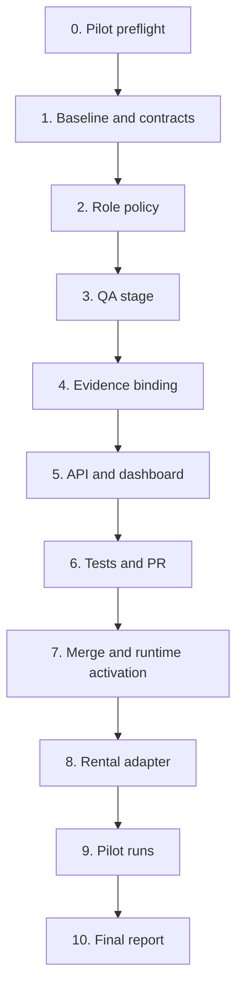

# DS MCP Pilot v1 — Implementation Plan

**Status:** Planned; implementation and runtime activation not verified complete  
**Status reviewed:** 2026-07-20

## Evidence rule

All checkboxes remain open until evidence is bound to the exact DS MCP repository
base, branch, PR/head SHA, CI, required QA, review, runtime capability version,
and legal DS Admin transitions. A related completed task, merged component, or
conversation memory does not by itself prove Pilot completion.

A QA `PASS` without accepted, current, exact-head evidence is invalid. The QA
record must be schema-valid, submitted by the active lease owner with the
required role/capability, bound to the active repository/PR/scope/head, and
accepted after required CI passes for the same head. Any new head invalidates
prior CI, QA, and G3 review evidence.

## Overview

Implement Pilot v1 in bounded slices. First freeze contracts and compatibility.
Then add or verify role-bound QA workflow behavior, exact evidence binding,
projections, and tests. After the DS MCP Draft PR reaches G3 review-ready and is
separately merged, obtain manual G5 authority only when runtime deployment or
activation requires a manual action. Then implement the Rental Home adapter and
execute two controlled Pilot runs.

Repository changes must follow task-scoped G0/G1, a valid DS Admin claim, a G2
envelope, an isolated branch/worktree, validation, and G3 Draft PR delivery.
`qa_validate` is a Pilot stage in the G3 evidence path, not a new canonical GWC
gate.

## Pilot preflight checklist

This checklist addresses the observed failure patterns in
[`../../../../gaps/g0-g1-naming-location-convention-gaps.md`](../../../../gaps/g0-g1-naming-location-convention-gaps.md).
Do not begin Pilot repository execution until every applicable item has evidence.

- [ ] Resolve or create the real DS Admin task and verify its legal current state.
- [ ] Record deterministic task/run identity according to the active AGENTS/runbook rules; do not invent a conflicting ad-hoc identifier.
- [ ] Use a collision-free task-scoped workspace appropriate to the execution mode and record its owner/path.
- [ ] Resolve the current protected branch and full protected-base SHA from the repository connector.
- [ ] Keep G0 and all G1 artifacts under the same task-scoped workspace with consistent trace/task references.
- [ ] Run `python tools/validate_g01.py --workspace <workspace>` before G2 and preserve command, stdout, exit code, and workspace path.
- [ ] Resolve remediable validation failures and rerun the validator; never claim G1 `PASS` without validator evidence.
- [ ] Confirm exact Files WRITE, exclusions, acceptance criteria, and normalized scope hash contain no placeholder values.
- [ ] Confirm the approval request ID, scope-hash prefix, and ISO-8601 UTC expiry are exact and unexpired.
- [ ] Report G0/G1/G2 transitions in the required visible gate-status format.
- [ ] Do not infer completion, readiness, or authority from conversation memory or a similarly named task.
- [ ] When the approved base changed, classify drift using [`../../../../base-drift-policy.md`](../../../../base-drift-policy.md) and preserve the evaluation.

### Drift response checklist

- [ ] `SAFE_CONTINUE`: record old/new base, changed files, overlap, risk, and decision; verify scope/authority are unchanged.
- [ ] `REVALIDATE`: reconstruct or rebase the execution head when required; rerun affected validation, CI, QA, and G3 review.
- [ ] `REAPPROVE`: regenerate G0/G1, scope hash, work binding, G2 envelope, and exact approval before further writes.
- [ ] `STOP`: stop execution and request a new bounded scope/authority package; reuse no prior approval or production-sensitive evidence.

## Task dependency graph

## Tasks

- [ ] 1. Inspect and freeze the Pilot baseline
  - Complete the Pilot preflight checklist and preserve its evidence.
  - Read protected-base `AGENTS.md`, GWC package, DS MCP profile/instructions/extension/claim rule, package scripts, workflows, State Engine, async workflow store, task schemas, agent registry, scheduler, dashboard, GitHub gateway, route policy, tests, and OpenAPI.
  - Confirm current default branch and full base SHA.
  - Map existing capabilities before proposing new components.
  - Confirm existing `qa_validate` and `QaEvidence` semantics before describing any implementation gap.
  - Resolve profile/package/extension contradictions before G2.
  - Produce versioned Pilot contracts for workflow context, work binding, role policy, and QA evidence only where existing contracts require extension.
  - Record non-goals and compatibility strategy.
  - _Requirements: 1, 2, 3, 4, 7, 10_

- [ ] 2. Add or verify role and stage contracts
  - Add or verify `qa_validate` for the Pilot workflow only.
  - Define Lead, Dev, QA, Reviewer, Operator, and System roles.
  - Map roles to claimable task types and advertised capabilities.
  - Emit stable rejection reason codes and audit events.
  - Preserve legacy workflow compatibility.
  - Confirm `qa_validate` remains a Pilot stage and does not alter canonical GWC gates.
  - _Requirements: 1, 2, 10_

- [ ] 3. Implement deterministic QA stage transitions
  - Create QA work only after exact-SHA CI success.
  - Accept QA result only from the active lease owner with the required role/capability.
  - Validate QA schema, repository, PR, scope, head, timestamps, findings, and redaction before accepting a result.
  - On accepted QA pass, create final-report or review-ready state.
  - On QA failure or invalid/stale evidence, fail closed and create the legal blocked/repair path.
  - Preserve current CI repair behavior.
  - Ensure only State Engine logic creates next tasks.
  - _Requirements: 1, 2, 5, 9_

- [ ] 4. Implement exact work and evidence binding
  - Bind workflow/task to repository, base SHA, working branch, scope hash, PR number, and current head SHA.
  - Validate binding before claim result, CI transition, QA evidence acceptance, and G3 review closure.
  - Add or verify the versioned QA evidence schema and validator.
  - Reject stale-head, wrong-agent, malformed, oversized, secret-bearing, or scope-violating evidence.
  - Preserve the validator command/result and normalized accepted evidence in bounded artifacts and events.
  - Invalidate prior CI, QA, and G3 review evidence after any head change.
  - Apply the documented base-drift response before reusing G0/G1 or G2 authority.
  - _Requirements: 3, 4, 9_

- [ ] 5. Implement bounded repair and human-intervention state
  - Track repair attempt count and root-cause fingerprint.
  - Allow at most three automatic repairs.
  - Allow at most one repeated attempt for an unchanged root cause.
  - Set `needs_attention` with a stable reason when the budget is exhausted.
  - Recover expired leases through scheduler policy.
  - _Requirements: 5, 6, 9_

- [ ] 6. Add REST, MCP, capability, and dashboard projections
  - Expose compact Pilot status through REST and MCP.
  - Accept QA evidence through the smallest compatible write contract.
  - Register sensitive operations in route policy.
  - Preserve auth, roles, rate limits, request IDs, and secret redaction.
  - Display stage, owner, stale state, lease, PR/head SHA, CI, QA, retries, blockers, drift decision, and next action.
  - Distinguish QA `PASS`, G3 review-ready, and pending-G4 states without implying later authority.
  - Do not add unapproved merge, deploy, or destructive controls.
  - _Requirements: 6, 7, 8, 9_

- [ ] 7. Add focused tests
  - Add role policy, stage transition, targeted claim, lease, exact PR/head/CI, QA schema, evidence-freshness, stale-head rejection, repair exhaustion, success, failure-recovery, drift response, and legacy compatibility tests.
  - Verify QA `PASS` cannot be emitted without accepted current evidence.
  - Verify `REVIEW_READY` and `ACCEPTED_PENDING_G4` grant no merge/deploy/production authority.
  - _Requirements: 1, 2, 3, 4, 5, 9, 10_

- [ ] 8. Validate and deliver the DS MCP Draft PR
  - Run repository-required test, typecheck, and build commands.
  - Review complete diff for secrets, scope drift, accidental deletion, generated noise, weakened checks, and unrelated changes.
  - Create or update a Draft PR under G3 only.
  - Record the exact head SHA and required CI evidence.
  - Complete required exact-head QA before reporting G3 review-ready or `PASS`.
  - Create the G3 delivery record and independent read-only review for the same head.
  - Stop before merge or manual deployment.
  - _Requirements: 8, 9, 10_

- [ ] 9. Obtain separate merge and runtime activation authority
  - Treat `REVIEW_READY` or `ACCEPTED_PENDING_G4` as evidence state only.
  - Obtain exact G4 approval for the reviewed DS MCP PR head SHA.
  - Merge only under valid G4 authority.
  - Run automatic read-only G5 status verification for the merge commit.
  - Obtain exact G5 approval only before a manual deploy, redeploy, release, publish, or runtime reload.
  - Verify the active runtime capability version after activation.
  - Exclude production data, credentials, secrets, migrations, and destructive operations.
  - _Requirements: 8, 10_

- [ ] 10. Implement and deliver the Rental Home adapter
  - Follow the Rental Home Pilot adapter plan.
  - Deliver it as a separate Draft PR and exact head SHA.
  - Keep app runtime, DB, RLS, auth, and production data unchanged.
  - _Requirements: 3, 4, 7, 10_

- [ ] 11. Execute the success Pilot run
  - Create a root DS Admin task and Pilot workflow with `tracking_mode: ds_admin_runtime`.
  - Register and heartbeat Lead, Dev, and QA agents.
  - Claim each stage by exact task/workflow/repository filters.
  - Verify exact PR/head-SHA evidence at every stage.
  - Accept QA pass only after validator and freshness checks succeed for the current head.
  - Produce a final report without merge unless separately authorized.
  - _Requirements: 1, 2, 3, 4, 6, 7, 8, 9_

- [ ] 12. Execute the controlled failure-recovery Pilot run
  - Use a Pilot-only deterministic failing fixture or branch state.
  - Confirm QA failure creates a Dev repair task with findings.
  - Confirm old CI, QA, and G3 review evidence is rejected after a new head SHA.
  - Reclassify base drift if protected `main` changed during the repair cycle.
  - Repair within the bounded loop and preserve all attempts/transitions.
  - _Requirements: 3, 4, 5, 9_

- [ ] 13. Produce Pilot closure and end-state go/no-go
  - Report success criteria, failures, manual interventions, timing, queue/lease behavior, drift handling, evidence quality, and operator usability.
  - Reconcile DS Admin runtime state with repository projections.
  - Confirm no completion claim relies on conversation memory or stale evidence.
  - Decide `GO`, `GO_WITH_CONDITIONS`, or `NO_GO`.
  - _Requirements: 6, 7, 8, 9, 10_

## Notes

- Suggested risk: R2 because workflow/API/state behavior changes.
- Use one task-scoped workspace and isolated worktree per branch.
- DS Admin claim is mandatory before repository execution.
- Never write directly to protected branches.
- QA, CI, G3 review, `REVIEW_READY`, and `ACCEPTED_PENDING_G4` grant no G4/G5/G6 authority.
- No production data or credential operations are included.
