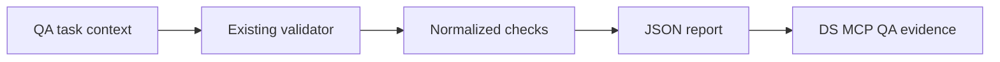

# Design Document

## Overview

The Rental Home Pilot adapter adds a deterministic JSON mode to the existing workflow validation path. It converts existing repository checks into a bounded evidence report that DS MCP can attach to `QaEvidence`.

The design follows Reuse → Extend:

- Reuse current `workflow:validate`.
- Reuse current workflow state libraries and task/spec parsing.
- Extend output formatting and expected-head/runtime-state inputs.
- Do not create a new validator or modify application behavior.

## Architecture



## Components and Interfaces

### Validation Report Model

Suggested path:

```text
scripts/workflow/lib/validation-report.mjs
```

Responsibility:

- Normalize current validation results.
- Produce stable pass/fail/blocked semantics.
- Serialize deterministic JSON.
- Redact sensitive text.

Interface:

```ts
type WorkflowValidationReportV1 = {
  schema_version: "1.0";
  generated_at: string;
  repository: string;
  branch?: string;
  head_sha?: string;
  expected_head_sha?: string;
  tracking_mode?: "repository" | "ds_admin_runtime";
  root_task_id?: string;
  spec_id?: string;
  result: "passed" | "failed" | "blocked";
  checks: Array<{
    code: string;
    status: "passed" | "failed" | "skipped";
    summary: string;
  }>;
  findings: Array<{
    code: string;
    severity: "info" | "warning" | "error";
    summary: string;
    path?: string;
    line?: number;
  }>;
  scope: {
    changed_files: string[];
    unexpected_files: string[];
  };
};
```

### Validator CLI Extension

Suggested path:

```text
scripts/workflow/validate-repo-state.mjs
```

Responsibility:

- Preserve current human output.
- Add JSON output mode.
- Accept expected head SHA and optional runtime state file.
- Set stable process exit code.

Proposed options:

```text
--format human|json
--output <path>
--expected-head-sha <sha>
--runtime-state <path>
--allowed-file <path>        # repeatable
```

Environment-only alternatives should be avoided when explicit CLI inputs are clearer and safer.

### Runtime Projection Validator

Suggested path:

```text
scripts/workflow/lib/runtime-projection.mjs
```

Responsibility:

- Validate supplied DS Admin runtime projection.
- Compare root task/spec/branch/head state.
- Report mismatch without mutating either source.

Interface:

```ts
type PilotRuntimeProjection = {
  workflow_id: string;
  root_task_id: string;
  spec_id: string;
  repository: string;
  branch: string;
  head_sha?: string;
  stage: string;
  owner?: string;
};
```

### Scope Validator

Suggested path:

```text
scripts/workflow/lib/write-scope.mjs
```

Responsibility:

- Compare changed files with task-approved exact paths.
- Detect production code modification by QA.
- Return bounded findings.

Reuse existing Git/worktree helpers when present.

### Focused Tests

Suggested paths:

```text
test/workflow-validation-report.test.ts
test/workflow-runtime-projection.test.ts
```

Actual paths must follow protected-base test conventions discovered during G0.

## Data Models

### Adapter Input

```ts
type PilotValidationInput = {
  expected_head_sha: string;
  tracking_mode: "ds_admin_runtime";
  runtime_state?: PilotRuntimeProjection;
  allowed_files: string[];
  agent_role: "qa";
};
```

### Adapter Output Mapping to DS MCP

```ts
function toQaEvidence(
  report: WorkflowValidationReportV1,
  taskContext: {
    workflow_id: string;
    task_id: string;
    pr_number: number;
    qa_agent_id: string;
  }
): QaEvidenceV1;
```

The Rental Home adapter may produce the report only; the QA Agent or DS MCP client may perform the final mapping.

## Correctness Properties

### No Duplicate Truth

The adapter reports consistency but does not become a second runtime state engine.

### Exact Head

A report cannot be `passed` when `head_sha !== expected_head_sha`.

### Scope Safety

A QA report cannot be `passed` when changed files exceed the exact allowed set.

### Production Isolation

The adapter cannot require or use production data or service-role credentials.

### Backward Compatibility

Human-format `pnpm run workflow:validate` remains usable.

### Stable Result

Every execution ends in exactly one of `passed`, `failed`, or `blocked`.

## Error Handling

Stable finding codes:

```text
RH_PILOT_INPUT_INVALID
RH_PILOT_GIT_UNAVAILABLE
RH_PILOT_HEAD_MISMATCH
RH_PILOT_RUNTIME_STATE_MISSING
RH_PILOT_RUNTIME_STATE_MISMATCH
RH_PILOT_SCOPE_VIOLATION
RH_PILOT_PRODUCTION_FILE_MODIFIED_BY_QA
RH_PILOT_VALIDATION_FAILED
RH_PILOT_OUTPUT_WRITE_FAILED
RH_PILOT_SECRET_REDACTED
```

Suggested exit codes:

```text
0 = passed
1 = failed
2 = blocked or invalid invocation
```

## Testing Strategy

Focused tests:

- Human output compatibility.
- Valid JSON output.
- Deterministic normalized checks.
- Passed result.
- Repository validation failure.
- Missing runtime state.
- Expected/current head mismatch.
- Changed-file scope violation.
- QA production-code modification detection.
- Secret redaction.
- Output file error.
- Malformed JSON input.

Validation commands, after inspecting scripts:

```text
pnpm run typecheck
pnpm run workflow:validate
pnpm test
pnpm run build
```

Full `pnpm test` may include Playwright and must be run only in an appropriate inspected environment. Focused test commands may be used during iteration, but skipped checks must be reported.

## Implementation Constraints

- Follow protected-base `AGENTS.md`.
- Use the Rental Home Kiro spec format.
- Use one unique session folder and isolated worktree per branch.
- Do not edit `main`.
- Do not change application business behavior.
- Do not touch Supabase schema, migration, RLS, auth, production config, or production data.
- Do not add dependencies unless separately approved.
- Do not edit CI or package scripts unless G1 proves it is necessary and the scope is re-approved.
- Keep exact file paths in the G2 envelope.
