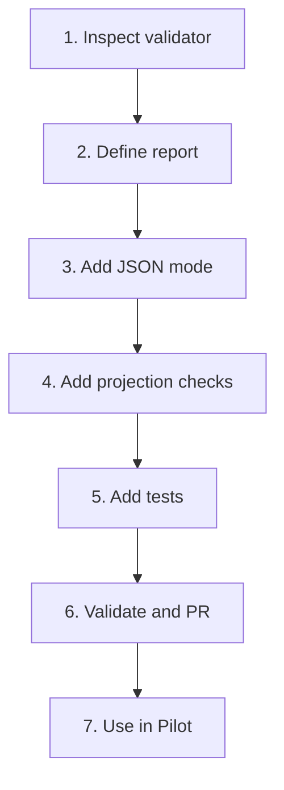

# Implementation Plan

## Overview

Extend the current Rental Home repository workflow validator with a machine-readable Pilot report. Keep the implementation limited to workflow tooling and focused tests. Do not change the Rental Home application, database, auth, RLS, CI, deployment, or production data.

## Task Dependency Graph

## Tasks

- [ ] 1. Inspect current repository workflow validation
  - Read protected-base `AGENTS.md`, orchestrator, project GWC package, `TASK.md`, relevant Kiro specs, workflow scripts/libraries, package scripts, tests, and CI workflows.
  - Confirm the current source of human-readable validation output.
  - Confirm current Git/worktree helpers and task-state parsing.
  - Identify exact files to reuse and avoid duplicate validator logic.
  - Resolve the project-extension write-enabled contradiction before G2.
  - _Requirements: 1, 3, 6, 7_

- [ ] 2. Define the Pilot validation report contract
  - Add a versioned report type/schema.
  - Define stable result, check, finding, and exit-code semantics.
  - Define expected-head, runtime projection, and allowed-file inputs.
  - Define redaction and size limits.
  - Keep DS Admin as runtime SSOT for Pilot tasks.
  - _Requirements: 1, 2, 3, 4, 5, 7_

- [ ] 3. Extend the existing validator with JSON output
  - Preserve existing human output.
  - Add explicit JSON format and optional output-file support.
  - Normalize existing checks and findings.
  - Include branch/head metadata when available.
  - Implement stable exit codes.
  - _Requirements: 1, 2, 5, 6_

- [ ] 4. Add runtime projection and scope validation
  - Accept a bounded DS Admin runtime-state projection.
  - Compare repository, root task, spec, branch, and head SHA.
  - Detect runtime/repository projection mismatch.
  - Compare changed files with exact allowed files.
  - Fail when QA modifies production code outside the approved scope.
  - Do not mutate repository task state or DS Admin state.
  - _Requirements: 2, 3, 4, 5_

- [ ] 5. Add focused tests
  - Add pass, fail, and blocked cases.
  - Add JSON schema/shape tests.
  - Add expected-head mismatch test.
  - Add runtime projection mismatch test.
  - Add changed-file scope violation test.
  - Add QA production-code modification test.
  - Add secret-redaction test.
  - Add human-output compatibility test.
  - _Requirements: 1, 2, 3, 4, 5, 6, 7_

- [ ] 6. Validate and deliver the Rental Home Draft PR
  - Inspect selected commands and lifecycle scripts.
  - Run focused tests.
  - Run `pnpm run typecheck`.
  - Run `pnpm run workflow:validate`.
  - Run applicable `pnpm test` and `pnpm run build`.
  - Review the complete diff.
  - Confirm no app, Supabase, RLS, auth, migration, production config, secret, or production-data changes.
  - Deliver a Draft PR under G3 and record exact head SHA/CI.
  - Stop before merge or deployment.
  - _Requirements: 4, 6, 7_

- [ ] 7. Use the adapter in Pilot success and failure-recovery runs
  - Run the adapter from the QA task against the exact PR head SHA.
  - Submit the normalized report as DS MCP QA evidence.
  - Verify stale evidence is rejected after a Dev repair commit.
  - Verify repository projection does not override DS Admin runtime state.
  - Record operator feedback and gaps.
  - _Requirements: 1, 2, 3, 4, 5, 6_

## Notes

- Suggested branch: `feature/ops-agent-01-multi-agent-pilot-adapter`.
- Suggested risk: R1 if limited to scripts/tests; escalate to R2 if workflow behavior or public interfaces change materially.
- Use exact `Files WRITE`; do not use broad directory permissions.
- Do not change `package.json` or CI unless separately justified and approved.
- No production operations are included.
