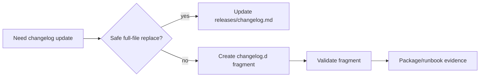

# Changelog Append Hygiene Runbook

Status: active  
Scope: GWC release-note hygiene and safe append operations

## Purpose

This runbook defines a safe, additive changelog mechanism for GWC work where the chat connector cannot safely replace the full `releases/changelog.md` file.

The goal is to avoid repeating the prior truncation risk seen when a long changelog had to be modified through whole-file replacement.

## Rules

1. Do not rewrite `releases/changelog.md` through a chat connector unless the full file content has been fetched and validated.
2. Prefer additive fragments under `releases/changelog.d/` for small release-note entries.
3. Each fragment must use a stable file name:

```text
releases/changelog.d/<YYYY-MM-DD>-<task-id-kebab>.md
```

4. Each fragment must contain:

```text
## <YYYY-MM-DD> — <title>

### Added|Changed|Fixed|Safety

- Entry text.
```

5. Fragments are release-note evidence only. They do not grant G2 write, G3 ready-for-review, G4 merge, deploy, release, production configuration, credential, migration, or production-data authority.
6. A later local-agent or repo-CI task may materialize fragments into `releases/changelog.md` only after full-file readback and validator evidence.

## Required validation

A valid changelog fragment must:

- live under `releases/changelog.d/`;
- end in `.md`;
- include exactly one top-level `## ` dated heading;
- include at least one section heading using `### `;
- mention the related task ID;
- avoid protected-authority claims.

## Runtime behavior



## Compatibility

This is additive. It does not remove the canonical changelog. It adds a safer path for connector-only execution modes.
