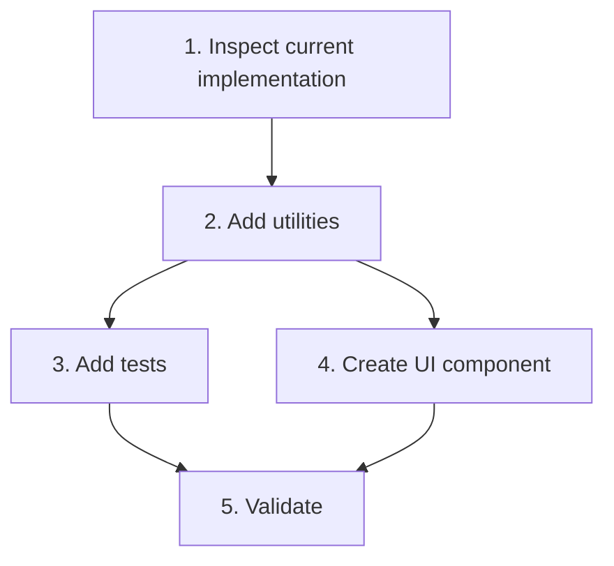
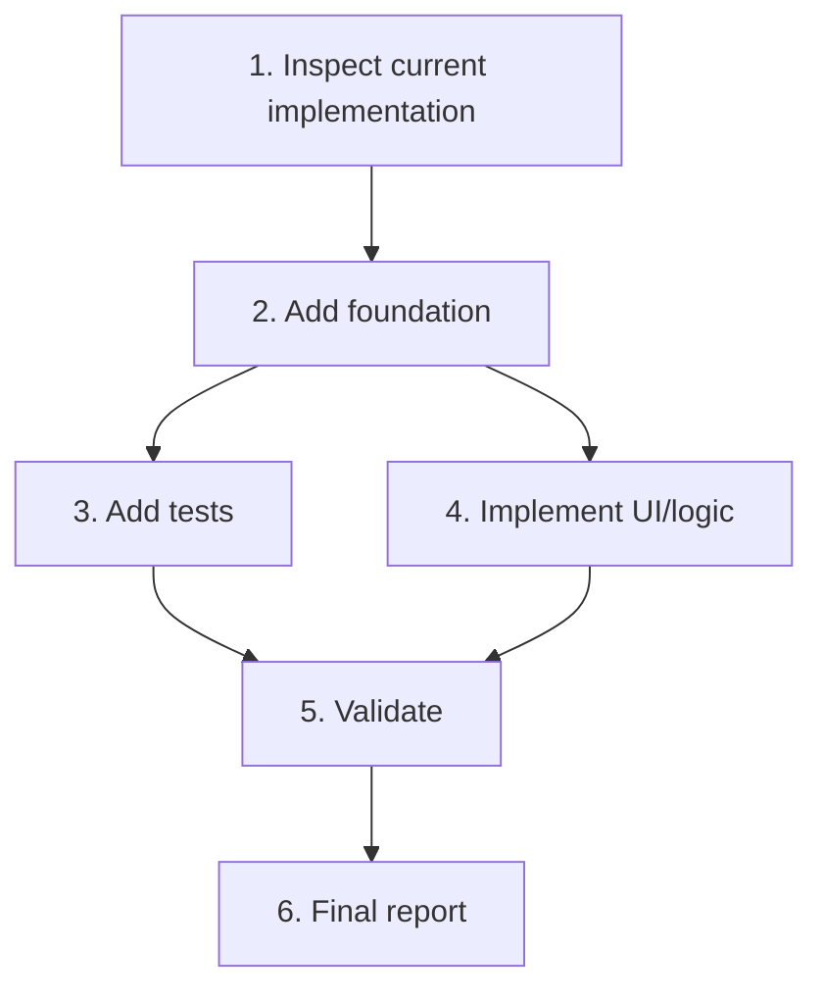

# Rental Home Spec-Driven Format Rule

## Purpose

Use this rule whenever the user asks to create a task, create a spec, plan work, or says:

```txt
I want to do <something> in rental home
```

The output must follow the Rental Home Kiro spec-driven format exactly.

## Trigger Conditions

Apply this rule when the user says or implies any of the following:

- `create task`
- `create tasks`
- `create spec`
- `create specs`
- `make spec`
- `write requirements`
- `write design`
- `write tasks`
- `I want to do ... in rental home`
- `implement ... in rental_home`
- `add feature ... in rental home`
- `fix ... in rental home`
- `plan ... for rental home`

If the request is about the Rental Home repo and requires planned implementation, default to spec-driven output.

## Required Folder Structure

Create one spec folder under:

```txt
.kiro/specs/<SPEC-ID-kebab-case>/
```

Each spec folder must contain exactly these files:

```txt
requirements.md
design.md
tasks.md
```

Example:

```txt
.kiro/specs/RD-INV-01-debt-report-range-ui/
  requirements.md
  design.md
  tasks.md
```

If there are multiple independent workstreams, create multiple spec folders.

Do not put spec-driven feature specs under `docs/tasks/` unless the user explicitly asks for a non-Kiro archive.

## Naming Rule

Use this format:

```txt
<DOMAIN>-<AREA>-<NN>-<short-kebab-title>
```

Examples:

```txt
RD-INV-01-debt-report-range-ui
RD-INV-02-invoice-table-crud-actions
RD-INV-03-invoice-generation-logic
OPS-ALERT-01-notification-read-state
TENANT-DETAIL-01-logic-cleanup
```

Use uppercase prefix if the current repo/spec convention uses uppercase. Do not silently change existing folder casing.

## `requirements.md` Required Format

The file must start with:

```md
# Requirements Document
```

Required sections, in order:

```md
# Requirements Document

## Introduction

## Glossary

## Requirements
```

Each requirement heading must use this exact format:

```md
### Requirement N: Title
```

Valid:

```md
### Requirement 1: Overview Debt Report
```

Invalid:

```md
### Requirement 1 — Overview Debt Report
### Requirement 1 - Overview Debt Report
### Requirement: Overview Debt Report
### Overview Debt Report
```

Each requirement must include:

```md
**User Story:** As a <role>, I want <capability>, so that <benefit>.

#### Acceptance Criteria
```

Acceptance criteria must be numbered and use EARS-style language when practical:

```md
1. WHEN <condition> THEN the system SHALL <behavior>.
2. IF <condition> THEN the system SHALL <behavior>.
3. WHEN <condition> THEN the system SHOULD <behavior>.
```

Use `SHALL` for mandatory behavior.
Use `SHOULD` for preferred behavior.
Use `MUST NOT` / `SHALL NOT` for constraints.

### `requirements.md` Template

```md
# Requirements Document

## Introduction

<Explain current problem, target outcome, and explicit non-goals.>

## Glossary

| Term | Definition |
|---|---|
| <Term> | <Definition> |

## Requirements

### Requirement 1: <Title>

**User Story:** As a <role>, I want <capability>, so that <benefit>.

#### Acceptance Criteria

1. WHEN <condition> THEN the system SHALL <behavior>.
2. IF <condition> THEN the system SHALL <behavior>.
3. WHEN <condition> THEN the system SHOULD <behavior>.

### Requirement 2: <Title>

**User Story:** As a <role>, I want <capability>, so that <benefit>.

#### Acceptance Criteria

1. WHEN <condition> THEN the system SHALL <behavior>.
```

## `design.md` Required Format

The file must start with:

```md
# Design Document
```

Required sections, in order:

```md
# Design Document

## Overview

## Architecture

## Components and Interfaces

## Data Models

## Correctness Properties

## Error Handling

## Testing Strategy

## Implementation Constraints
```

### Components and Interfaces

This section must define:

- Component/module name.
- Suggested path.
- Responsibility.
- Interface/type signature where practical.
- Existing shared components to reuse.

### Data Models

This section must define:

- Domain types.
- Derived UI row models.
- State models.
- Mapping rules.

### Correctness Properties

This section must define invariants and non-regression rules.

Examples:

```txt
A missing period must not increase total debt.
A paid invoice must never be marked overdue.
Danger tone has priority over warning tone.
```

### `design.md` Template

```md
# Design Document

## Overview

<Explain design purpose and non-goals.>

## Architecture

```txt
<High-level structure>
```

## Components and Interfaces

### <ComponentOrModuleName>

Suggested path:

```txt
<path>
```

Responsibility:

- <Responsibility>

Interface:

```ts
type <PropsOrInput> = {
  ...
}
```

## Data Models

### <ModelName>

```ts
type <ModelName> = {
  ...
}
```

## Correctness Properties

### <Property group>

<Invariant or rule.>

## Error Handling

<Expected error behavior.>

## Testing Strategy

<Required tests and validation commands.>

## Implementation Constraints

- Do not touch unrelated files.
- Do not call Supabase directly from UI.
- Use repositories from `src/app/dependencies.ts`.
- Run validation honestly.
```

## `tasks.md` Required Format

The file must start with:

```md
# Implementation Plan
```

Required sections, in order:

```md
# Implementation Plan

## Overview

## Task Dependency Graph

## Tasks

## Notes
```

The Task Dependency Graph section must contain a Mermaid graph.

Recommended:

```md
## Task Dependency Graph


```

Tasks must be checkboxes and use requirement mapping:

```md
- [ ] 1. Inspect current implementation
  - Read current files.
  - Identify current behavior.
  - Confirm scope boundaries.
  - _Requirements: 1, 2, 3_
```

Allowed task statuses:

```txt
[ ] not started
[x] done
[-] blocked/skipped
[~] in progress
```

### `tasks.md` Template

```md
# Implementation Plan

## Overview

<Explain implementation slice and strict scope.>

## Task Dependency Graph



```json
{
  "waves": [
    {
      "id": "wave-1",
      "description": "Inspection and planning",
      "tasks": ["1"]
    },
    {
      "id": "wave-2",
      "description": "Overview compaction",
      "tasks": ["2"]
    },
    {
      "id": "wave-3",
      "description": "Invoice tab compaction",
      "tasks": ["3"]
    },
    {
      "id": "wave-4",
      "description": "Scoped CSS styling",
      "tasks": ["4"]
    },
    {
      "id": "wave-5",
      "description": "Validation and smoke testing",
      "tasks": ["5"]
    },
    {
      "id": "wave-6",
      "description": "Final reporting",
      "tasks": ["6"]
    }
  ]
}
```

## Tasks

- [ ] 1. Inspect current implementation
  - Read relevant files.
  - Identify current behavior.
  - Identify existing conventions.
  - Confirm scope boundaries.
  - _Requirements: 1, 2, 3_

- [ ] 2. Add foundation
  - Add helpers/types/components required by this spec.
  - Keep logic pure where practical.
  - _Requirements: 1, 2_

- [ ] 3. Add tests
  - Add unit tests for pure logic.
  - Add UI tests only if current project convention supports them.
  - _Requirements: 1, 2, 3_

- [ ] 4. Implement scoped behavior
  - Wire the new behavior into the smallest safe surface.
  - Do not touch unrelated features.
  - _Requirements: 1, 2, 3_

- [ ] 5. Validate
  - Run `npm run typecheck`.
  - Run `npm run build`.
  - Run relevant tests.
  - Report honestly if validation cannot run.
  - _Requirements: 1, 2, 3_

- [ ] 6. Final report
  - Report files changed.
  - Report behavior changed.
  - Report validation result.
  - Report risks/blockers.
  - _Requirements: 1, 2, 3_

## Notes

- Do not combine unrelated workstreams.
- Do not change database schema unless the spec explicitly requires it.
- Do not call Supabase directly from UI.
- Use repositories from `src/app/dependencies.ts`.
- Reuse existing shared UI components first.
- Keep generated files in `.kiro/specs/<SPEC-ID>/`.
```

## Agent Process Rule

When generating a new spec:

1. Restate the requested outcome.
2. Choose one spec folder name.
3. Create:
   - `requirements.md`
   - `design.md`
   - `tasks.md`
4. Validate the headings before final output.
5. If multiple workstreams exist, split them into multiple spec folders.
6. Do not produce only one file.
7. Do not use old `docs/tasks/<task>/spec.md` format unless explicitly requested.
8. Do not claim the spec is Kiro-ready unless all required sections exist.

## Heading Validation Checklist

Before final output, verify:

### requirements.md

- [ ] Starts with `# Requirements Document`
- [ ] Has `## Introduction`
- [ ] Has `## Glossary`
- [ ] Has `## Requirements`
- [ ] Every requirement heading is `### Requirement N: Title`
- [ ] Every requirement has `**User Story:**`
- [ ] Every requirement has `#### Acceptance Criteria`

### design.md

- [ ] Starts with `# Design Document`
- [ ] Has `## Overview`
- [ ] Has `## Architecture`
- [ ] Has `## Components and Interfaces`
- [ ] Has `## Data Models`
- [ ] Has `## Correctness Properties`
- [ ] Has `## Error Handling`
- [ ] Has `## Testing Strategy`
- [ ] Has `## Implementation Constraints`

### tasks.md

- [ ] Starts with `# Implementation Plan`
- [ ] Has `## Overview`
- [ ] Has `## Task Dependency Graph`
- [ ] Has `## Tasks`
- [ ] Has `## Notes`
- [ ] Task Dependency Graph contains Mermaid graph
- [ ] Tasks are checkbox items
- [ ] Tasks include `_Requirements: ..._`

## Response Rule for ChatGPT

When the user asks ChatGPT to create Rental Home tasks/specs:

- Provide spec-driven files in this exact format.
- Prefer creating a zip artifact if the user asks for files.
- If only text is requested, provide file-by-file content.
- If the user says “create task/spec” but does not provide enough detail, ask only for missing critical info.
- If enough context exists, make reasonable PM assumptions and proceed.
- Include the exact destination path:

```txt
.kiro/specs/<SPEC-ID>/
  requirements.md
  design.md
  tasks.md
```

## Response Rule for Kiro/Codex Agent

When Kiro/Codex receives a Rental Home task/spec request:

- Read this rule first.
- Generate specs only under `.kiro/specs/<SPEC-ID>/`.
- Use exactly `requirements.md`, `design.md`, and `tasks.md`.
- Follow the heading validation checklist.
- Do not implement code unless the user explicitly asks.
- If implementation is requested, first read the spec and follow `tasks.md`.
