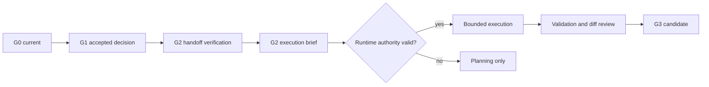

# GWC G2 Skill

## Purpose

Use this skill to convert current G0 context and an accepted G1 decision into a
bounded, evidence-backed execution brief.

G2 answers two separate questions:

```text
Is the accepted G1 decision fresh and complete enough to plan bounded work?

Does the active runtime and task context authorize execution of that bounded
work right now?
```

A valid handoff prepares execution. This skill does not create authority by
itself and does not grant G3, G4, G5, or G6.

## Phase boundary



## Authority boundary

This skill may guide:

- consumption of current G0 and accepted G1 evidence;
- verification of repository, protected-base, task, scope, decision, and risk
  freshness;
- construction of a bounded G2 execution brief;
- implementation and validation only when the active runtime already grants
  valid G2 authority;
- preparation of evidence for a separate G3 decision or automatic G3 path when
  the active project explicitly permits it.

This skill never independently grants:

- `G2_EXECUTION`;
- `G3_PR_AUTHORITY`;
- `G4_MERGE`;
- `G5_DEPLOY`;
- `G6_PRODUCTION`;
- release, secret, credential, production-configuration, or production-data
  authority.

Preserve this minimum boundary:

```yaml
authority_boundaries:
  granted_by_this_skill: []
  excluded:
    - G3_PR_AUTHORITY
    - G4_MERGE
    - G5_DEPLOY
    - G6_PRODUCTION
```

The active protected-base project and runtime instructions decide whether a
specific user direction and DS Admin task authorize bounded G2 execution.

## Source of authority

Repository governance remains authoritative. Reuse:

- `AGENTS.md`;
- `core/Coding_Project_Governance_v1.0.md`;
- `core/Agent_Behavior_Semantic_Contract_v1.0.md`;
- `projects/<project-id>/project-profile.yaml`;
- project instructions and extensions;
- `skills/gwc-g0/SKILL.md`;
- `skills/gwc-g1/SKILL.md`;
- `docs/g01-lifecycle.md`;
- `governance/base-drift-policy.yaml`;
- runtime-specific agent instructions and capabilities;
- DS Admin task and State Engine evidence;
- repository-native validators, tests, and CI.

Repository evidence wins over conversation memory and stale handoff text.

## Existing mechanism and B1 boundary

The repository already provides schema-valid G0/G1 evidence, G1 decision
capture, task traceability, branch safety, base-drift handling, validators, and
CI. Reuse those mechanisms instead of creating a parallel lifecycle.

This B1 skill is an instruction-level handoff contract. It does not introduce:

- a new `.gwc/g2` canonical artifact;
- a new JSON Schema;
- a generator or validator;
- a workflow or State Engine transition;
- a new authority token.

Until a later tool-level enhancement is separately approved, the G2 execution
brief may be represented in the current response and persisted only through an
existing durable channel such as the active DS Admin task, branch/commit
history, or Pull Request evidence. Never claim durable persistence unless that
write was observed.

## Required input contract

A G2 handoff requires current evidence for:

| Input | Required evidence |
|---|---|
| Project | Exactly one active project and profile |
| Repository | Verified full name, protected base, and current base SHA |
| G0 | Current `READY` context or equivalent verified handoff |
| G1 decision | `ACCEPTED` decision or an explicit, current, repository-permitted chat-only equivalent |
| Selected path | Selected option and rationale |
| Scope | In-scope work, non-goals, constraints, and acceptance criteria |
| Task | Exactly one compatible modifying task when the project requires it |
| Risk | Current risk class and any human-direction requirement |
| Actions | Exact requested repository and validation actions |
| Exclusions | G3-G6 and all production, secret, destructive, or unrelated actions not granted |

A G1 `PASS` is evidence for G2 planning. It is not execution authority.

## Freshness and drift checks

Before planning or execution, compare the handoff with current evidence:

1. project ID and profile path;
2. repository identity and protected-base SHA;
3. required governance sources;
4. DS Admin task identity, state, repository, and branch;
5. selected option and decision source;
6. scope, non-goals, constraints, and acceptance criteria;
7. risk class and human direction;
8. intended actions and exclusions.

Refresh only the evidence affected by change.

Use the existing base-drift policy when the protected base moved. Do not treat
every unrelated base change as automatic invalidation, and do not continue when
the change affects governance, target files, scope, risk, validation, or
compatibility.

Output one of:

```text
G2_HANDOFF_CURRENT
G2_HANDOFF_REFRESHED
G2_HANDOFF_STALE
G2_HANDOFF_BLOCKED
```

## Significant-change matrix

Before implementation, record:

| Item | Required content |
|---|---|
| Current mechanism | Existing file, workflow, contract, task, or tool |
| Purpose | Why it exists and who consumes it |
| Limitation | Exact gap against the accepted G1 outcome |
| Improvement | Smallest compatible evolution |
| Compatibility | How current consumers and authority boundaries remain valid |
| Impact | Expected behavior, maintenance, and governance effect |

Apply:

```text
Reuse → Extend → Refactor → Replace
```

Do not start with a replacement or parallel mechanism.

## G2 execution brief

Prepare a concise execution brief before repository mutation.

```yaml
trace:
  project_id: <project>
  repository: <owner/repo>
  task_id: <ds-admin-task>
  base_ref: <protected-base>
  base_sha: <40-char-sha>
  working_branch: <dedicated-branch>
decision:
  source: <artifact-ref-or-explicit-current-user-direction>
  selected_option: <option-id-or-bounded-path>
  scope_hash_or_ref: <hash-ref-or-qualified-reference>
change:
  current_mechanism: <existing-mechanism>
  limitation: <verified-gap>
  improvement: <smallest-compatible-change>
  compatibility: <preserved-consumers-and-boundaries>
  impact: <expected-effect>
execution:
  risk_class: R0|R1|R2|R3
  authorized_actions: []
  excluded_actions: []
  files_or_modules: []
validation:
  commands_or_checks: []
  diff_review: required
continuity:
  durable_evidence_target: <task|commit|pr|none>
  temporary_context: <session-local-description>
  promotion_rules: <what-must-be-kept>
```

A response or task note may use Markdown instead of YAML when it preserves the
same information.

## Continuity and self-cleaning

Use three evidence layers. Do not retain everything as durable project memory.

| Layer | Content | Lifecycle |
|---|---|---|
| Temporary session context | Scratch analysis, repeated file excerpts, intermediate tool output, abandoned wording | May be discarded when no longer needed |
| Active handoff | Current execution brief, unresolved blockers, working branch/head, pending validation | Keep while the task is active; supersede when scope or evidence changes |
| Durable evidence | Accepted decision, material scope/authority change, invariant, final changed files, commit/PR/CI evidence, rollback, residual risk, next gate | Persist only through an existing verified channel |

Promote information to durable evidence only when it changes future behavior,
scope, authority, architecture, compatibility, validation, rollback, or an
unresolved material risk.

At handoff or task closure:

1. remove duplicate and obsolete scratch context from the handoff summary;
2. retain the latest accepted decision and mark older decisions `SUPERSEDED`;
3. retain exact repository/task/branch/head and validation evidence;
4. retain exclusions, residual risks, and next legal action;
5. do not physically delete audit evidence required by repository or State
   Engine history;
6. do not claim automatic cleanup or persistence when no supporting tool ran.

This is a semantic lifecycle rule, not a background cleanup service.

## Execution modes

Choose the strongest mode supported by current evidence.

| Mode | Use when | Allowed | Not allowed |
|---|---|---|---|
| `g2-planning` | G1 handoff is current but execution authority or task traceability is absent | Execution brief, dependency analysis, validation plan | Branch, commit, push, PR, or remote mutation |
| `g2-execution` | Handoff, task, runtime authority, branch, risk, and write path are verified | Bounded implementation, push when authorized, validation, diff review | Scope expansion or later gates |
| `g2-blocked` | Required evidence is missing, contradictory, stale, or high-risk direction is absent | Blocker report and smallest recovery action | Mutation or success claims |

## Action 1 — Consume the G1 handoff

Require:

- current G0 context;
- accepted G1 decision evidence;
- selected option or explicitly bounded path;
- scope, non-goals, constraints, and acceptance criteria;
- current task and risk facts.

Do not reinterpret a `PENDING`, `REJECTED`, `SUPERSEDED`, `BLOCKED`, or stale G1
decision as accepted.

## Action 2 — Reconstruct current execution context

Refresh repository, protected base, governance, task, branch, target-file, and
validation evidence affected by material change.

Distinguish:

- protected-base governance;
- working-branch content;
- conversation-local assumptions;
- persistent decision evidence;
- current tool-observed facts.

## Action 3 — Prepare the bounded execution brief

Identify existing mechanisms and fill the significant-change matrix. Limit the
brief to the selected G1 outcome and one task.

State:

- exact files or modules expected to change;
- expected behavior change;
- validation and rollback;
- explicit exclusions;
- whether push is part of G2;
- whether G3 is excluded or separately permitted.

## Action 4 — Verify execution authority

Execution may start only when:

- the active project/runtime explicitly permits the bounded G2 path;
- exactly one compatible DS Admin task represents the work when required;
- repository and base evidence are current;
- the branch is dedicated and not protected;
- scope and risk remain within the accepted boundary;
- high-risk human direction exists when required;
- no later gate is implied.

Output:

```text
G2_EXECUTION_AUTHORIZED_BY_RUNTIME
```

or:

```text
G2_PLANNING_ONLY
G2_EXECUTION_NOT_AUTHORIZED
```

## Action 5 — Execute the smallest compatible change

When authorized:

- create or use one dedicated branch/session for the task;
- re-read each target before updating it;
- use expected-state guards where supported;
- update authoritative source before generated output;
- avoid unrelated cleanup, formatting sweeps, dependency changes, and
  opportunistic refactors;
- verify branch head after writes;
- stop and re-evaluate on material scope drift.

## Action 6 — Validate and review the complete diff

Run applicable repository-native validation after inspecting command and
workflow definitions.

At minimum:

- parse changed YAML/JSON;
- validate package and source references;
- run applicable tests or CI;
- review the complete diff against the verified base;
- check secrets, accidental deletion, generated noise, weakened validation,
  workflow changes, and unrelated files;
- report skipped validation with exact reasons.

CI is evidence only. It does not grant G3-G6.

## Action 7 — Prepare the next boundary

After bounded implementation and validation, report one of:

```text
G2_IMPLEMENTATION_COMPLETE
G3_CANDIDATE_READY
G3_PR_AUTHORITY_NOT_GRANTED
```

or, only when protected-base project/runtime instructions separately permit the
automatic G3 path:

```text
G2_IMPLEMENTATION_COMPLETE
G3_AUTOMATIC_PATH_ELIGIBLE
```

Do not create or mutate a Pull Request when the current request explicitly
stops at G2.

## Standard response shape

```markdown
## G2 Context

## G1 Handoff and Freshness

## Existing Mechanism

## Bounded Execution Brief

## Implementation Evidence

## Validation and Diff Review

## Continuity Record

## Boundaries and Next Legal Action
```

## Stop conditions

Stop and report `G2_BLOCKED` when:

- G0 is missing, contradictory, stale, or blocked for required evidence;
- G1 decision is absent, non-explicit, pending, rejected, superseded, or stale;
- project or repository identity is ambiguous;
- task traceability is missing or conflicts with repository/branch facts;
- protected-base governance cannot be verified;
- the working branch is protected, shared, or owned by unrelated scope;
- target files or acceptance criteria cannot be bounded;
- the change exceeds the accepted scope or requires an unapproved architecture,
  security, financial, destructive, irreversible, production, credential,
  secret, or broad-blast-radius boundary;
- validation cannot provide the evidence required for the claimed outcome;
- G3, G4, G5, or G6 is implied without separate permission.

## Completion markers

Successful bounded G2 execution:

```text
G2_HANDOFF_CURRENT
G2_EXECUTION_AUTHORIZED_BY_RUNTIME
G2_IMPLEMENTATION_COMPLETE
NO_LATER_PHASE_AUTHORITY_GRANTED
```

Planning-only outcome:

```text
G2_HANDOFF_CURRENT
G2_PLANNING_ONLY
G2_EXECUTION_NOT_AUTHORIZED
NO_LATER_PHASE_AUTHORITY_GRANTED
```

Blocked outcome:

```text
G2_HANDOFF_BLOCKED
G2_EXECUTION_BLOCKED
NO_LATER_PHASE_AUTHORITY_GRANTED
```
